# Agent Reference — Pantheon

## Table of Contents
- [Overview](#overview)
- [Delegation Matrix](#delegation-matrix)
- [Agent Details](#agent-details)
- [Architecture Diagram](#architecture-diagram)
- [Quick Selection Guide](#quick-selection-guide)

## Overview

Pantheon provides **14 specialized agents** organized into a conductor-delegate architecture. Zeus (the orchestrator) dispatches work to specialized sub-agents with isolated context windows, enforced quality gates, and human approval at every transition. Each agent has a single responsibility, a restricted tool set, and explicit context boundaries.

### 🎯 Model Tiers

Agents declare abstract **tiers** (`fast`/`default`/`premium`) instead of concrete model names. The actual model depends on the platform and subscription you're using (OpenCode Go, Copilot Pro, Cursor Pro, etc.).

> **TL;DR:** Same agent files, different models depending on your subscription. Configure models via your platform's settings (e.g., `~/.config/opencode/opencode.json` for OpenCode).

**7 tiers:**
1. **Orchestrator** — Zeus
2. **Planning & Discovery** — Athena, Apollo
3. **AI Infrastructure** — Hephaestus
4. **Implementation** — Hermes, Aphrodite, Demeter
5. **Quality & Observability** — Themis, Nyx
6. **Infrastructure & Release** — Prometheus, Iris, Mnemosyne
7. **Express & Specialist** — Talos, Gaia

---

## Delegation Matrix

| Agent | Tier | Role | Delegates to | Skills Used |
|---|---|---|---|---|---|
| Zeus | Orchestrator | Central coordinator | All 14 agents | agent-coordination, artifact-management, auto-continue, internet-search, orchestration-workflow, session-goal |
| Athena | Planning & Discovery | Strategic planner | Apollo, Themis | architecture-diagrams, codemap, init-deep, interview, metis-gap-analysis |
| Apollo | Planning & Discovery | Read-only codebase scout | Zeus, Athena | internet-search, codemap |

| Hephaestus | AI Infrastructure | AI pipelines + conversational AI | Apollo, Themis, Prometheus | rag-pipelines, mcp-server-development, agent-evaluation, conversational-ai-design, prompt-improver |

| Hermes | Implementation | Backend (FastAPI) | Apollo, Themis | api-design-patterns, fastapi-async-patterns, tdd-with-agents, database-optimization, cache-strategy, code-discipline, simplify, test-architecture |
| Aphrodite | Implementation | Frontend (React) | Apollo, Themis | frontend-analyzer, tdd-with-agents, nextjs-seo-optimization, code-discipline, simplify |
| Demeter | Implementation | Database | Apollo, Themis | database-migration, database-optimization, cache-strategy, code-discipline, simplify |
| Themis | Quality & Observability | Security & review gate | Mnemosyne, Zeus | code-review-checklist, security-audit-pro, tdd-with-agents, mcp-security |
| Nyx | Quality & Observability | Tracing & cost tracking | Apollo, Zeus | agent-observability, agent-evaluation |
| Prometheus | Infrastructure & Release | Docker + model provider hub | Apollo, Themis | docker-best-practices, multi-model-routing, agent-observability |
| Iris | Infrastructure & Release | GitHub Ops | Mnemosyne, Zeus | artifact-management |
| Mnemosyne | Infrastructure & Release | Memory bank & ADRs | (none) | architecture-diagrams, artifact-management, handoff, task-system |
| Talos | Express & Specialist | Rapid direct fixes | Zeus | code-discipline, simplify |
| Gaia | Express & Specialist | Remote sensing | Athena, Apollo, Hermes, Themis | remote-sensing-analysis, internet-search |

---

## Agent Details

### Zeus (Orchestrator)

- **Tier:** Orchestrator
- **Model:** premium
- **Description:** Central coordinator of the entire development lifecycle. NEVER implements code, NEVER edits files. Delegates work to specialized sub-agents.
- **Delegates to:** All 14 agents
- **Key Responsibilities:** Phase-based orchestration, parallel dispatch, approval gates (3 pause points), context conservation, agent routing
- **Usage:** `@zeus: Implement [feature description]`
- **Tools:** agent (delegation), askQuestions, runInTerminal, readFile, search/codebase, search/usages, web/fetch, search/changes
- **Handoffs:** athena (plan) → themis (validate) → hermes/aphrodite/demeter (implement) → themis (review) → prometheus (deploy + providers) → hephaestus (AI systems) → nyx (observe) → iris (github) → mnemosyne (document)

### Athena (Strategic Planner)

- **Tier:** Planning & Discovery
- **Model:** premium
- **Description:** Research-first architecture design and TDD roadmap generation. NEVER implements code or edits files. Creates concise 3-5 phase plans presented in chat.
- **Delegates to:** Apollo (nested subagent for complex discovery), Themis (plan validation), Zeus (execution handoff)
- **Key Responsibilities:** Codebase research, architecture decisions, risk analysis, phase planning, plan validation gate
- **Usage:** `@athena: Plan [feature]`
- **Tools:** agent, askQuestions, search/codebase, search/usages, web/fetch

### Apollo (Codebase Scout)

- **Tier:** Planning & Discovery
- **Model:** fast
- **Description:** Read-only rapid discovery agent. Launches 3-10 parallel searches simultaneously. Never edits files, never runs commands. Can be invoked as nested subagent from any other agent.
- **Delegates to:** Zeus (findings handoff), Athena (plan refinement)
- **Key Responsibilities:** Codebase exploration, pattern discovery, dependency mapping, external docs/GitHub research, structured reports
- **Usage:** `@apollo: Find all [pattern]`
- **Tools:** search/codebase, search/usages, search/fileSearch, search/textSearch, search/listDirectory, readFile, web/fetch, browser (openPage, navigate, read, screenshot)
- **Note:** `user-invocable: false` — primarily called by other agents

### Hephaestus (AI Infrastructure & Conversational AI)

- **Tier:** AI Infrastructure
- **Model:** default
- **Description:** AI infrastructure & conversational AI specialist — RAG pipelines, LangChain/LangGraph chains, vector stores, embeddings, NLU pipelines, dialogue management, intent/entity extraction. Merged Echo's conversational AI capabilities.
- **Delegates to:** Apollo (discovery), Themis (review + prompt injection audit), Prometheus (GPU deployment)
- **Skills:** rag-pipelines, mcp-server-development, agent-evaluation, conversational-ai-design, prompt-improver
- **Tools:** agent, askQuestions, search, read, edit, runInTerminal, web/fetch
- **Usage:** `@hephaestus: Build RAG pipeline for [use case]`
- **Key Responsibilities:** Vector store selection (Pinecone, Weaviate, pgvector, Chroma), chunking strategies, hybrid search (BM25 + vector), LangGraph stateful agents, hallucination detection, RAG evaluation (faithfulness, relevancy), NLU pipelines, dialogue management, intent/entity extraction

### Hermes (Backend Specialist)

- **Tier:** Implementation
- **Model:** default
- **Description:** Backend FastAPI implementation specialist. Async endpoints, Pydantic schemas, service layer, dependency injection, TDD enforced.
- **Delegates to:** Apollo (nested for pattern discovery), Themis (code review + security audit)
- **Skills:** fastapi-async-patterns, api-design-patterns, security-audit, tdd-with-agents
- **Tools:** agent, search, read, problems, edit, runInTerminal, testFailure, getTerminalOutput, changes
- **Usage:** `@hermes: Create [endpoint]`
- **Key Responsibilities:** RESTful endpoints (GET/POST/PUT/PATCH/DELETE), JWT auth with httpOnly cookies, CSRF protection, rate limiting, N+1 prevention, max 300 lines per file, async/await on all I/O, type hints on all functions

### Aphrodite (Frontend Specialist)

- **Tier:** Implementation
- **Model:** default
- **Description:** React frontend implementation specialist. TypeScript strict mode, WCAG AA accessibility, responsive design (mobile-first), component tests with vitest.
- **Delegates to:** Apollo (nested for component discovery), Themis (review + accessibility audit)
- **Skills:** web-ui-analysis, frontend-analyzer, nextjs-seo-optimization, tdd-with-agents
- **Tools:** agent, askQuestions, search, read, problems, edit, runInTerminal, testFailure, getTerminalOutput, changes, browser (open, navigate, read, click, type, hover, drag, dialog, screenshot)
- **Usage:** `@aphrodite: Build [component]`
- **Key Responsibilities:** Reusable components, admin CRUD interfaces, drag-and-drop upload, data tables with pagination, form validation, modal dialogs, toast notifications, ARIA labels, skeleton loaders, visual verification via integrated browser tools

### Demeter (Database Specialist)

- **Tier:** Implementation
- **Model:** default
- **Description:** Database implementation specialist. SQLAlchemy 2.0 async models, Alembic migrations, query optimization, N+1 prevention, zero-downtime strategy.
- **Delegates to:** Apollo (nested for optimization patterns), Themis (review + security audit)
- **Skills:** database-migration, database-optimization, performance-optimization, security-audit
- **Tools:** agent, search, read, problems, edit, runInTerminal, testFailure, getTerminalOutput
- **Usage:** `@demeter: Optimize [query]`
- **Key Responsibilities:** Model design (relationships, constraints, indexes), migration generation (upgrade + downgrade), eager loading (selectinload/joinedload), composite indexes, EXPLAIN ANALYZE, rollback testing, data migration safety

### Themis (Quality & Security Gate)

- **Tier:** Quality & Observability
- **Model:** premium
- **Description:** Quality & security gate enforcer. Reviews only changed files (lightweight). OWASP Top 10, >80% coverage, correctness validation. Returns APPROVED / NEEDS_REVISION / FAILED.
- **Delegates to:** Mnemosyne (artifact persistence), Zeus (fix escalation)
- **Skills:** code-review-checklist, security-audit, tdd-with-agents, prompt-injection-security
- **Tools:** agent, askQuestions, search, read, problems, changes, runInTerminal, testFailure, edit, browser
- **Usage:** `: Review this code`
- **Key Responsibilities:** Trailing whitespace/hard tab/wild import detection (BLOCKER), OWASP Top 10 audit, test coverage gate (>80% hard block), AI review contract (What/Why, Proof, Risk tier, Review focus), integrated browser validation for UI, severity levels (CRITICAL/HIGH/MEDIUM/LOW)

### Nyx (Observability)

- **Tier:** Quality & Observability
- **Model:** fast
- **Description:** Observability & monitoring specialist. OpenTelemetry tracing, token/cost tracking, LangSmith integration, agent performance analytics.
- **Delegates to:** Apollo (discovery), Zeus (anomaly reporting)
- **Skills:** agent-observability
- **Tools:** agent, askQuestions, search, read, problems, edit, runInTerminal, testFailure, getTerminalOutput, changes, web/fetch
- **Usage:** `: Set up monitoring for [service]`
- **Key Responsibilities:** Span hierarchy (orchestration → agent → tool → model), per-agent token/cost attribution, P50/P95/P99 latency metrics, LangSmith traces, structured JSON logging, metric naming (`mythic.<agent>.<metric>.<unit>`), sensitive data redaction from traces, anomaly detection (latency spikes, cost anomalies, deadlocks)

### Prometheus (Infrastructure & Model Provider Hub)

- **Tier:** Infrastructure & Release
- **Model:** default
- **Description:** Infrastructure + model provider specialist — Docker multi-stage builds, docker-compose orchestration, Traefik proxy, CI/CD workflows, health checks, multi-model routing, cost optimization, provider abstraction. Merged Chiron's model provider hub capabilities.
- **Delegates to:** Apollo (nested for pattern discovery), Themis (infrastructure validation)
- **Skills:** docker-best-practices, multi-model-routing, agent-observability
- **Tools:** agent, askQuestions, search, read, problems, edit, runInTerminal, createAndRunTask, getTerminalOutput
- **Usage:** `@prometheus: Set up [infrastructure]`
- **Key Responsibilities:** Multi-stage Dockerfiles, non-root user execution, HEALTHCHECK directives, named volumes, restart policies, resource limits, Traefik routing + SSL, zero-downtime deployment, .env.example templates, startup order with `depends_on` conditions, multi-model routing (cost/quality selection, provider fallbacks, rate limiting, failover)
- **⚠️ Security Warning:** Provider API keys must be set via environment variables only — never hardcoded in config files or agent frontmatter. See `skill: mcp-security`.

### Iris (GitHub Operations)

- **Tier:** Infrastructure & Release
- **Model:** fast
- **Description:** GitHub workflow specialist — branches, pull requests, issues, releases, tags. Never merges without explicit human approval. Never force-pushes.
- **Delegates to:** Mnemosyne (release documentation), Zeus (merge confirmation)
- **Tools:** agent, askQuestions, readFile, search/codebase, runInTerminal, getTerminalOutput
- **Usage:** `@iris: Create release v[version]` | `@iris: Open PR from [branch]`
- **Key Responsibilities:** Branch naming (feat/fix/chore/docs/release), draft PRs with template, Conventional Commits, semantic versioning (BREAKING→MAJOR, feat→MINOR, fix→PATCH), release notes from merged PRs, duplicate issue detection, squash merge default strategy

### Mnemosyne (Memory Keeper)

- **Tier:** Infrastructure & Release
- **Model:** fast
- **Description:** Memory bank quality owner. Initializes `.pantheon/memory-bank/`, writes ADRs and task records on explicit request, manages artifact persistence. Never invoked automatically after phases.
- **Tools:** search/codebase, search/usages, readFile, edit/editFiles
- **Usage:** `@mnemosyne: Initialize memory bank` | `@mnemosyne: Close sprint [summary]` | `@mnemosyne: Create artifact: REVIEW-[feature] [content]`
- **Key Responsibilities:** Project initialization (00-project), sprint close (wipe `.tmp/`, update active-context, append progress-log), ADR creation (`_notes/NOTE000X-topic.md`, immutable), artifact persistence (PLAN/IMPL/REVIEW/DISC → `.tmp/`, ADR → `_notes/`), `.tmp/` cleanup, native memory graduation (`/memories/session/` → `01-active-context.md`)

### Talos (Hotfix Express)

- **Tier:** Express Lane
- **Model:** fast
- **Description:** Hotfix & rapid repair specialist. Direct fixes for small bugs, CSS, typos, minor logic errors. No TDD ceremony, no orchestration overhead, no review gates (unless tests break).
- **Tools:** search/codebase, search/usages, readFile, problems, edit/editFiles, runInTerminal, testFailure, runCommand
- **Usage:** `@talos: Fix [bug]` | `@talos: Fix color on [component]`
- **Key Responsibilities:** Direct file edits for trivial fixes, verify with existing tests only, escalate complex issues to Zeus, <2 minute human-equivalent fixes
- **Note:** `disable-model-invocation: true` — user-invocable only

### Gaia (Remote Sensing)

- **Tier:** Domain Specialist
- **Model:** default
- **Description:** Remote sensing domain specialist — satellite image processing, spectral analysis, SAR, change detection, time series, ML/DL classification, photogrammetry, LULC products, scientific literature research.
- **Delegates to:** Athena (implementation planning), Apollo (rapid code search), Hermes (Python backend), Themis (quality review)
- **Skills:** remote-sensing-analysis, internet-search
- **Tools:** search/codebase, search/usages, search/fileSearch, search/textSearch, search/listDirectory, readFile, web/fetch
- **Usage:** `@gaia: Analyze [dataset]` | `@gaia: Review atmospheric correction pipeline`
- **Key Responsibilities:** Full RS pipeline (DN → analysis-ready), atmospheric correction (6S, Sen2Cor, LEDAPS), spectral indices (NDVI, NDWI, NBR, EVI, etc.), SAR processing (calibration, speckle filtering, polarimetry), change detection (LandTrendr, CCDC, BFAST), ML/DL classification (U-Net, SegFormer, YOLO), LULC inter-product agreement (Kappa, OA, F1), scientific literature search (MDPI, IEEE TGRS, RSE, ISPRS), accuracy assessment (Olofsson 2014)
- **Note:** `disable-model-invocation: true` — user-invocable only

---

## Architecture Diagram

```mermaid
---
config:
  look: classic
  theme: dark
  layout: elk
---
graph TB
    classDef tier0 fill:#1f2937,stroke:#4b5563,stroke-width:2px,color:#f3f4f6,font-weight:bold
    classDef tier1 fill:#1e3a5f,stroke:#3b82f6,stroke-width:2px,color:#dbeafe
    classDef tier1b fill:#4a1a3f,stroke:#c084fc,stroke-width:2px,color:#f3e8ff
    classDef tier2 fill:#7c2d12,stroke:#ea580c,stroke-width:2px,color:#fed7aa
    classDef tier3 fill:#3f1a3e,stroke:#d946a6,stroke-width:2px,color:#f5d1f8
    classDef tier4 fill:#1e3a3f,stroke:#14b8a6,stroke-width:2px,color:#ccfbf1
    classDef tier5 fill:#1e294b,stroke:#60a5fa,stroke-width:1px,color:#bfdbfe
    classDef tier6 fill:#3f065f,stroke:#a855f7,stroke-width:2px,color:#e9d5ff
    classDef planning fill:#1e3a5f,stroke:#f59e0b,stroke-width:2px,color:#dbeafe
    classDef discovery fill:#1e3a5f,stroke:#10b981,stroke-width:2px,color:#dbeafe

    O["Zeus<br/>Orchestrator"]:::tier0

    subgraph T1["Planning & Discovery"]
        A1["Athena<br/>Strategic Planner"]:::tier1
        A2["Apollo<br/>Codebase Scout"]:::tier1
    end

    subgraph AI["AI Infrastructure"]
        H["Hephaestus<br/>AI Pipelines"]:::tier1b

    end

    subgraph T2["Implementation"]
        I1["Hermes<br/>Backend"]:::tier2
        I2["Aphrodite<br/>Frontend"]:::tier2
        I3["Demeter<br/>Database"]:::tier2
    end

    subgraph T3["Quality & Observability"]
        T1a["Themis<br/>Security & Review"]:::tier3
        N["Nyx<br/>Observability"]:::tier3
    end

    subgraph T4["Infrastructure & Release"]
        R["Prometheus<br/>Infrastructure"]:::tier4
        I["Iris<br/>GitHub Ops"]:::tier4
        M["Mnemosyne<br/>Memory"]:::tier4
    end

    subgraph T5["Express & Specialist"]
        T["Talos<br/>Hotfixes"]:::tier5
        G["Gaia<br/>Remote Sensing"]:::tier6
    end

    O --> A1 & A2 & H & I1 & I2 & I3 & T1a & N & R & I & M
    O -.-> T & G
    A1 --> A2

    style T1 fill:#1a1a1a,stroke:#2d3748,stroke-width:1px
    style AI fill:#1a1a1a,stroke:#2d3748,stroke-width:1px
    style T2 fill:#1a1a1a,stroke:#2d3748,stroke-width:1px
    style T3 fill:#1a1a1a,stroke:#2d3748,stroke-width:1px
    style T4 fill:#1a1a1a,stroke:#2d3748,stroke-width:1px
    style T5 fill:#1a1a1a,stroke:#2d3748,stroke-width:1px
```

---

## Quick Selection Guide

| Need | Agent | Command |
|---|---|---|
| Orchestrate a full feature | Zeus | `@zeus: Implement [feature]` |
| Plan architecture with TDD phases | Athena | `@athena: Plan [feature]` |
| Discover codebase patterns | Apollo | `@apollo: Find all [pattern]` |

| Build RAG / LangChain pipelines / conversational AI | Hephaestus | `@hephaestus: Build RAG pipeline for [use case]` |
| Chat / NLU / dialogue management | Hephaestus | _(also covers Echo's former role)_ |

| Create backend API endpoints | Hermes | `@hermes: Create POST /[endpoint]` |
| Build frontend React components | Aphrodite | `@aphrodite: Build [component]` |
| Design or optimize database schema | Demeter | `@demeter: Optimize [query]` |
| Review code for quality & security | Themis | `@themis: Review this code` |
| Set up OpenTelemetry / cost tracking | Nyx | `@nyx: Set up monitoring for [service]` |
| Configure Docker / CI/CD / model provider routing | Prometheus | `@prometheus: Set up [infrastructure]` |
| Model provider routing / cost optimization | Prometheus | _(also covers Chiron's former role)_ |
| Open PR / manage releases / issues | Iris | `@iris: Create release v[version]` |
| Close sprint or document decisions | Mnemosyne | `@mnemosyne: Close sprint [summary]` |
| Fix small bugs / CSS / typos fast | Talos | `@talos: Fix [bug]` |
| Analyze satellite imagery / LULC | Gaia | `@gaia: Analyze [dataset]` |

---

> [Main Documentation](../README.md)
