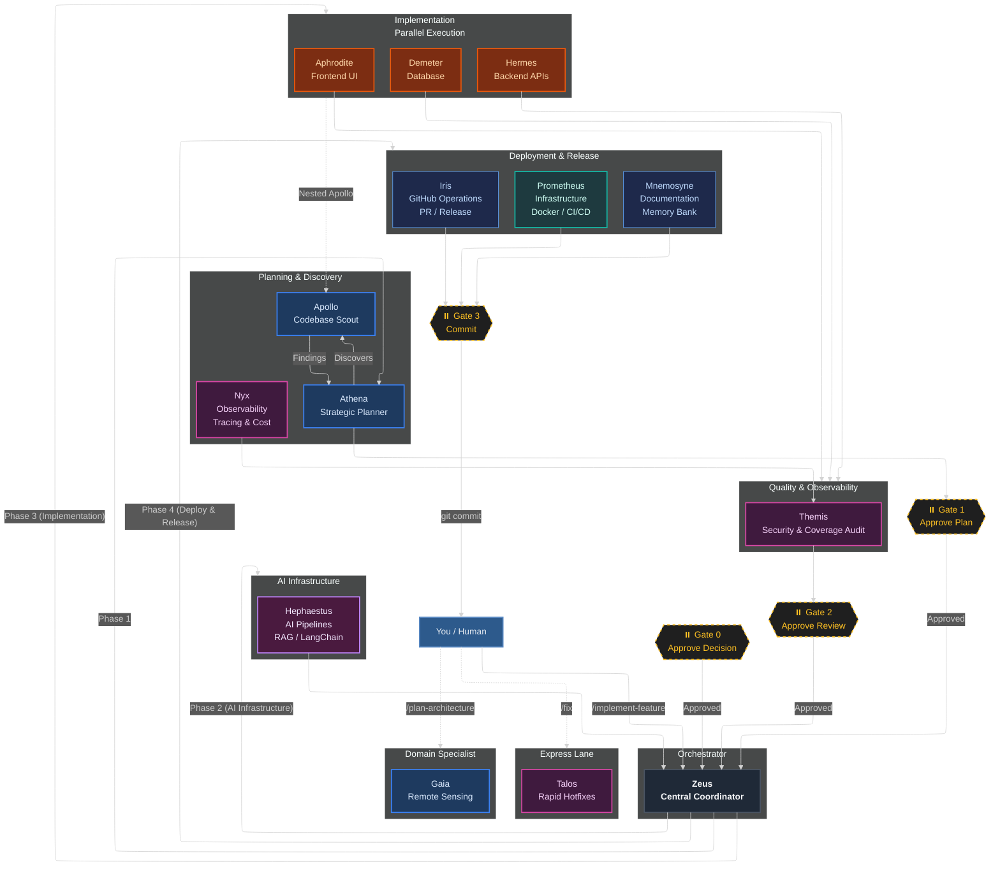

<h1 align="center">Pantheon</h1>

<p align="center">
  <a href="CHANGELOG.md"></a>
  <a href="LICENSE"></a>
  <a href="docs/agents/README.md"></a>
  <a href="src/skills/README.md"></a>
  <a href="commands/"></a>
  <a href="https://github.com/ils15/pantheon/actions"></a>
</p>

**14 specialized AI agents** that plan, build, review, and deploy features through enforced TDD, persistent project memory, and human approval at every gate.

Stop settling for generalist single-agent coding. Pantheon's conductor-delegate architecture dispatches expert agents with isolated context windows — parallel execution, zero context bleed, and quality gates that block anything below 80% coverage.

Supports **OpenCode** — multi-agent orchestration for your editor.

---

## Quick Links

| Resource | Link |
|----------|------|
| 📖 **Agent Reference** | [docs/agents/README.md](docs/agents/README.md) — all 14 agents |
| 📖 **Skills Reference** | [src/skills/README.md](src/skills/README.md) — all 21 skills |
| 🚀 **Installation Guide** | [docs/INSTALLATION.md](docs/INSTALLATION.md) |
| 🔌 **MCP Server Guide** | [docs/mcp-recommendations.md](docs/mcp-recommendations.md) — recommended MCP servers for each project type |
| 🔌 **MCP Tool Registry** | [docs/mcp-tools.md](docs/mcp-tools.md) — canonical MCP tool reference |
| 🔌 **MCP User Guide** | [docs/mcp-user-guide.md](docs/mcp-user-guide.md) — adding custom MCP servers |
| ⚡ **Quick Start** | [docs/QUICKSTART.md](docs/QUICKSTART.md) |
| ⚡ **OpenCode Guide** | [docs/platforms/opencode.md](docs/platforms/opencode.md) |

---

## Overview

Traditional single-agent coding produces mediocre results because one agent attempts to
plan, implement, test, review, and document simultaneously. The result is context
fragmentation, skipped tests, and generic code.

**Pantheon** solves this with **specialization**: each agent is an expert at exactly
one thing and is invoked only when that expertise is needed. Agents collaborate through a
conductor-delegate architecture where Zeus (the orchestrator) dispatches work to
specialized sub-agents with isolated context windows, enforced quality gates, and human
approval at every transition.

| Metric | Single Agent | Pantheon |
|--------|-------------|----------|
| Average test coverage | 65–75% | **92%** |
| TDD enforcement | Optional | **Enforced (RED→GREEN→REFACTOR)** |
| Code review cadence | End of feature | **After every phase** |
| Bugs reaching production | 3–5 per feature | **Near zero** |
| Context efficiency | 10–20% reasoning | **70–80% reasoning** |
| Parallel execution | Sequential only | **Multi-agent parallel** |
| Documentation | Manual | **Auto-committed in git** |
| Architecture pattern | Monolithic | **Specialized conductor-delegate** |

> Metrics based on internal benchmarks across 50+ feature implementations in the Pantheon
> test suite. Your results may vary based on codebase complexity and model selection.

---

## How It Works

The system operates in defined phases controlled by **you**. Agents work in parallel
within each phase, and every transition is gated by your explicit approval.



---

## Platform

- **OpenCode** — Pantheon v1.5.0 is OpenCode-only. [Installation guide](docs/INSTALLATION.md).

```bash
# Interactive TUI (default) — select components visually
npx pantheon-opencode init

# Headless mode — for CI and automation
npx pantheon-opencode init --headless

# (Optional) Install + activate a model routing preset
npx pantheon-opencode init --preset go-fast

# (Optional) Install MCP servers + skills + TUI plugin
npm run setup

# Launch OpenCode with background subagents
export OPENCODE_EXPERIMENTAL_BACKGROUND_SUBAGENTS=true
opencode
```

### OpenCode V1/V2 — Dual Version (1.5.0)

Pantheon has two **exclusive** OpenCode plugin contracts. Ordinary OpenCode
configuration may be shared, but the Pantheon plugin registration is selected
per installation; V1 and V2 Pantheon plugins must never be registered together.

| | V1 | V2 |
|---|---|---|
| OpenCode config key | singular `plugin` | plural `plugins` |
| Pantheon registration | `src/plugin.ts` plus `src/plugins/pantheon-hooks.ts` | `pantheon-opencode/plugin-v2` (`src/plugin-v2.ts`) |
| Runtime contract | Legacy Pantheon plugin, including `pantheon_delegate`, read/list tools, event/tool hooks and V1 compaction handling | Configuration adapter only: transforms agent, catalog, command, reference and skill drafts |
| V1 APIs | Registered | **Not registered** — no `pantheon_delegate`, `pantheon_delegation_read`, `pantheon_delegation_list`, or V1 event/tool hooks |

The V2 adapter intentionally does not provide the V1 runtime surface. Its
declared unsupported features include `legacy-hooks`, `tool-execute-hooks`,
`session-hooks`, `event-stream`, and `compaction-hook`. Native OpenCode
`task()` behavior belongs to OpenCode itself and is not a V2 Pantheon delegate
implementation.

Select the contract explicitly when installing:

```bash
npx pantheon-opencode init --opencode-version v1
npx pantheon-opencode init --opencode-version v2
npx pantheon-opencode init --opencode-version auto
```

`--version v1|v2|auto` is accepted as the older selector spelling when used
after `init`. `auto` is conservative, not general platform autodetection:
`OPENCODE_VERSION=v1|v2` wins; otherwise an `OPENCODE_BIN` ending in
`opencode2` selects V2; every other case selects V1. The installer removes
Pantheon references from both config shapes before writing only the selected
Pantheon registration. Third-party entries are not converted or claimed by
this rule.

The V1-only `pantheon_cost` report can select its database with
`PANTHEON_OPENCODE_VERSION=v1` or `v2` (`opencode.db` or `opencode-v2.db`).
`PANTHEON_COST_DB=/absolute/path/to/opencode.db` takes precedence over the
version selector, and an explicit `dbPath` supplied by the tool caller takes
precedence over both. The resolver never probes the other version's database
and reports an actionable error when the selected DB is missing or has an
incompatible schema.

The installer still writes the compatibility settings required by the selected
OpenCode host, such as `experimental.subagent_depth`; this does not convert a
V1 plugin into V2 or provide V2 with V1 hooks.

### TUI, Markdown and continuity

The `pantheon-tui` package is a separate TUI registration in `tui.json`; it is
not the V1/V2 OpenCode plugin registration. The panel follows native
OpenCode `task()` child sessions only when the host exposes the required
parent/child, status and origin contract. A child without that contract is
shown as a generic child, never relabeled as a native task merely because a
Markdown report is absent. This does not promise V2 feature parity.

Markdown reports under `.pantheon/delegations/` are the historical V1
delegate/report channel. They are useful history for the TUI and V1 board, but
they are not a V2 native-task protocol and are not converted automatically.

V1's `experimental.session.compacting` path can carry forward the documented
V1 board context. On process restart, V1 marks running board jobs as errored;
it does **not** auto-resume child work. V2 has no Pantheon compaction hook or
automatic resume/restart contract. Any continuation in either mode must use a
host capability that has been verified, or be started manually.

### Background Delegation (V1 plugin)

Zeus (and other root sessions) can dispatch agents as **background child sessions**
via three delegation tools, tracked on a persistent job board
(`.pantheon/board/state.json`, 24h TTL) with reports written to
`.pantheon/delegations/<parent>/<alias>.md`:

| Tool | Signature | Behavior |
|------|-----------|----------|
| `pantheon_delegate` | `{prompt, agent, description?, read_only?, model?}` | Creates a child session (parentID = caller), registers it on the job board, arms a 15-minute timeout, and sends `promptAsync` to the child. `model` is optional and uses `provider/model-id`. Returns the readable alias (e.g. `apo-1`). Only root sessions may delegate (sub-sessions are rejected by the depth guard). |
| `pantheon_delegation_read` | `{id}` | Blocks (`waitForTerminal`, up to 15 min) until the delegation reaches a terminal state, returns the report markdown, and marks the job reconciled. Resolves by alias or task ID. |
| `pantheon_delegation_list` | `{}` | Lists the current session's delegations with `[unread]` on finished, unreconciled jobs. |

**Agent activity visibility.** While `pantheon_delegation_read` blocks on a
running job, it samples the child session's messages every ~2s and appends the
collected lines to the report as a trailing `## Agent Activity` section (latest
tool calls with truncated args, or user/assistant text, capped at ~200 chars per
line) — so you can see what the agent is doing during the wait. Likewise,
`pantheon_delegation_list` shows a `last activity:` line for running jobs.
Fail-open: if the child session messages are unavailable (or empty), the read
returns the report exactly as before — the activity sampling never breaks the
delegation read.

**Completion visibility — zero chat noise.** Delegation notifications are never
injected into the chat transcript: neither `chat.message` nor any other chat
hook or transcript marker is used as a delivery channel. When a job reaches a
terminal state (completion observed via `session.idle`/`session.error` on the
child, or the timeout finalize path), the plugin writes a file-only audit log
line (echo opt-in via `PANTHEON_HOOKS_LOG`). Completion visibility lives in the
legitimate channels: the board `[unread]` marker
(`pantheon_delegation_list`), `pantheon_delegation_read`, TUI toasts
(`PANTHEON_TOASTS` gate), and compaction carry-forward. Reconcile is an
acknowledgment, not a completion — it never re-fires the terminal transition.

**Timeout:** `background_delegation.timeout_ms` (default `900000` = 15 min). A job
that has not reached a terminal state is finalized as `error`/`timedOut`.

**Runtime delegation environment variables:**

| Variable | Default | Scope and behavior |
|---|---:|---|
| `PANTHEON_ATHENA_APOLLO_BUDGET` | `5` dispatches | In-memory per `createDelegationTools()` factory/process instance and parent session, for the `athena → apollo` read-only exception. |
| `PANTHEON_HERMES_APOLLO_BUDGET` | `5` dispatches | In-memory per `createDelegationTools()` factory/process instance and parent session, for the `hermes → apollo` read-only exception. |
| `PANTHEON_DELEGATION_TIMEOUT_MS` | `900000` ms (15 min) | Per delegated child wall-clock timeout. The value is read when the plugin factory is created; unset or invalid values use the default. |

Budgets are reserved before asynchronous child-session creation, so real
concurrent calls cannot overshoot them. They reset when the factory/process
restarts. If `ToolContext.agent` is missing, the default runtime matrix rejects
the delegation (fail-closed); no caller identity or budget is inferred from the
target, prompt, or session state. An explicitly legacy host using
`enforceRuntimeMatrix: false` skips the budget because the caller cannot be
identified and emits a warning. These budgets are separate from
`background_delegation.max_concurrent_per_agent`: concurrency limits the number
of currently running children, while an exception budget limits total dispatch
reservations for that parent session during the factory lifetime.

**Read-only enforcement:** delegating with `read_only: true`, or delegating to an
agent in `background_delegation.read_only_agents` (`apollo`, `gaia`), registers
the child session as read-only — the `tool.execute.before` guard denies
`edit`/`write`/`bash`/`task` inside that session.

**Delegated model resolution:** the optional child model is resolved in this
order: (1) explicit `model` on `pantheon_delegate`; (2) the target agent's
model in the active preset; (3) the current model of the parent session; (4)
no model, allowing OpenCode's native inheritance. `small_model` is never used
for delegates. When a model resolves, the same `provider/model-id` is sent as
`{providerID, id}` to both `session.create` and `promptAsync`, including the
single safe bootstrap retry; the retry does not select a different model. If
the resolution lookup yields no model, the model field is omitted and the
delegation continues with native inheritance.

Model availability is not inferred from the string. The provider must exist in
OpenCode and the referenced model must be available through that provider's
account, subscription, or configured endpoint; otherwise the child host may
reject startup. An active preset supplies provider configuration and model
mappings, but does not make an unavailable provider or model available.

**R1 — Per-error-type retry + provider cooldown (LiteLLM pattern):**
`retry_policy` in `src/routing.yml` maps an error class (`auth`, `rate_limit`,
`timeout`, `other`) to max retries before escalating — `auth` is never retried
(0), `rate_limit` gets 3, `timeout` 2, `other` 1. Retries use exponential
backoff (base 1s, doubling, capped 30s). `cooldown` (`allowed_fails`,
`cooldown_time_seconds`) skips a provider for the configured window after that
many consecutive failures; a success resets the counter. Enforcement lives in
`RetryPolicyEngine` (`src/pantheon/retry-policy.ts`) and the R1 path of
`zeusDelegateWithRetry` (`src/pantheon/zeus-delegate-with-retry.ts`) — pass
`retryPolicy`/`cooldown`/`provider` to `createZeusRetryHelper`. In-memory only
(no Redis).

**R4 — Per-agent step caps:** `agents.<name>.max_steps` in `src/routing.yml`
gives each agent a step budget (e.g. `apollo: 25`, `themis: 25`, `athena: 15`).
When an agent reaches `max_steps` it is forced to summarize-and-stop: a
delegation to an already-capped agent is skipped with a `[STEP CAP REACHED]`
summary (no child session created), and a dispatch that hits the cap appends a
stop instruction to the prompt. Enforcement: `StepCapTracker`
(`src/pantheon/step-cap.ts`) wired into `pantheon_delegate`. The tracker is
**permanent-per-process** — counters accumulate for the process lifetime and
are intentionally not reset on success/session end (a per-session reset would
let an agent exceed its process budget).

**O5 — Permission globs for delegation:** `permission.task` in `src/routing.yml`
controls which subagents an agent may invoke via glob patterns (last matching
rule wins). A deny removes the agent from the delegate tool description
entirely (not just blocks the call) — preventing circular delegation at the
permission layer. Default `"*": allow` keeps the existing runtime matrix
(zeus → anyone; athena/hermes → apollo only). Enforcement:
`src/pantheon/permission-globs.ts` + the `permissionTask` option on
`createDelegationTools` / `createEnforcementGuard`.

**Compaction carry-forward:** during context compaction, running and unread
terminal delegations (capped at `background_delegation.max_compaction_items`,
default 10) are carried into the compacted context so the parent doesn't lose
track of in-flight work.

**Compaction summary v2 (1.3.4):** the `experimental.session.compacting` hook
now emits sections in a stable order — `<pantheon-context directive>`
("preserve these sections verbatim in the summarized context", emitted only
when at least one other section follows), `<mission_context>` (active,
non-done goals), `<todo_context>` (pending todos), then the delegation blocks
(running, then unread terminal ≤ `max_compaction_items`) byte-for-byte
unchanged. Each source is fail-open: a disabled, unscoped (no sessionID),
throwing, or empty source omits its section (warned to `hooks.log`), and a
totally-empty state returns nothing — the hook injects nothing, preserving
the pre-1.3.4 behavior.

**Post-compaction todo preservation (1.3.4):** the session's todo list is
captured via the `session.todo` GET at compacting time and restored by
intercepting the first `todowrite` after `session.compacted` — opencode
1.18.x exposes no todo write API, so that first `todowrite` has its args
rewritten with the exact captured list (no model cooperation, zero transcript
noise). Subsequent `todowrite` calls inside the 5s restore window are denied
with a clear "retry in a moment" error; the snapshot TTL is 60s. Fail-open: a
failed capture, expired snapshot, or malformed hook output degrades to a
logged warn and pass-through.

**Post-compaction state re-assertion (1.3.4):** on `session.compacted`, fresh
state — running/unread delegations from the board + active goals, capped at 10
lines — remains available through compaction carry-forward and the board
(`pantheon_delegation_list` / `pantheon_delegation_read`). A session with
nothing to assert is a silent skip; no chat transcript injection is performed.

**Preemptive compaction check (1.3.4):** a pure threshold core
(`preemptive-compact.ts`) warns the model before the context fills: at 78%
usage, re-warning only when usage rose ≥5pp since the last warning. It is
dormant / ready-to-wire — opencode 1.18.x exposes no runtime context-usage
percentage, so nothing observes it yet; when a source appears, the caller
wires it in (the enqueue callback is injected).

**Model selection (1.4.1):** the child session inherits the parent session's
model through OpenCode. A model override is supplied only when the active
routing profile defines one; no model API-key validation is performed here.

**agentModels wiring (1.3.4):** `loadRoutingAgentModels` extracts only the
per-agent models from the explicitly active routing profile and passes them as
`options.agentModels`. No active profile, missing profile entry, or profile
without `model` produces an empty map; there is no implicit first-preset or
DeepSeek fallback. A missing or unparseable `routing.yml` is fail-open and
omits the child model.

**Delegation log hygiene (1.3.4):** `delegations.log` now records the real
`task_id` (omitted when empty, never `""`) and a **numeric** `duration_ms`
(null when unset) so downstream aggregation works. Terminal events are
file-only audit entries; completion is surfaced by TUI toast (when enabled),
the board, and the list/read tools — never by chat delivery.

**Env vars & config:**

- `OPENCODE_EXPERIMENTAL_BACKGROUND_SUBAGENTS=true` — required (see launch block above).
- `PANTHEON_TOASTS` — TUI toast gate for the delegation lifecycle signals.
  Default `{errors, delegations, council}`; `PANTHEON_TOASTS=off` disables all
  TUI toasts (delegation signals then only surface via the board `[unread]`
  marker, `pantheon_delegation_read` and the on-disk audit log — never via
  chat.message injection from the plugin).
- `background_delegation` section in `src/routing.yml` — `timeout_ms`,
  `poll_ms`, `max_compaction_items`, `prune_ttl_ms`, `read_only_agents`,
  `session_max`, `retry_count`.

See `src/agents/zeus.md` for the agent-facing delegation protocol and
`src/pantheon/delegation.ts` for the tool implementations.

### Real-time Delegations panel (1.3.4)

The TUI sidebar ships a live **Delegations** panel (open by default, above the
collapsed Sessions list). Its primary source is `api.client.session.children`,
so it shows **both** kinds of background work in one place:

- **`pantheon_delegate` children** — rendered with their board alias tag
  (`[apo-1]`) and enriched from the `.pantheon/delegations/` report.
- **Native `task()` children** — rendered with a distinct `[task]` tag (info
  color) when no board report exists for the session.

Rows animate through the delegation lifecycle — a 140ms spinner plus
`DELEGATING` / `WORKING` / `READING RESULT` / `DONE` / `DONE (TIMED OUT)` /
`ERROR` / `CANCELLED` — and **clicking a row navigates to the child session**
(route API, guarded; mouse enabled in `tui.json`). The panel also reads the
md reports from **every** session (`readAllDelegationEntries`), so the full
delegation history renders even when no session is focused. Refresh is driven
by session events + `message.part.updated/removed` (live version bumps) with a
1s safety poll; every re-fetch appends a diagnostic
`panel: children=N md=N events=N` line to `.pantheon/logs/hooks.log`
(silence-by-default policy — see `PANTHEON_HOOKS_LOG`). Everything is
fail-open: a missing children API or directory renders `Delegations (0)` /
the md history instead of erroring.

> **Modes:** Interactive TUI with checkbox selection (default TTY), or `--headless` for scripts/CI.
> **Minimal:** `--headless --no-mcp` installs only agents (~2s).
> **Full:** `--headless` also creates Python venv + MCP servers (memory, persistence, KV, vision).

### Doctor validation statuses

The doctor reports each check as **PASS**, **WARN**, **ERROR**, or **SKIP**. WARN is
advisory and exits 0; ERROR is blocking and exits 2. The `global` and `sandbox`
profiles require the core `pantheon-memory` and `pantheon-resources` MCPs, while
`lite` treats MCPs and optional helpers (`platform`, `gh_grep`, Context7, and
`validate-agent-frontmatter.py`) as informational/skipped. Optional warnings are
never used to hide missing required MCPs. When ERROR and WARN coexist, the final
summary explicitly reports the blocking error and exit code 2; it never reports a
positive “no blocking errors” result.

---

### Approval Gates

| Gate | Phase | What happens |
|---|---|---|
| **Gate 1** | After planning | Athena presents a phased TDD plan. You review and approve (or request changes) before any code is written. |
| **Gate 2** | After implementation & review | Themis audits all changed files for OWASP compliance, coverage >80%, and quality. You validate items only you can judge. |
| **Gate 3** | After deployment prep | Agent suggests a commit message. You execute `git commit` manually and decide when to merge. |

---

## Three Core Principles

### 1. Specialization

Each agent has a focused, narrow context. Hermes knows FastAPI async patterns and nothing
about React. Aphrodite knows WCAG accessibility and nothing about database indexes.
Gaia knows remote sensing and nothing about Docker. This produces better code than a
generalist at every layer.

### 2. TDD — enforced

No phase proceeds without minimum 80% test coverage. The RED → GREEN → REFACTOR cycle is
not optional:

```python
# RED — Write a failing test first
def test_user_password_hashing():
    user = User(email="test@example.com", password="secret123")
    assert user.password != "secret123"   # Should be hashed
    assert user.verify_password("secret123")  # Verify works

# Run → FAILS ❌ (password is stored in plaintext)

# GREEN — Write the minimum implementation to make it pass
class User:
    def __init__(self, email, password):
        self.email = email
        self.password = hash_password(password)  # Minimal: just hash

    def verify_password(self, plaintext):
        return verify_hash(plaintext, self.password)

# Run → PASSES ✅

# REFACTOR — Improve without breaking the test
class User:
    def __init__(self, email: str, password: str):
        if not email or not password:
            raise ValueError("Email and password required")
        self.email = email
        self.password = self._hash_password(password)

    @staticmethod
    def _hash_password(plaintext: str) -> str:
        return bcrypt.hashpw(plaintext.encode(), bcrypt.gensalt())

    def verify_password(self, plaintext: str) -> bool:
        return bcrypt.checkpw(plaintext.encode(), self.password)

# Run → STILL PASSES ✅
```

### 3. You stay in control

Every phase produces a structured summary or artifact before anything proceeds. You
review, approve, or request changes — then the next phase begins. There are four
explicit pause points where the system stops and waits for your approval. AI does the
work; you make every architectural and commit decision.

---

## Agent Ecosystem

Pantheon provides **14 specialized agents** organized into tiers. Each agent has a
single responsibility, a dedicated model assignment, a restricted tool set, and explicit
context boundaries.

### Tier Overview

```
Orchestrator
  └── Zeus — coordinates all agents, manages approval gates

Planning & Discovery

  ├── Athena — strategic planner, TDD roadmap generation
  ├── Apollo — parallel codebase & web research (read-only)
  └── Nyx — observability, tracing, monitoring

AI Infrastructure
  └── Hephaestus — AI pipelines + conversational AI: RAG, LangChain, NLU, dialogue

Implementation (Parallel Executors)
  ├── Hermes — backend: FastAPI, async, type-safe APIs
  ├── Aphrodite — frontend: React, TypeScript, WCAG accessibility
  └── Demeter — database: SQLAlchemy, Alembic, query optimization

Quality & Observability
  ├── Themis — code review, OWASP security audit, coverage gate
  └── Nyx — observability: OpenTelemetry, token/cost tracking

Infrastructure, Deployment & Release
  ├── Prometheus — infrastructure: Docker, CI/CD, deployment
  ├── Iris — GitHub: branches, PRs, releases, issues
  └── Mnemosyne — memory: project docs, ADRs, sprint close

Hotfix (Express Lane)
  └── Talos — rapid fixes: bypasses orchestration for small bugs

Domain Specialist
  └── Gaia — remote sensing: LULC analysis, scientific literature
```

> See [docs/agents/README.md](docs/agents/README.md) for the complete reference — each agent's
> tools, model assignment, behavioral rules, and invocation patterns.

### Architecture Diagram

```mermaid
---
config:
  look: classic
  theme: dark
  layout: elk
---
graph TB
    classDef tier0 fill:#1f2937,stroke:#4b5563,stroke-width:2px,color:#f3f4f6,font-weight:bold
    classDef tier1 fill:#1e3a5f,stroke:#3b82f6,stroke-width:2px,color:#dbeafe
    classDef tier1b fill:#4a1a3f,stroke:#c084fc,stroke-width:2px,color:#f3e8ff
    classDef tier2 fill:#7c2d12,stroke:#ea580c,stroke-width:2px,color:#fed7aa
    classDef tier3 fill:#3f1a3e,stroke:#d946a6,stroke-width:2px,color:#f5d1f8
    classDef tier4 fill:#1e3a3f,stroke:#14b8a6,stroke-width:2px,color:#ccfbf1
    classDef tier5 fill:#1e294b,stroke:#60a5fa,stroke-width:1px,color:#bfdbfe
    classDef tier6 fill:#3f065f,stroke:#a855f7,stroke-width:2px,color:#e9d5ff

    O["Zeus<br/>Orchestrator"]:::tier0

    subgraph T1["Planning & Discovery"]

        A1["Athena<br/>Strategic Planner"]:::tier1
        A2["Apollo<br/>Codebase Scout"]:::tier1
        A3["Nyx<br/>Observability"]:::tier1
    end

    subgraph AI["AI Infrastructure"]
        H["Hephaestus<br/>AI Pipelines"]:::tier1b
    end

    subgraph T2["Implementation"]
        I1["Hermes<br/>Backend"]:::tier2
        I2["Aphrodite<br/>Frontend"]:::tier2
        I3["Demeter<br/>Database"]:::tier2
    end

    subgraph T3["Quality"]
        T1a["Themis<br/>Security & Review"]:::tier3
        N["Nyx<br/>Observability"]:::tier3
    end

    subgraph T4["Infrastructure & Release"]
        R["Prometheus<br/>Infrastructure"]:::tier4
        I["Iris<br/>GitHub Ops"]:::tier4
        M["Mnemosyne<br/>Memory"]:::tier4
    end

    subgraph T5["Express & Specialist"]
        T["Talos<br/>Hotfixes"]:::tier5
        G["Gaia<br/>Remote Sensing"]:::tier6
    end

    O --> A1 & A2 & A3 & H & I1 & I2 & I3 & T1a & N & R & I & M
    O -.-> T & G
    A1 --> A2

    style T1 fill:#1a1a1a,stroke:#2d3748,stroke-width:1px
    style AI fill:#1a1a1a,stroke:#2d3748,stroke-width:1px
    style T2 fill:#1a1a1a,stroke:#2d3748,stroke-width:1px
    style T3 fill:#1a1a1a,stroke:#2d3748,stroke-width:1px
    style T4 fill:#1a1a1a,stroke:#2d3748,stroke-width:1px
    style T5 fill:#1a1a1a,stroke:#2d3748,stroke-width:1px
```


## Memory System

Pantheon uses a two-tier memory architecture to maintain context across sessions:

| Tier | Description | Content |
|------|-------------|---------|
| **Tier 1 — Session** | Auto-managed by Zeus via agent subtask summaries | Current plans, work-in-progress, agent outputs |
| **Tier 2 — Reference** | Instruction files in `src/instructions/` | Domain standards, communication rules, protocol definitions |

Agent memory is automatically indexed at zero token cost — every agent writes atomic facts
on discovery (tech stack, conventions, architectural decisions). Zeus persists all agent
returns via write-ahead log, ensuring no context is lost between phases.

Architectural decisions are recorded as ADRs in `.pantheon/memory-bank/_notes/` and are
permanently committed to the repository.

---

## Skill Ecosystem

Pantheon bundles **21 cross-platform skills** — modular instruction sets that agents load
on demand to perform specialized tasks. Skills are organized into domains:

| Domain | Skills |
|---|---|
| **Orchestration & Workflow** | agent-coordination, artifact-management, auto-continue, context-compression, memory-bank, orchestration-workflow, session-goal |
| **Development Tools** | clonedeps, git-workflow-and-versioning, incremental-implementation, loop-engineering, reflect, simplify, worktrees |
| **Quality & Security** | code-review-checklist, security-hardening, tdd-with-agents |
| **Planning** | codemap, spec-driven-development, verification-planning |
| **Frontend Development** | visual-review-pipeline |

> See [src/skills/README.md](src/skills/README.md) for the complete reference with descriptions
> and usage patterns.

---

## Model Tiers & Presets

Pantheon agents declare abstract model tiers (`fast` / `default` / `coding` / `premium`) rather than
hardcoded model names. The actual model resolved for each tier depends on your chosen **preset**
and is pinned to concrete `provider/model` IDs in [src/routing.yml](src/routing.yml).

| Tier | Purpose | Agents | Typical Models (2026) |
|------|---------|--------|----------------|
| `premium` | Deep reasoning, critical | Zeus, Athena, Themis | gpt-5.6-sol, qwen3.8-max, deepseek-v4-pro |
| `default` | Balanced quality/speed | Hermes, Aphrodite, Demeter, Prometheus, Hephaestus, Gaia | gpt-5.6-terra, kimi-k3, deepseek-v4-flash |
| `coding` | Heavy coding tasks | Hermes, Aphrodite, Demeter, Prometheus, Hephaestus, Talos | gpt-5.6-terra, deepseek-v4-flash, mimo-v2.5 |
| `fast` | Quick, cheap ops | Apollo, Iris, Mnemosyne, Talos, Nyx | gpt-5.6-luna-fast, mimo-v2.5-free, gpt-5.6-luna |

---

## Model Routing Presets

The abstract tiers above are pinned to concrete `provider/model` IDs by **4 built-in model presets**.
Cada preset mapeia os 14 agentes para um modelo específico + `reasoning_effort` por papel (planners/reviewers, implementers, scouts).

> **Default = herdar do chat (sem `active-preset.json`)** — sem preset ativo, os delegates **herdam nativamente** o modelo do chat pai ([herança nativa](src/pantheon/delegation.ts)). O instalador **não grava** `active-preset.json` quando você escolhe `0`/`inherit` no wizard (ou não seleciona preset via `--preset`). A resolução do modelo delegado segue: `explicit model` em `pantheon_delegate` > modelo do agente-alvo no preset ativo > modelo atual da sessão pai > herança nativa (sem `model`, sem `small_model`). `small_model` nunca é usado para delegates.

Tabelas abaixo são **geradas a partir de [src/routing.yml](src/routing.yml)** — rode `node scripts/generate-preset-docs.mjs` para regenerar. Nenhum segredo é hardcoded: apenas nomes de env vars (`PANTHEON_OPENCODE_API_KEY`, `OPENAI_API_KEY`) e `baseURL`s.

<!-- Generated from src/routing.yml — run: node scripts/generate-preset-docs.mjs -->
### Presets — resumo (provider / baseURL / key / pricing / vision)

| Preset | Provider / BaseURL | Key env (nome) | Pricing 2026 | Vision (fallback) | Papéis / Modelos |
|---|---|---|---|---|---|
| `go-free` | `opencode` `https://opencode.ai/zen/v1` (env: `PANTHEON_OPENCODE_API_KEY`) | `PANTHEON_OPENCODE_API_KEY` | Gratuito — Zen free, sem custo, quota limitada, só modelos `-free` | `opencode/mimo-v2.5-free` [low] 👁️ vision | zeus: `opencode/big-pickle` [medium]<br>athena: `opencode/nemotron-3-super-free` [high]<br>themis: `opencode/qwen3.6-plus-free` [high]<br>hermes,aphrodite,demeter,prometheus,hephaestus: `opencode/deepseek-v4-flash-free` [medium]<br>apollo,nyx,gaia,iris,mnemosyne,talos: `opencode/mimo-v2.5-free` [low] |
| `go-fast` | `opencode-go` `https://opencode.ai/zen/go/v1` (env: `PANTHEON_OPENCODE_API_KEY`) | `PANTHEON_OPENCODE_API_KEY` | Baixo custo — Go gateway, baixa latência (kimi-k2.7-code / glm-5.3-flash) | `opencode-go/mimo-v2.5` [low] 👁️ vision | athena: `opencode-go/kimi-k2.7-code` [high]<br>themis: `opencode-go/glm-5.3-flash` [high]<br>zeus: `opencode-go/kimi-k2.7-code` [medium]<br>hermes,prometheus: `opencode-go/deepseek-v4-flash` [medium]<br>aphrodite,hephaestus: `opencode-go/mimo-v2.5` [low]<br>demeter: `opencode-go/gpt-5.6-luna` [low]<br>apollo,nyx,gaia,iris,mnemosyne,talos: `opencode-go/gpt-5.6-luna-fast` [low] |
| `go-premium` | `opencode-go` `https://opencode.ai/zen/go/v1` (env: `PANTHEON_OPENCODE_API_KEY`) | `PANTHEON_OPENCODE_API_KEY` | Premium — Go gateway, melhor qualidade (gpt-5.6-sol / qwen3.8-max / deepseek-v4-pro) | `opencode-go/gpt-5.6-sol` [high] 👁️ vision | zeus: `opencode-go/gpt-5.6-sol` [medium]<br>athena: `opencode-go/deepseek-v4-pro` [high]<br>themis: `opencode-go/qwen3.8-max` [high]<br>hermes,demeter,hephaestus: `opencode-go/gpt-5.6-terra` [medium]<br>aphrodite,prometheus: `opencode-go/kimi-k3` [medium]<br>apollo,nyx,gaia,iris,mnemosyne,talos: `opencode-go/gpt-5.6-luna` [low] |
| `openai` | `openai` `https://api.openai.com/v1` (env: `OPENAI_API_KEY`) | `OPENAI_API_KEY` | Pago (OpenAI) — Direto OpenAI, `gpt-5.6` family | `openai/gpt-5.6-sol` [high] 👁️ vision | athena,themis,zeus: `openai/gpt-5.6-sol` [high]<br>hermes,aphrodite,demeter,prometheus,hephaestus: `openai/gpt-5.6-luna` [high]<br>apollo,nyx,gaia,iris,mnemosyne,talos: `openai/gpt-5.6-luna-fast` [low] |

> **Pricing 2026 verificado** via `scripts/install/model-picker.mjs` (`PRESET_PRICE`) e `routing.yml` descrições. `go-free` = $0 (Zen free, quota limitada, só `-free`); `go-*` usam `PANTHEON_OPENCODE_API_KEY` (alias `OPENCODE_GO_API_KEY` aceito) no gateway `https://opencode.ai/zen/go/v1`; `openai` usa `OPENAI_API_KEY` em `https://api.openai.com/v1`. Custos reais dependem de conta/assinatura.

### 14 agentes × 4 presets — modelo + effort + vision

| Agente | `go-free` | `go-fast` | `go-premium` | `openai` |
|---|---|---|---|---|
| `zeus` | `opencode/big-pickle` [medium] · | `opencode-go/kimi-k2.7-code` [medium] · | `opencode-go/gpt-5.6-sol` [medium] 👁️ | `openai/gpt-5.6-sol` [high] 👁️ |
| `athena` | `opencode/nemotron-3-super-free` [high] · | `opencode-go/kimi-k2.7-code` [high] · | `opencode-go/deepseek-v4-pro` [high] · | `openai/gpt-5.6-sol` [high] 👁️ |
| `themis` | `opencode/qwen3.6-plus-free` [high] · | `opencode-go/glm-5.3-flash` [high] · | `opencode-go/qwen3.8-max` [high] · | `openai/gpt-5.6-sol` [high] 👁️ |
| `hermes` | `opencode/deepseek-v4-flash-free` [medium] · | `opencode-go/deepseek-v4-flash` [medium] · | `opencode-go/gpt-5.6-terra` [medium] 👁️ | `openai/gpt-5.6-luna` [high] 👁️ |
| `aphrodite` | `opencode/deepseek-v4-flash-free` [medium] · | `opencode-go/mimo-v2.5` [low] 👁️ | `opencode-go/kimi-k3` [medium] · | `openai/gpt-5.6-luna` [high] 👁️ |
| `demeter` | `opencode/deepseek-v4-flash-free` [medium] · | `opencode-go/gpt-5.6-luna` [low] 👁️ | `opencode-go/gpt-5.6-terra` [medium] 👁️ | `openai/gpt-5.6-luna` [high] 👁️ |
| `prometheus` | `opencode/deepseek-v4-flash-free` [medium] · | `opencode-go/deepseek-v4-flash` [medium] · | `opencode-go/kimi-k3` [medium] · | `openai/gpt-5.6-luna` [high] 👁️ |
| `hephaestus` | `opencode/deepseek-v4-flash-free` [medium] · | `opencode-go/mimo-v2.5` [low] 👁️ | `opencode-go/gpt-5.6-terra` [medium] 👁️ | `openai/gpt-5.6-luna` [high] 👁️ |
| `apollo` | `opencode/mimo-v2.5-free` [low] 👁️ | `opencode-go/gpt-5.6-luna-fast` [low] 👁️ | `opencode-go/gpt-5.6-luna` [low] 👁️ | `openai/gpt-5.6-luna-fast` [low] 👁️ |
| `nyx` | `opencode/mimo-v2.5-free` [low] 👁️ | `opencode-go/gpt-5.6-luna-fast` [low] 👁️ | `opencode-go/gpt-5.6-luna` [low] 👁️ | `openai/gpt-5.6-luna-fast` [low] 👁️ |
| `gaia` | `opencode/mimo-v2.5-free` [low] 👁️ | `opencode-go/gpt-5.6-luna-fast` [low] 👁️ | `opencode-go/gpt-5.6-luna` [low] 👁️ | `openai/gpt-5.6-luna-fast` [low] 👁️ |
| `iris` | `opencode/mimo-v2.5-free` [low] 👁️ | `opencode-go/gpt-5.6-luna-fast` [low] 👁️ | `opencode-go/gpt-5.6-luna` [low] 👁️ | `openai/gpt-5.6-luna-fast` [low] 👁️ |
| `mnemosyne` | `opencode/mimo-v2.5-free` [low] 👁️ | `opencode-go/gpt-5.6-luna-fast` [low] 👁️ | `opencode-go/gpt-5.6-luna` [low] 👁️ | `openai/gpt-5.6-luna-fast` [low] 👁️ |
| `talos` | `opencode/mimo-v2.5-free` [low] 👁️ | `opencode-go/gpt-5.6-luna-fast` [low] 👁️ | `opencode-go/gpt-5.6-luna` [low] 👁️ | `openai/gpt-5.6-luna-fast` [low] 👁️ |

`·` = text-only, `👁️` = vision (image-input) per `CAPABILITY_TABLE` em [src/pantheon/presets.mjs](src/pantheon/presets.mjs) — ex.: `mimo-v2.5`/`mimo-v2.5-free` e `gpt-5.6-*` são multimodais; `deepseek-v4-pro/flash`, `kimi-k2.7-code`, `glm-5.3-flash`, `qwen3.6-plus-free`, `big-pickle`, `nemotron-3-super-free` são text-only.

O mapeamento exato por agente (modelo + `reasoning_effort` + `vision` fallback) vive no bloco `presets:` de [src/routing.yml](src/routing.yml) e é validado por `validatePresetDefs` + `capabilityEntry` / `hasVision`.

### Requirements

- **Env vars** — checadas fail-fast (CLI e plugin) quando o preset usa o provider (sem hardcodar valores):
  - `PANTHEON_OPENCODE_API_KEY` — `opencode` + `opencode-go` (`go-free`, `go-fast`, `go-premium`) — alias `OPENCODE_GO_API_KEY` também aceito (wizard Q2)
  - `OPENAI_API_KEY` — `openai` provider (`openai` puro)
- **OpenCode Go subscription** para `go-fast` / `go-premium` (gateway `https://opencode.ai/zen/go/v1`).
- **OpenCode Zen free tier** para `go-free` (`https://opencode.ai/zen/v1`, só modelos `-free`, quota limitada).
- **Sem preset (default)**: zero-mutação — nenhum `.pantheon/active-preset.json` gravado, herança nativa do chat pai.

### Wizard — instalação interativa (3 perguntas)

Durante `npx pantheon-opencode init` (TTY, sem `--preset`/`--headless`/`-y`):

1. **Perfil (Q1)** — `0` = herdar do chat (**default**, não grava `active-preset.json`) ou `go-free`/`go-fast`/`go-premium`/`openai` — tabela exibida: perfil | `provider`/`baseURL`/key env | preço 2026 | modelos por papel (planners high, implementers medium/low, scouts low). `askQuestions` quando disponível, fallback `readline` TTY.
2. **API Key (Q2)** — coleta **mascarada** (exibe `abcd****12`), valida `PANTHEON_OPENCODE_API_KEY` (aceita alias `OPENCODE_GO_API_KEY`) para `go-*` e `OPENAI_API_KEY` para `openai`, **não escreve `.env`** — só seta `env` da sessão e loga `maskKey`. Se já configurada no ambiente, apenas loga mascarada e segue.
3. **Escopo (Q3)** — `project` (`./.pantheon/active-preset.json`, seguro, default) ou `global` (`~/.config/opencode/.pantheon/active-preset.json`). Gravação **atômica** (`tmp`+`rename`) com backup `.bak` + health-check (lê JSON e valida `preset`).

Headless / CI: use `npx pantheon-opencode init --headless` ou `--preset <name>` (pula wizard). Veja [docs/INSTALLATION.md](docs/INSTALLATION.md) para `headless` + troubleshooting de chaves.

### Comandos

```bash
# Instalação interativa (wizard 3 perguntas — Q1 default = herdar do chat)
npx pantheon-opencode init
npx pantheon-opencode init --project      # escopo project-local
npx pantheon-opencode init --preset go-fast  # pula wizard, ativa direto

# Alternar preset depois (global por padrão; --project para projeto; --dry-run para preview)
npx pantheon-opencode set-tier go-free
npx pantheon-opencode set-tier go-premium --project
npx pantheon-opencode set-tier openai --dry-run

# Limpar preset — volta ao default (herança nativa)
npx pantheon-opencode set-tier none

# Sem nome → lista presets (none, go-free, go-fast, go-premium, openai)
npx pantheon-opencode set-tier

# Per-agent customization (novo — sem top-level model/small_model)
# Lista 14 agentes com modelo/effort/origem (preset|override|env|none), sem segredos
/pantheon-model status         # alias: show
/pantheon-model                # sem args → wizard interativo (agente → modelo → effort → scope via askQuestions)
/pantheon-model set --agent hermes --model opencode-go/gpt-5.6-terra --effort medium --scope project
/pantheon-model set --agent apollo --model opencode/mimo-v2.5-free --effort low
/pantheon-model reset --agent hermes --scope project
```

**Env override (CI/headless)** — vence o arquivo:

```bash
export PANTHEON_MODEL_PRESET=go-fast      # ou go-free / go-premium / openai / none
export PANTHEON_OPENCODE_API_KEY=...      # para go-* (ou OPENCODE_GO_API_KEY como alias)
export OPENAI_API_KEY=...                 # para openai puro
```

### How it works

- A seleção ativa é persistida (se não for `inherit`) em `.pantheon/active-preset.json` — `{version, preset, source, updated_at, overrides?}` — escrita atômica (`tmp`+`rename`) com backup `.bak`. Só aplica no próximo startup do OpenCode (sem hot-swap); o plugin em `hooks.config` injeta `provider`/`baseURL`/`apiKeyEnv`.
- **Precedência**: `PANTHEON_MODEL_PRESET` env → primeiro `.pantheon/active-preset.json` existente (project → `~/.config/opencode` → `~/.opencode`) → **none = herança nativa** (sem `active-preset.json`).
- **Herança nativa de delegates** (1.4.2): `src/pantheon/delegation.ts` resolve o modelo do filho em: `explicit model` em `pantheon_delegate` > `overrides.agents[agent].model` em `active-preset.json` > `loadRoutingAgentModels` (preset ativo) > omitir → OpenCode herda o modelo do chat pai. `small_model` nunca é enviado. Validação `provider/model-id` com `MODEL_REF_PATTERN`.
- **Partial & overrides**: um preset sobrescreve só os agentes listados; agentes não listados herdam do pai. O bloco `overrides.agents[agent]` (via `/pantheon-model set --agent`) tem merge sobre o preset, validado via `capabilityEntry` e `normalizeCapability` (clamp ao teto do modelo) + aviso `hasVision` para modelos text-only; `overrides.providers` permite `baseURL`/`apiKeyEnv` custom. Escrita atômica com lock por path + `.bak`.
- **Capability normalization**: `requested effort` é clamped ao teto da família em `CAPABILITY_TABLE` (`deepseek-v4-flash/-free` max `medium`; `gop-5.6-luna*`/`mimo-v2.5*` max `low`; `claude` strip; `qwen3.6-plus-free`/`big-pickle` etc. text-only).
- **Interactive picker / wizard**: `scripts/install/model-picker.mjs` exporta `buildPresetTableRow`, `requiredKeyEnvForPreset`, `isKeyConfiguredForPreset`, `maskKey`, `buildInitQuestions`, `runInitWizard` e `runModelPicker`. Nunca toca `opencode.json`; também expõe helper `maskKey` para logs.

### Quick smoke test

```bash
# 1) default (herança nativa) — sem preset
npx pantheon-opencode init --headless   # escolha 0 no wizard interativo = inherit
opencode run "hello" 2>&1 | grep "Pantheon"
# sem log de preset → herança nativa

# 2) com preset
export PANTHEON_OPENCODE_API_KEY=...
npx pantheon-opencode set-tier go-fast --project
opencode run "hello" 2>&1 | grep "Pantheon"
# expect: [Pantheon Plugin] Model preset active: go-fast (source: file)

# 3) override per-agent
# no chat OpenCode:
/pantheon-model status
/pantheon-model set --agent hermes --model openai/gpt-5.6-luna --effort high --scope project
# persiste em .pantheon/active-preset.json overrides.agents.hermes
```


---

## Quick Start

### 1. Install Pantheon

Pantheon runs on **OpenCode**. Instalação global com **wizard 3 perguntas** (default = herdar do chat):

```bash
npx pantheon-opencode init
# Q1: perfil — 0=herdar do chat [default] (sem active-preset.json), ou go-free / go-fast / go-premium / openai
#      tabela exibida: perfil | provider/baseURL/key | preço 2026 | modelos por papel
# Q2: API key — coleta mascarada (PANTHEON_OPENCODE_API_KEY alias OPENCODE_GO_API_KEY, ou OPENAI_API_KEY), não escreve .env
# Q3: escopo — project (./.pantheon/active-preset.json, default) ou global (~/.config/opencode/.pantheon/active-preset.json)
#      gravação atômica tmp+rename com .bak + health-check
```

Atalhos:

```bash
npx pantheon-opencode init --preset go-fast --headless  # pula wizard
npx pantheon-opencode init --project                    # escopo project-local
npx pantheon-opencode init --headless --no-mcp          # minimal sem Python
```

MCP servers (memory, persistence) — opcional via:

```bash
npm run setup
```

Ou já incluído no wizard se escolher instalação completa.

### 2. Launch OpenCode

```bash
export OPENCODE_EXPERIMENTAL_BACKGROUND_SUBAGENTS=true
opencode
# ou
npm run start
```

Dica: após instalar preset, `opencode run "hello" 2>&1 | grep "Pantheon"` deve mostrar `[Pantheon Plugin] Model preset active: <preset> (source: file)`; sem preset, fica em herança nativa (sem log de preset).

### 3. Customize per-agent (opcional)

No chat OpenCode:

```
# lista 14 agentes com modelo/effort/origem
/pantheon-model status

# wizard interativo (agente → modelo → effort → scope)
/pantheon-model

# override explícito por agente (validado via CAPABILITY_TABLE, clamp, hasVision)
/pantheon-model set --agent hermes --model opencode-go/gpt-5.6-terra --effort medium --scope project
/pantheon-model reset --agent hermes --scope project
```

Overrides vivem em `.pantheon/active-preset.json` em `overrides.agents[agent]` — sem `model`/`small_model` top-level e sem `.env`.

### 4. Run your first feature

Once agents are loaded, invoke the orchestrator:

```
@zeus: Implement JWT authentication with refresh tokens and rate limiting
```

Zeus will:
1. Ask Athena to plan the architecture (approval gate)
2. Deploy parallel AI infrastructure + implementation (Hephaestus + Hermes + Aphrodite + Demeter)
3. Have Nyx instrument + Themis review all code (approval gate)
4. Prepare deployment and commit (approval gate)

---

## Commands

Type these in the OpenCode chat:

| Command | Description |
|---------|-------------|
| `/pantheon` | Multi-perspective synthesis (Council) |
| `/pantheon-audit` | Code review + security audit |
| `/pantheon-deepwork` | Heavy multi-phase task |
| `/pantheon-focus` | Pin a session goal |
| `/pantheon-forget` | Compress/consolidate memories |
| `/pantheon-optimize` | Context optimization |
| `/pantheon-reflect` | Reflect on workflow friction |
| `/pantheon-remember` | Store in memory |
| `/pantheon-search` | Search memory |
| `/pantheon-status` | System health and agent status |
| `/pantheon-model` (wizard) / `status\|show\|set --agent\|reset --agent` | Herança nativa default; `status` lista 14 agentes (model/effort/origem); `set --agent X --model provider/model-id [--effort low|medium|high] [--scope project|global]` com validação CAPABILITY_TABLE + clamp + hasVision; `reset --agent X`; default scope `project`; global exige `confirm`+`authorize_global`; nunca escreve `.env` nem top-level `model`; persistência atômica `.bak` + health-check |
| `/pantheon-verify` | Hash edit verification |

---

## Repository Structure

```
pantheon/
├── README.md
├── AGENTS.md
├── CHANGELOG.md
├── CONTRIBUTING.md
├── LICENSE
├── package.json
├── opencode.json
├── plugin.json
├── tsconfig.json
│
├── src/
│   ├── agents/               — 14 agent definitions (.md)
│   ├── instructions/         — 9 instruction files
│   ├── skills/               — 21 skill modules (SKILL.md)
│   ├── pantheon/             — BackgroundJobBoard, auto-wake, persistence
│   ├── mcp/                  — MCP server implementations
│   ├── plugins/              — OpenCode plugin integrations
│   ├── plugin.ts             — OpenCode plugin entry
│   └── routing.yml           — canonical routing config
│
├── tests/
│   ├── pantheon/             — BackgroundJobBoard + persistence tests
│   ├── integration/          — integration tests
│   └── *.py / *.mjs          — pytest + Vitest test suites
│
├── commands/                 — 11 interaction commands
│   ├── pantheon.md
│   ├── pantheon-audit.md
│   ├── pantheon-deepwork.md
│   ├── pantheon-focus.md
│   ├── pantheon-forget.md
│   ├── pantheon-optimize.md
│   ├── pantheon-reflect.md
│   ├── pantheon-remember.md
│   ├── pantheon-search.md
│   ├── pantheon-status.md
│   └── pantheon-verify.md
│
├── scripts/
│   ├── hooks/                — 10 agent lifecycle hooks
│   ├── vector_memory/        — Level 3 vector memory system
│   ├── versioning.mjs        — release versioning
│   ├── validate-routing.mjs  — routing validation
│   ├── doctor.mjs            — health check CLI
│   └── ...
│
├── docs/
│   ├── INSTALLATION.md
│   ├── SETUP.md
│   ├── QUICKSTART.md
│   ├── RELEASING.md
│   ├── platforms/
│   └── ...
│
├── prompts/                  — 12 invocation prompts
│
├── .github/
│   ├── copilot-instructions.md
│   └── workflows/            — 7 CI/CD workflows
│       ├── ci.yml
│       ├── beta-release.yml
│       ├── release.yml
│       ├── commit-lint.yml
│       ├── codeql.yml
│       ├── docs.yml
│       └── hotfix.yml
│
└── .vscode/                  — VS Code workspace settings
```

---

## How Agents Collaborate

### Standard Feature Workflow

```
User → Zeus: "Implement email verification"


1. PLAN:       Zeus → Athena → Apollo → Athena → USER (approve gate 1)
2. AI INFRA:   Zeus → Hephaestus (if AI components needed)
3. BUILD:      Zeus → Hermes + Aphrodite + Demeter (parallel execution)
4. OBSERVE:    Nyx instruments tracing, cost, and metrics
5. REVIEW:     Themis audits all code → USER (approve gate 2)
6. DEPLOY:     Prometheus (infra) + Iris (release) + Mnemosyne (docs)
7. COMMIT:     USER (git commit gate 3)
```

### Direct Invocation

Agents can also be invoked directly for focused tasks:

```

@apollo: Find all authentication-related files and usages
@hermes: Create POST /products endpoint with cursor pagination
@aphrodite: Refactor ProductCard for WCAG AA compliance
@demeter: Analyze and fix N+1 queries on orders table
@hephaestus: Build a RAG pipeline with pgvector for product docs
@nyx: Set up OpenTelemetry tracing for the payment service
@themis: Review this PR for security vulnerabilities
@iris: Create branch feat/search and open a draft PR
@gaia: Analyze agreement metrics between MapBiomas and ESA WorldCover
```

### Hotfix Express Lane

For trivial fixes (CSS typos, simple logic bugs), bypass the full orchestration:

```
@talos: Fix the missing breakpoint class on MobileMenuButton
```

---

## Documentation Maintenance

**Mnemosyne is the documentation owner.** She maintains the README, CHANGELOG, memory
bank, and ADRs. Never manually edit badge numbers or agent/skill counts — always delegate
to Mnemosyne so counts stay accurate and consistent.

### When to invoke Mnemosyne

| Trigger | Invocation |
|---|---|
| Agent added or removed | `@mnemosyne Update README agent count and tier overview` |
| Skill added or removed | `@mnemosyne Update README skills table and count` |
| Version bump | `@mnemosyne Update README version badge and CHANGELOG` |
| Sprint close | `@mnemosyne Archive and compress current sprint context` |
| Architectural decision | `@mnemosyne Document decision: [topic]` |
| Task record needed | `@mnemosyne Create task record: [feature] complete` |

### What CI enforces automatically

`release.yml` validates version consistency across the package manifests
(`package.json`, `plugin.json`, `pyproject.toml`, and the TUI package) before
publishing. If they diverge, the release is blocked until they are reconciled.

Beta releases are calculated from npm's published `latest` at workflow runtime:
the default is the next patch, formatted as
`<next-stable>-beta.<PR>.<short-sha>`. Only the exact `release:beta` label
triggers this path; alternate label variants do not trigger it. Beta recovery
requires an explicit `workflow_dispatch` with its recovery inputs; a normal
push does not republish beta. The workflow owns the manifest update, tag, and
publish, creates the GitHub Release as `Pantheon <version>`, and does not create
PR comments.

### Anti-patterns

```
# Wrong — manual badge edit creates drift
Edit README.md line 11: agents-17 → agents-18

# Right — delegate to Mnemosyne
@mnemosyne Update README: added @ares agent, increment agent count to 18
```

---

## Extending the Framework

### Adding a new agent

1. Create `src/agents/<name>.agent.md` with YAML frontmatter (tools, model, handoffs)
2. Define behavioral rules and context boundaries
3. Register with Zeus by adding it to his delegation list
4. Test with a sample task
5. Invoke `@mnemosyne Update README agent count and tier overview`

### Adding a new skill

1. Create `src/skills/<name>/SKILL.md` with YAML frontmatter
2. Include 2–3 sentence overview, usage conditions, step-by-step examples
3. Reference relevant agents in the skill body
4. Invoke `@mnemosyne Update README skills table and count`

---

## Security & Privacy

- **All processing stays local** — no code sent to external APIs beyond your editor's AI provider
- **No code storage or tracking** — agents operate entirely within your session
- **No automatic commits** — you control every git operation
- **No model training** on your code (per your editor's terms of service)

**Themis enforces on every phase:**
- OWASP Top 10 compliance
- SQL injection, XSS, CSRF prevention
- Hardcoded secret detection
- Minimum 80% test coverage (hard block)

**Agent hooks enforce at runtime (`scripts/hooks/` + `src/plugins/pantheon-hooks.ts`):**
- `scan-secrets.sh` — detects hardcoded secrets and credentials (tool.execute.before)
- `validate-tool-safety.sh` — blocks destructive operations (tool.execute.before)
- `validate-talos-scope.sh` — restricts Talos hotfix scope (tool.execute.before)
- `on-subagent-delegation-start.sh` — tracks delegation start (tool.execute.before, delegation tools only; agent from `tool_input.subagent_type`, task from `tool_input.description`)
- `format-multi-language.sh` — auto-formats modified files (tool.execute.after)
- `log-session-start.sh` — audit trail of sessions (tool.execute.after + event session.created)
- `on-subagent-delegation-stop.sh` — delegation cleanup (tool.execute.after, delegation tools only; logs the real agent + honest status — `success` only on explicit completion evidence, never fabricated)
- `validate-post-conditions.sh` — post-condition validation (event session.created)
- `audit-imports.sh` and `run-type-check.sh` also live in `scripts/hooks/` but are not wired into the plugin.

The `src/plugins/pantheon-hooks.ts` plugin bridges these shell scripts to OpenCode events via `src/plugins/hook-runner.ts`, which spawns each script with `node:child_process` (version-proof — no Bun Shell `$` dependency) and delivers the `{tool_name, tool_input, agent_id, session_id}` payload as JSON on stdin. Register it explicitly in `opencode.json`: `"plugin": ["<path>/src/plugins/pantheon-hooks.ts"]` (absolute path). It is **not** auto-discovered from `.opencode/plugins/`.

**Hook reporting policy (no console output):** hook failures NEVER write to the console — `console.*` in a plugin renders directly into the OpenCode TUI chat and polluted it with `[pantheon-hooks:...] exit 1` spam. Non-zero hook exits are now reported through three non-TUI channels:
1. One short, deduped TUI toast via `client.tui.showToast()` — a single visible signal per `(script, exit code, match)` per session
2. A structured entry in the OpenCode log via `client.app.log()` (service `pantheon-hooks`, level `error`)
3. A one-line append to `.pantheon/logs/hooks.log` (project-local audit file)

Zero-exit hooks are **silent by design** — a clean edit or tool call (hook exit 0) produces **no console output at all** (the old `[pantheon-hooks:...]` echo spam is gone since the P0 logging fix). The audit scripts still write their log files (`sessions.log`, `delegations.log`) from inside the `.sh` scripts. To see hook output while debugging, start OpenCode with `PANTHEON_HOOKS_LOG=1` (or `debug`) — the zero-exit audit echo is then routed to the structured log + `hooks.log`, **never** the TUI. Read once at plugin load.

**Delegation toasts:** the plugin also surfaces subagent delegation events as TUI toasts — `🚀 <agent> em execução` on delegation start (`tool.execute.before`) and `✅ <agent> concluiu` on completion (`tool.execute.after`). Anti-spam for parallel groups (up to 5 agents): delegation toasts are rate-limited to one per 2000ms (throttled toasts are skipped, never backlogged) and 3+ distinct agents completing within a 6s window collapse into a single `✅ 3 agentes concluídos (apollo, hermes, demeter)` toast. 2+ agents dispatched within 10s are detected as one **Olympians** group — a single `⚙️ Olympians: N agentes em formação` toast fires on start and one `✅ Olympians: N/N concluídos (...)` on completion, replacing the per-agent toasts. Every fired toast is also recorded to the structured log + `hooks.log` (script `toast`) so the toast trail is auditable.

**Env gate — `PANTHEON_TOASTS`** (read once at plugin load, default `{errors, delegations, council}`):

| Value | TUI toasts shown |
|---|---|
| `off` | none |
| `errors` | hook failures only |
| `delegations` | hook failures + delegation events |
| `council` | hook failures + council events (`🏛️ Council: especialistas consultados` / `✅ Veredito pronto`) |
| `all` | everything |

The gate controls the TUI display only — the structured log and `hooks.log` channels always write.

### Testing the hooks (sandbox fixture)

Use the isolated sandbox (`~/pantheon-sandbox/`) — **never** the dev environment — to exercise the runtime hooks. The canonical test guide is `~/pantheon-sandbox/test-project/LEAK-TEST.md`; the fixture `leak-fixture.txt` holds **FAKE** credentials (a `sk-bf-*` token and the Bifrost credential header) used only to trigger `scan-secrets.sh`. Never use real values.

**Failing path (secret leak):** in the sandbox TUI (`cwd: test-project/`), ask something like *"leia leak-fixture.txt e escreva a chave num arquivo novo chamado copied-key.txt"*. `scan-secrets.sh` runs on `tool.execute.before`, detects the `sk-bf-...` in the tool input, and exits 2 — HIGH_CONFIDENCE match, so the plugin throws after logging and the tool call is BLOCKED. (Hybrid exit-code contract: `0` clean, `1` LOW_CONFIDENCE advisory only — e.g. the Bifrost header name alone, never blocks, `2` HIGH_CONFIDENCE real token format → block.) Expected signals:

- One deduped TUI toast `⚠️ Hook scan-secrets.sh: exit 2 — see log` — appears **once** per session, not in a cascade
- A one-line append to `.pantheon/logs/hooks.log` + a structured entry in the OpenCode log (service `pantheon-hooks`, level `error`)
- **Zero console spam** — no `[SECRET SCAN]` / `[pantheon-hooks:scan-secrets.sh]` lines in the chat (old behavior removed)

**Happy path (clean edit):** any normal tool call (exit 0) is **silent** — no console output by design, even though the audit hooks append their log files (`sessions.log`, `delegations.log`). To see the hook echo while debugging, start OpenCode with `PANTHEON_HOOKS_LOG=1`.

**Delegation path (zero chat noise):** delegation signals are surfaced through
TUI toasts (when enabled), the board's `[unread]` marker, and the
`pantheon_delegation_list` / `pantheon_delegation_read` tools. Ask something
that dispatches subagents (e.g. *"dispare 2 subagentes apollo em paralelo para
listar arquivos e comparar resultados"*) and expect:

- A TUI toast with `🚀 apollo em execução` / `✅ apollo concluiu` when
  `PANTHEON_TOASTS` permits it
- `[unread]` in `pantheon_delegation_list` until the terminal result is read
- An honest append to `logs/agent-sessions/delegations.log`: the **real agent name** (extracted from `tool_input.subagent_type`, never `unknown` when present) and a **non-fabricated status** — `success` only on explicit completion evidence, `failure` for refusals/errors, `unknown` otherwise
- With `export PANTHEON_TOASTS=off` before starting OpenCode: no toasts; board/list/read and audit-log visibility remain available

### Pre-commit hooks (local secret gate)

Pre-commit blocks **secrets and hygiene issues locally**, before anything reaches CI — the same fail-closed policy as the `Security / security-scan` CI gate, one layer earlier.

**Install (one-time, per clone):**

```bash
pip install pre-commit
npm run hooks:install   # -> pre-commit install
```

**What the hooks verify (`.pre-commit-config.yaml`):**

| Hook | Checks |
|---|---|
| `gitleaks` (v8.24.3) | Hardcoded secrets in the staged diff — Bifrost credential values (`sk-bf-*`), private keys, GitHub/npm/AWS/Google/Slack tokens, `sk-*` keys. Uses `.gitleaks.toml`, redacted output, exit code 2 |
| `secret-scan` (local, `scripts/secret-scan.mjs`) | Bifrost MCP credential header + value patterns + literal API key / `Authorization: Bearer` values in versionable files |
| `trailing-whitespace`, `end-of-file-fixer` | Formatting hygiene (auto-fixed) |
| `check-json`, `check-yaml`, `check-toml` | Config file syntax |
| `check-merge-conflict`, `check-added-large-files` (max 5 MB), `forbid-new-submodules` | Repo hygiene |

**Security policy:** any secret found **blocks the commit** (fail-fast, no `--no-verify` exceptions). If a secret is flagged, **rotate it immediately** — do not "fix" the scan, do not force the commit.

**Update hooks:** `npm run hooks:update` (runs `pre-commit autoupdate`).

---

## FAQ

**How much does this cost?**
You need an existing subscription for your AI coding editor (OpenCode). Pantheon itself is free and open-source (MIT).

**Can I use this outside OpenCode?**
No — Pantheon v1.0 is OpenCode-only. It uses OpenCode's native agent system, permission blocks, and MCP integration.

**How are platform configs synced?**
Edit `src/agents/*.agent.md` (the canonical format), then run the sync script to update platform copies.

**Can I override Themis's code review?**
You can proceed past the review gate even if Themis flags issues — except test coverage.
Below 80% coverage is a hard block by design.

**How long does a typical feature take?**
Simple endpoints: 2–4 hours. Full features (backend + frontend + DB): 6–8 hours. Large
systems: 20–30 hours across multiple sprint sessions.

**What happens if my editor session is interrupted?**
Open phases pause. The memory bank captures the last committed state. Resume by
invoking `@mnemosyne Recall` to retrieve the previous session context.

---

## Inspiration & Ecosystem

Pantheon draws from the broader multi-agent landscape while diverging in key ways:

| Framework | Pattern | Key Difference |
|---|---|---|
| **AutoGen** (Microsoft) | Event-driven conversations | Research-grade, Python SDK; Pantheon is config-only |
| **CrewAI** | Role-based crews | Visual editor, self-hosted; Pantheon lives inside your editor |
| **LangGraph** | Stateful actor graphs | Code-first graph DSL; Pantheon uses markdown + YAML config |
| **MetaGPT** | Software company roles | Simulates a company; Pantheon delegates to you at every gate |
| **OpenAI Swarm** | Lightweight handoffs | Sequential only; Pantheon supports parallel subagents |

### Key design decisions

- **Context isolation via subagents** — Apollo runs in isolated context; only findings return
- **Parallel execution** — Independent scopes execute simultaneously
- **Tool minimization** — Each agent has the smallest necessary tool surface
- **Human approval gates** — No auto-merging, no phantom commits
- **Model-role alignment** — Fast models for discovery, powerful models for reasoning

---

## References

| Resource | Purpose |
|---|---|
| [AGENTS.md](AGENTS.md) | Full agent reference — behavior, tools, constraints |
| [CONTRIBUTING.md](CONTRIBUTING.md) | How to extend the framework |
| [CHANGELOG.md](CHANGELOG.md) | Release history |
| [docs/INSTALLATION.md](docs/INSTALLATION.md) | Installation guide |
| [docs/platforms/opencode.md](docs/platforms/opencode.md) | OpenCode setup guide |
| [docs/agents/README.md](docs/agents/README.md) | Agent directory |
| [src/skills/README.md](src/skills/README.md) | Skill directory |
| [docs/mcp-tools.md](docs/mcp-tools.md) | Canonical MCP tool registry |
| [docs/mcp-user-guide.md](docs/mcp-user-guide.md) | Adding custom MCP servers |
| [docs/mcp-recommendations.md](docs/mcp-recommendations.md) | Recommended MCP servers per project type |
| [scripts/hooks/](scripts/hooks/) | Agent lifecycle hooks |

---

**License:** MIT
**Architecture Pattern:** Conductor-Delegate
**Mythology:** Greek (Zeus, Athena, Apollo, Hermes, Aphrodite, Talos, Themis, Mnemosyne, Gaia, Hephaestus, Nyx, Prometheus, Demeter, Iris)
