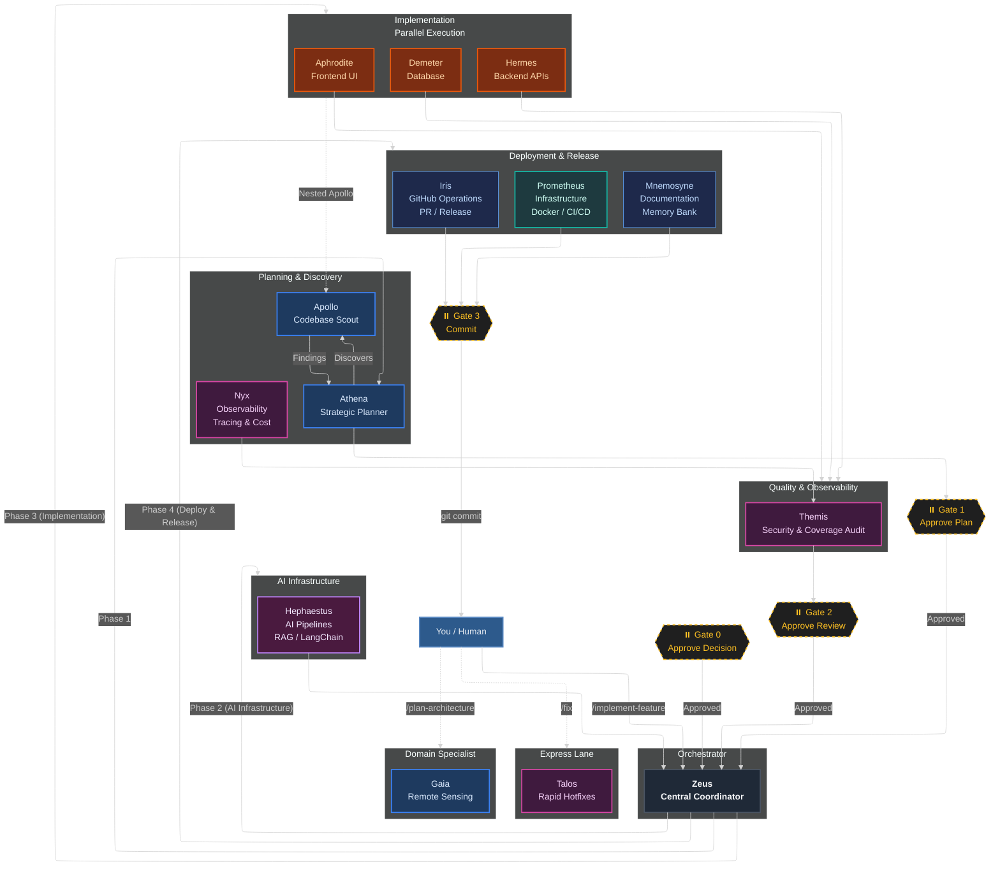

<h1 align="center">Pantheon</h1>

<p align="center">
  <a href="CHANGELOG.md"></a>
  <a href="LICENSE"></a>
  <a href="src/agents/README.md"></a>
  <a href="src/skills/README.md"></a>
  <a href="commands/"></a>
  <a href="https://github.com/ils15/pantheon/actions"></a>
</p>

**14 specialized AI agents** that plan, build, review, and deploy features through enforced TDD, persistent project memory, and human approval at every gate.

Stop settling for generalist single-agent coding. Pantheon's conductor-delegate architecture dispatches expert agents with isolated context windows — parallel execution, zero context bleed, and quality gates that block anything below 80% coverage.

Supports **OpenCode** — multi-agent orchestration for your editor.

---

## Quick Links

| Resource | Link |
|----------|------|
| 📖 **Agent Reference** | [src/agents/README.md](src/agents/README.md) — all 14 agents |
| 📖 **Skills Reference** | [src/skills/README.md](src/skills/README.md) — all 21 skills |
| 🚀 **Installation Guide** | [docs/INSTALLATION.md](docs/INSTALLATION.md) |
| 🔌 **MCP Server Guide** | [docs/mcp-recommendations.md](docs/mcp-recommendations.md) — recommended MCP servers for each project type |
| 🔌 **MCP Tool Registry** | [docs/mcp-tools.md](docs/mcp-tools.md) — canonical MCP tool reference |
| 🔌 **MCP User Guide** | [docs/mcp-user-guide.md](docs/mcp-user-guide.md) — adding custom MCP servers |
| ⚡ **Quick Start** | [docs/QUICKSTART.md](docs/QUICKSTART.md) |
| ⚡ **OpenCode Guide** | [docs/platforms/opencode.md](docs/platforms/opencode.md) |

---

## Overview

Traditional single-agent coding produces mediocre results because one agent attempts to
plan, implement, test, review, and document simultaneously. The result is context
fragmentation, skipped tests, and generic code.

**Pantheon** solves this with **specialization**: each agent is an expert at exactly
one thing and is invoked only when that expertise is needed. Agents collaborate through a
conductor-delegate architecture where Zeus (the orchestrator) dispatches work to
specialized sub-agents with isolated context windows, enforced quality gates, and human
approval at every transition.

| Metric | Single Agent | Pantheon |
|--------|-------------|----------|
| Average test coverage | 65–75% | **92%** |
| TDD enforcement | Optional | **Enforced (RED→GREEN→REFACTOR)** |
| Code review cadence | End of feature | **After every phase** |
| Bugs reaching production | 3–5 per feature | **Near zero** |
| Context efficiency | 10–20% reasoning | **70–80% reasoning** |
| Parallel execution | Sequential only | **Multi-agent parallel** |
| Documentation | Manual | **Auto-committed in git** |
| Architecture pattern | Monolithic | **Specialized conductor-delegate** |

> Metrics based on internal benchmarks across 50+ feature implementations in the Pantheon
> test suite. Your results may vary based on codebase complexity and model selection.

---

## How It Works

The system operates in defined phases controlled by **you**. Agents work in parallel
within each phase, and every transition is gated by your explicit approval.



---

## Platform

- **OpenCode** — Pantheon v1.0 is OpenCode-only. [Installation guide](docs/INSTALLATION.md).

```bash
# Interactive TUI (default) — select components visually
npx pantheon-opencode init

# Headless mode — for CI and automation
npx pantheon-opencode init --headless

# (Optional) Install + activate a model routing preset
npx pantheon-opencode init --preset go-fast

# (Optional) Install MCP servers + skills + TUI plugin
npm run setup

# Launch OpenCode with background subagents
export OPENCODE_EXPERIMENTAL_BACKGROUND_SUBAGENTS=true
opencode
```

> **Modes:** Interactive TUI with checkbox selection (default TTY), or `--headless` for scripts/CI.
> **Minimal:** `--headless --no-mcp` installs only agents (~2s).
> **Full:** `--headless` also creates Python venv + MCP servers (memory, persistence, KV, vision).

---

### Approval Gates

| Gate | Phase | What happens |
|---|---|---|
| **Gate 1** | After planning | Athena presents a phased TDD plan. You review and approve (or request changes) before any code is written. |
| **Gate 2** | After implementation & review | Themis audits all changed files for OWASP compliance, coverage >80%, and quality. You validate items only you can judge. |
| **Gate 3** | After deployment prep | Agent suggests a commit message. You execute `git commit` manually and decide when to merge. |

---

## Three Core Principles

### 1. Specialization

Each agent has a focused, narrow context. Hermes knows FastAPI async patterns and nothing
about React. Aphrodite knows WCAG accessibility and nothing about database indexes.
Gaia knows remote sensing and nothing about Docker. This produces better code than a
generalist at every layer.

### 2. TDD — enforced

No phase proceeds without minimum 80% test coverage. The RED → GREEN → REFACTOR cycle is
not optional:

```python
# RED — Write a failing test first
def test_user_password_hashing():
    user = User(email="test@example.com", password="secret123")
    assert user.password != "secret123"   # Should be hashed
    assert user.verify_password("secret123")  # Verify works

# Run → FAILS ❌ (password is stored in plaintext)

# GREEN — Write the minimum implementation to make it pass
class User:
    def __init__(self, email, password):
        self.email = email
        self.password = hash_password(password)  # Minimal: just hash

    def verify_password(self, plaintext):
        return verify_hash(plaintext, self.password)

# Run → PASSES ✅

# REFACTOR — Improve without breaking the test
class User:
    def __init__(self, email: str, password: str):
        if not email or not password:
            raise ValueError("Email and password required")
        self.email = email
        self.password = self._hash_password(password)

    @staticmethod
    def _hash_password(plaintext: str) -> str:
        return bcrypt.hashpw(plaintext.encode(), bcrypt.gensalt())

    def verify_password(self, plaintext: str) -> bool:
        return bcrypt.checkpw(plaintext.encode(), self.password)

# Run → STILL PASSES ✅
```

### 3. You stay in control

Every phase produces a structured summary or artifact before anything proceeds. You
review, approve, or request changes — then the next phase begins. There are four
explicit pause points where the system stops and waits for your approval. AI does the
work; you make every architectural and commit decision.

---

## Agent Ecosystem

Pantheon provides **14 specialized agents** organized into tiers. Each agent has a
single responsibility, a dedicated model assignment, a restricted tool set, and explicit
context boundaries.

### Tier Overview

```
Orchestrator
  └── Zeus — coordinates all agents, manages approval gates

Planning & Discovery

  ├── Athena — strategic planner, TDD roadmap generation
  ├── Apollo — parallel codebase & web research (read-only)
  └── Nyx — observability, tracing, monitoring

AI Infrastructure
  └── Hephaestus — AI pipelines + conversational AI: RAG, LangChain, NLU, dialogue

Implementation (Parallel Executors)
  ├── Hermes — backend: FastAPI, async, type-safe APIs
  ├── Aphrodite — frontend: React, TypeScript, WCAG accessibility
  └── Demeter — database: SQLAlchemy, Alembic, query optimization

Quality & Observability
  ├── Themis — code review, OWASP security audit, coverage gate
  └── Nyx — observability: OpenTelemetry, token/cost tracking

Infrastructure, Deployment & Release
  ├── Prometheus — infrastructure: Docker, CI/CD, deployment
  ├── Iris — GitHub: branches, PRs, releases, issues
  └── Mnemosyne — memory: project docs, ADRs, sprint close

Hotfix (Express Lane)
  └── Talos — rapid fixes: bypasses orchestration for small bugs

Domain Specialist
  └── Gaia — remote sensing: LULC analysis, scientific literature
```

> See [src/agents/README.md](src/agents/README.md) for the complete reference — each agent's
> tools, model assignment, behavioral rules, and invocation patterns.

### Architecture Diagram

```mermaid
---
config:
  look: classic
  theme: dark
  layout: elk
---
graph TB
    classDef tier0 fill:#1f2937,stroke:#4b5563,stroke-width:2px,color:#f3f4f6,font-weight:bold
    classDef tier1 fill:#1e3a5f,stroke:#3b82f6,stroke-width:2px,color:#dbeafe
    classDef tier1b fill:#4a1a3f,stroke:#c084fc,stroke-width:2px,color:#f3e8ff
    classDef tier2 fill:#7c2d12,stroke:#ea580c,stroke-width:2px,color:#fed7aa
    classDef tier3 fill:#3f1a3e,stroke:#d946a6,stroke-width:2px,color:#f5d1f8
    classDef tier4 fill:#1e3a3f,stroke:#14b8a6,stroke-width:2px,color:#ccfbf1
    classDef tier5 fill:#1e294b,stroke:#60a5fa,stroke-width:1px,color:#bfdbfe
    classDef tier6 fill:#3f065f,stroke:#a855f7,stroke-width:2px,color:#e9d5ff

    O["Zeus<br/>Orchestrator"]:::tier0

    subgraph T1["Planning & Discovery"]

        A1["Athena<br/>Strategic Planner"]:::tier1
        A2["Apollo<br/>Codebase Scout"]:::tier1
        A3["Nyx<br/>Observability"]:::tier1
    end

    subgraph AI["AI Infrastructure"]
        H["Hephaestus<br/>AI Pipelines"]:::tier1b
    end

    subgraph T2["Implementation"]
        I1["Hermes<br/>Backend"]:::tier2
        I2["Aphrodite<br/>Frontend"]:::tier2
        I3["Demeter<br/>Database"]:::tier2
    end

    subgraph T3["Quality"]
        T1a["Themis<br/>Security & Review"]:::tier3
        N["Nyx<br/>Observability"]:::tier3
    end

    subgraph T4["Infrastructure & Release"]
        R["Prometheus<br/>Infrastructure"]:::tier4
        I["Iris<br/>GitHub Ops"]:::tier4
        M["Mnemosyne<br/>Memory"]:::tier4
    end

    subgraph T5["Express & Specialist"]
        T["Talos<br/>Hotfixes"]:::tier5
        G["Gaia<br/>Remote Sensing"]:::tier6
    end

    O --> A1 & A2 & A3 & H & I1 & I2 & I3 & T1a & N & R & I & M
    O -.-> T & G
    A1 --> A2

    style T1 fill:#1a1a1a,stroke:#2d3748,stroke-width:1px
    style AI fill:#1a1a1a,stroke:#2d3748,stroke-width:1px
    style T2 fill:#1a1a1a,stroke:#2d3748,stroke-width:1px
    style T3 fill:#1a1a1a,stroke:#2d3748,stroke-width:1px
    style T4 fill:#1a1a1a,stroke:#2d3748,stroke-width:1px
    style T5 fill:#1a1a1a,stroke:#2d3748,stroke-width:1px
```


## Memory System

Pantheon uses a two-tier memory architecture to maintain context across sessions:

| Tier | Description | Content |
|------|-------------|---------|
| **Tier 1 — Session** | Auto-managed by Zeus via agent subtask summaries | Current plans, work-in-progress, agent outputs |
| **Tier 2 — Reference** | Instruction files in `src/instructions/` | Domain standards, communication rules, protocol definitions |

Agent memory is automatically indexed at zero token cost — every agent writes atomic facts
on discovery (tech stack, conventions, architectural decisions). Zeus persists all agent
returns via write-ahead log, ensuring no context is lost between phases.

Architectural decisions are recorded as ADRs in `.pantheon/memory-bank/_notes/` and are
permanently committed to the repository.

---

## Skill Ecosystem

Pantheon bundles **21 cross-platform skills** — modular instruction sets that agents load
on demand to perform specialized tasks. Skills are organized into domains:

| Domain | Skills |
|---|---|
| **Orchestration & Workflow** | agent-coordination, artifact-management, auto-continue, context-compression, memory-bank, orchestration-workflow, session-goal |
| **Development Tools** | clonedeps, git-workflow-and-versioning, incremental-implementation, loop-engineering, reflect, simplify, worktrees |
| **Quality & Security** | code-review-checklist, security-hardening, tdd-with-agents |
| **Planning** | codemap, spec-driven-development, verification-planning |
| **Frontend Development** | visual-review-pipeline |

> See [src/skills/README.md](src/skills/README.md) for the complete reference with descriptions
> and usage patterns.

---

## Model Tiers & Presets

Pantheon agents declare abstract model tiers (`fast` / `default` / `coding` / `premium`) rather than
hardcoded model names. The actual model resolved for each tier depends on your platform
subscription (OpenCode Go, Copilot Pro, Claude Pro, etc.).

| Tier | Purpose | Agents | Typical Models |
|------|---------|--------|----------------|
| `premium` | Deep reasoning, critical | Zeus, Athena, Themis | DeepSeek V4 Pro, Claude Opus, o3 |
| `default` | Balanced quality/speed | Hermes, Aphrodite, Demeter, Prometheus, Hephaestus, Gaia | Kimi K2.6, Claude Sonnet, GPT-4o |
| `coding` | Heavy coding tasks | Hermes, Aphrodite, Demeter, Prometheus, Hephaestus, Talos | DeepSeek V4 Flash, Claude Sonnet |
| `fast` | Quick, cheap ops | Apollo, Iris, Mnemosyne, Talos, Nyx | DeepSeek V4 Flash, MiniMax M2.7, Gemini Flash |

---

## Model Routing Presets

The abstract tiers above are pinned to concrete `provider/model` IDs by **6 built-in model presets**. Each preset maps all 14 agents to a specific model plus a reasoning effort per role (planners/reviewers, implementers, scouts). **Zero-mutation default**: without an active preset, agents run on OpenCode's default model — behavior is unchanged.

### Presets

| Preset | Provider | Planners/Reviewers | Implementers | Scouts |
|--------|----------|--------------------|--------------|--------|
| `go-deepseek` | opencode (Zen) | `opencode/deepseek-v4-pro` | `opencode/deepseek-v4-flash` | `opencode/deepseek-v4-flash-free` |
| `go-fast` | opencode-go | `opencode-go/deepseek-v4-flash` — all 14 agents, effort `low` | | |
| `go-claude` | anthropic | `anthropic/claude-opus-4-8` | `anthropic/claude-sonnet-5` | `anthropic/claude-haiku-4-5` |
| `go-openai` | openai | `openai/gpt-5.6-sol` | `openai/gpt-5.6-terra` | `openai/gpt-5.6-luna-fast` |
| `go-premium` | opencode-go | GLM-5.1 (zeus), DeepSeek V4 Pro (athena), Qwen3.7 Max (themis) | MiniMax M2.7 (hermes, hephaestus), Kimi K2.6 (aphrodite), Qwen3.7 Plus (demeter), GLM-5.2 (prometheus) | DeepSeek V4 Flash (scouts) |
| `go-free` | opencode (Zen free, $0) | Big Pickle (zeus), Nemotron 3 Ultra Free (athena) | DeepSeek V4 Flash Free | North Mini Code Free (scouts) |

The exact per-agent mapping (model + reasoning effort + fallbacks) lives in the `presets:` block of [src/routing.yml](src/routing.yml).

### Requirements

- **Env vars** — checked fail-fast (CLI and plugin) when the selected preset uses the provider:
  - `PANTHEON_OPENCODE_API_KEY` — `opencode` + `opencode-go` providers (`go-deepseek`, `go-fast`, `go-premium`, `go-free`)
  - `PANTHEON_ANTHROPIC_API_KEY` — `anthropic` provider (`go-claude`)
  - `PANTHEON_OPENAI_API_KEY` — `openai` provider (`go-openai`)
- **OpenCode Go subscription** required for `go-fast` / `go-premium`.
- **OpenCode Zen free tier** for `go-free` — note `nemotron-3-ultra-free` has known intermittent failures ([opencode#38028](https://github.com/opencode/opencode/issues/38028)); fall back to `go-fast` if flaky.

### Commands

```bash
# Install + activate a preset
npx pantheon-opencode init --preset go-fast

# Switch preset (global config; --project for project-local; --dry-run to preview)
pantheon-opencode set-tier go-deepseek
pantheon-opencode set-tier go-fast --project
pantheon-opencode set-tier go-fast --dry-run

# Clear preset — back to the zero-mutation default
pantheon-opencode set-tier none

# No name → lists available presets (none, go-deepseek, go-fast, go-claude, go-openai, go-premium, go-free)
pantheon-opencode set-tier
```

**Env override (CI/headless)** — wins over the file:

```bash
export PANTHEON_MODEL_PRESET=go-deepseek
```

### How it works

- The active selection is persisted to `.pantheon/active-preset.json` — `{version, preset, source, updated_at}` — written atomically (tmp file + rename) with a `.bak` backup of the previous file. It applies on the next OpenCode startup (no hot-swap); the plugin's `hooks.config` injects it.
- **Resolution precedence**: `PANTHEON_MODEL_PRESET` env → first existing `.pantheon/active-preset.json` (project → `~/.config/opencode` → `~/.opencode`) → **none** (defaults).
- **Partial semantics**: a preset overrides only the agents it lists; unlisted agents inherit the invoking primary agent's model.
- Interactive picker during `init`: one prompt listing the 6 presets (select by number or name, blank to skip). It never touches your `opencode.json` — the choice is injected at startup instead. The file format also supports an optional `overrides` block (per-agent `model`/`variant`, per-provider `baseURL`/`apiKeyEnv`) merged over the preset definition.
- **Capability normalization**: requested reasoning effort is clamped to each model family's ceiling (`deepseek-v4-flash` max `medium`; claude models strip the variant entirely — Anthropic uses thinking).
- **fallback_models**: per-agent ordered fallback list where configured (e.g. `go-deepseek` sets `[opencode/mimo-v2.5]` for every agent).

### Quick smoke test

```bash
export PANTHEON_OPENCODE_API_KEY=...
pantheon-opencode set-tier go-fast --project
opencode run "hello" 2>&1 | grep "Pantheon"
# expect: [Pantheon Plugin] Model preset active: go-fast (source: file)
```

---

## Quick Start

### 1. Install Pantheon

Pantheon runs on **OpenCode**. Install it globally:

```bash
npx pantheon-opencode init
```

For MCP servers (memory, persistence):

```bash
npm run setup
```

### 2. Launch OpenCode

```bash
export OPENCODE_EXPERIMENTAL_BACKGROUND_SUBAGENTS=true
opencode
```

### 3. Run your first feature

Once agents are loaded, invoke the orchestrator:

```
@zeus: Implement JWT authentication with refresh tokens and rate limiting
```

Zeus will:
1. Ask Athena to plan the architecture (approval gate)
2. Deploy parallel AI infrastructure + implementation (Hephaestus + Hermes + Aphrodite + Demeter)
3. Have Nyx instrument + Themis review all code (approval gate)
4. Prepare deployment and commit (approval gate)

---

## Commands

Type these in the OpenCode chat:

| Command | Description |
|---------|-------------|
| `/pantheon` | Multi-perspective synthesis (Council) |
| `/pantheon-audit` | Code review + security audit |
| `/pantheon-deepwork` | Heavy multi-phase task |
| `/pantheon-focus` | Pin a session goal |
| `/pantheon-forget` | Compress/consolidate memories |
| `/pantheon-optimize` | Context optimization |
| `/pantheon-reflect` | Reflect on workflow friction |
| `/pantheon-remember` | Store in memory |
| `/pantheon-search` | Search memory |
| `/pantheon-status` | System health and agent status |
| `/pantheon-verify` | Hash edit verification |

---

## Repository Structure

```
pantheon/
├── README.md
├── AGENTS.md
├── CHANGELOG.md
├── CONTRIBUTING.md
├── LICENSE
├── package.json
├── opencode.json
├── plugin.json
├── tsconfig.json
│
├── src/
│   ├── agents/               — 14 agent definitions (.md)
│   ├── instructions/         — 9 instruction files
│   ├── skills/               — 21 skill modules (SKILL.md)
│   ├── pantheon/             — BackgroundJobBoard, auto-wake, persistence
│   ├── mcp/                  — MCP server implementations
│   ├── plugins/              — OpenCode plugin integrations
│   ├── plugin.ts             — OpenCode plugin entry
│   └── routing.yml           — canonical routing config
│
├── tests/
│   ├── pantheon/             — BackgroundJobBoard + persistence tests
│   ├── integration/          — integration tests
│   └── *.py / *.mjs          — pytest + Vitest test suites
│
├── commands/                 — 11 interaction commands
│   ├── pantheon.md
│   ├── pantheon-audit.md
│   ├── pantheon-deepwork.md
│   ├── pantheon-focus.md
│   ├── pantheon-forget.md
│   ├── pantheon-optimize.md
│   ├── pantheon-reflect.md
│   ├── pantheon-remember.md
│   ├── pantheon-search.md
│   ├── pantheon-status.md
│   └── pantheon-verify.md
│
├── scripts/
│   ├── hooks/                — 10 agent lifecycle hooks
│   ├── vector_memory/        — Level 3 vector memory system
│   ├── versioning.mjs        — release versioning
│   ├── validate-routing.mjs  — routing validation
│   ├── doctor.mjs            — health check CLI
│   └── ...
│
├── docs/
│   ├── INSTALLATION.md
│   ├── SETUP.md
│   ├── QUICKSTART.md
│   ├── RELEASING.md
│   ├── platforms/
│   └── ...
│
├── prompts/                  — 12 invocation prompts
│
├── .github/
│   ├── copilot-instructions.md
│   └── workflows/            — 7 CI/CD workflows
│       ├── ci.yml
│       ├── beta-release.yml
│       ├── auto-release.yml
│       ├── commit-lint.yml
│       ├── codeql.yml
│       ├── docs.yml
│       └── hotfix.yml
│
└── .vscode/                  — VS Code workspace settings
```

---

## How Agents Collaborate

### Standard Feature Workflow

```
User → Zeus: "Implement email verification"


1. PLAN:       Zeus → Athena → Apollo → Athena → USER (approve gate 1)
2. AI INFRA:   Zeus → Hephaestus (if AI components needed)
3. BUILD:      Zeus → Hermes + Aphrodite + Demeter (parallel execution)
4. OBSERVE:    Nyx instruments tracing, cost, and metrics
5. REVIEW:     Themis audits all code → USER (approve gate 2)
6. DEPLOY:     Prometheus (infra) + Iris (release) + Mnemosyne (docs)
7. COMMIT:     USER (git commit gate 3)
```

### Direct Invocation

Agents can also be invoked directly for focused tasks:

```

@apollo: Find all authentication-related files and usages
@hermes: Create POST /products endpoint with cursor pagination
@aphrodite: Refactor ProductCard for WCAG AA compliance
@demeter: Analyze and fix N+1 queries on orders table
@hephaestus: Build a RAG pipeline with pgvector for product docs
@nyx: Set up OpenTelemetry tracing for the payment service
@themis: Review this PR for security vulnerabilities
@iris: Create branch feat/search and open a draft PR
@gaia: Analyze agreement metrics between MapBiomas and ESA WorldCover
```

### Hotfix Express Lane

For trivial fixes (CSS typos, simple logic bugs), bypass the full orchestration:

```
@talos: Fix the missing breakpoint class on MobileMenuButton
```

---

## Documentation Maintenance

**Mnemosyne is the documentation owner.** She maintains the README, CHANGELOG, memory
bank, and ADRs. Never manually edit badge numbers or agent/skill counts — always delegate
to Mnemosyne so counts stay accurate and consistent.

### When to invoke Mnemosyne

| Trigger | Invocation |
|---|---|
| Agent added or removed | `@mnemosyne Update README agent count and tier overview` |
| Skill added or removed | `@mnemosyne Update README skills table and count` |
| Version bump | `@mnemosyne Update README version badge and CHANGELOG` |
| Sprint close | `@mnemosyne Archive and compress current sprint context` |
| Architectural decision | `@mnemosyne Document decision: [topic]` |
| Task record needed | `@mnemosyne Create task record: [feature] complete` |

### What CI enforces automatically

`auto-release.yml` validates version consistency across all manifests (`package.json`,
`plugin.json`, `CHANGELOG.md`, and the README badge) before publishing. If they diverge,
the release is blocked until Mnemosyne reconciles them.

### Anti-patterns

```
# Wrong — manual badge edit creates drift
Edit README.md line 11: agents-17 → agents-18

# Right — delegate to Mnemosyne
@mnemosyne Update README: added @ares agent, increment agent count to 18
```

---

## Extending the Framework

### Adding a new agent

1. Create `src/agents/<name>.agent.md` with YAML frontmatter (tools, model, handoffs)
2. Define behavioral rules and context boundaries
3. Register with Zeus by adding it to his delegation list
4. Test with a sample task
5. Invoke `@mnemosyne Update README agent count and tier overview`

### Adding a new skill

1. Create `src/skills/<name>/SKILL.md` with YAML frontmatter
2. Include 2–3 sentence overview, usage conditions, step-by-step examples
3. Reference relevant agents in the skill body
4. Invoke `@mnemosyne Update README skills table and count`

---

## Security & Privacy

- **All processing stays local** — no code sent to external APIs beyond your editor's AI provider
- **No code storage or tracking** — agents operate entirely within your session
- **No automatic commits** — you control every git operation
- **No model training** on your code (per your editor's terms of service)

**Themis enforces on every phase:**
- OWASP Top 10 compliance
- SQL injection, XSS, CSRF prevention
- Hardcoded secret detection
- Minimum 80% test coverage (hard block)

**Agent hooks enforce at runtime (`scripts/hooks/` + `.opencode/plugins/pantheon-hooks.ts`):**
- `scan-secrets.sh` — detects hardcoded secrets and credentials (PreToolUse)
- `validate-tool-safety.sh` — blocks destructive operations (PreToolUse)
- `validate-talos-scope.sh` — restricts Talos hotfix scope (PreToolUse)
- `on-subagent-delegation-start.sh` — tracks delegation start (PreToolUse)
- `format-multi-language.sh` — auto-formats modified files (PostToolUse)
- `log-session-start.sh` — audit trail of sessions (PostToolUse)
- `on-subagent-delegation-stop.sh` — delegation cleanup (PostToolUse)
- `validate-post-conditions.sh` — post-condition validation (event)
- `audit-imports.sh` — detects wildcard imports and suspicious patterns (PostToolUse)
- `run-type-check.sh` — runs mypy/tsc if config exists (PostToolUse)

The `.opencode/plugins/pantheon-hooks.ts` plugin bridges these shell scripts to OpenCode events. OpenCode auto-discovers plugins from `.opencode/plugins/` when running from the project directory.

### Pre-commit hooks (local secret gate)

Pre-commit blocks **secrets and hygiene issues locally**, before anything reaches CI — the same fail-closed policy as the `Security / security-scan` CI gate, one layer earlier.

**Install (one-time, per clone):**

```bash
pip install pre-commit
npm run hooks:install   # -> pre-commit install
```

**What the hooks verify (`.pre-commit-config.yaml`):**

| Hook | Checks |
|---|---|
| `gitleaks` (v8.24.3) | Hardcoded secrets in the staged diff — Bifrost credential values (`sk-bf-*`), private keys, GitHub/npm/AWS/Google/Slack tokens, `sk-*` keys. Uses `.gitleaks.toml`, redacted output, exit code 2 |
| `secret-scan` (local, `scripts/secret-scan.mjs`) | Bifrost MCP credential header + value patterns + literal API key / `Authorization: Bearer` values in versionable files |
| `trailing-whitespace`, `end-of-file-fixer` | Formatting hygiene (auto-fixed) |
| `check-json`, `check-yaml`, `check-toml` | Config file syntax |
| `check-merge-conflict`, `check-added-large-files` (max 5 MB), `forbid-new-submodules` | Repo hygiene |

**Security policy:** any secret found **blocks the commit** (fail-fast, no `--no-verify` exceptions). If a secret is flagged, **rotate it immediately** — do not "fix" the scan, do not force the commit.

**Update hooks:** `npm run hooks:update` (runs `pre-commit autoupdate`).

---

## FAQ

**How much does this cost?**
You need an existing subscription for your AI coding editor (OpenCode). Pantheon itself is free and open-source (MIT).

**Can I use this outside OpenCode?**
No — Pantheon v1.0 is OpenCode-only. It uses OpenCode's native agent system, permission blocks, and MCP integration.

**How are platform configs synced?**
Edit `src/agents/*.agent.md` (the canonical format), then run the sync script to update platform copies.

**Can I override Themis's code review?**
You can proceed past the review gate even if Themis flags issues — except test coverage.
Below 80% coverage is a hard block by design.

**How long does a typical feature take?**
Simple endpoints: 2–4 hours. Full features (backend + frontend + DB): 6–8 hours. Large
systems: 20–30 hours across multiple sprint sessions.

**What happens if my editor session is interrupted?**
Open phases pause. The memory bank captures the last committed state. Resume by
invoking `@mnemosyne Recall` to retrieve the previous session context.

---

## Inspiration & Ecosystem

Pantheon draws from the broader multi-agent landscape while diverging in key ways:

| Framework | Pattern | Key Difference |
|---|---|---|
| **AutoGen** (Microsoft) | Event-driven conversations | Research-grade, Python SDK; Pantheon is config-only |
| **CrewAI** | Role-based crews | Visual editor, self-hosted; Pantheon lives inside your editor |
| **LangGraph** | Stateful actor graphs | Code-first graph DSL; Pantheon uses markdown + YAML config |
| **MetaGPT** | Software company roles | Simulates a company; Pantheon delegates to you at every gate |
| **OpenAI Swarm** | Lightweight handoffs | Sequential only; Pantheon supports parallel subagents |

### Key design decisions

- **Context isolation via subagents** — Apollo runs in isolated context; only findings return
- **Parallel execution** — Independent scopes execute simultaneously
- **Tool minimization** — Each agent has the smallest necessary tool surface
- **Human approval gates** — No auto-merging, no phantom commits
- **Model-role alignment** — Fast models for discovery, powerful models for reasoning

---

## References

| Resource | Purpose |
|---|---|
| [AGENTS.md](AGENTS.md) | Full agent reference — behavior, tools, constraints |
| [CONTRIBUTING.md](CONTRIBUTING.md) | How to extend the framework |
| [CHANGELOG.md](CHANGELOG.md) | Release history |
| [docs/INSTALLATION.md](docs/INSTALLATION.md) | Installation guide |
| [docs/platforms/opencode.md](docs/platforms/opencode.md) | OpenCode setup guide |
| [src/agents/README.md](src/agents/README.md) | Agent directory |
| [src/skills/README.md](src/skills/README.md) | Skill directory |
| [docs/mcp-tools.md](docs/mcp-tools.md) | Canonical MCP tool registry |
| [docs/mcp-user-guide.md](docs/mcp-user-guide.md) | Adding custom MCP servers |
| [docs/mcp-recommendations.md](docs/mcp-recommendations.md) | Recommended MCP servers per project type |
| [scripts/hooks/](scripts/hooks/) | Agent lifecycle hooks |

---

**License:** MIT
**Architecture Pattern:** Conductor-Delegate
**Mythology:** Greek (Zeus, Athena, Apollo, Hermes, Aphrodite, Talos, Themis, Mnemosyne, Gaia, Hephaestus, Nyx, Prometheus, Demeter, Iris)
