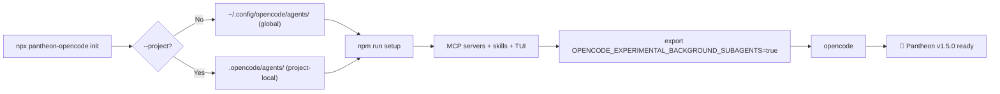

# Pantheon Installation Guide — v1.4.3 (OpenCode)

Pantheon v1.4.3 is **OpenCode-only**. Instalação global via `npx pantheon-opencode init` com **wizard 3 perguntas** (default = herdar do chat, sem `active-preset.json`). Herança nativa para delegates: sem preset, os filhos herdam o modelo do chat pai. 4 presets: `go-free`, `go-fast`, `go-premium` (Go gateway) + `openai` puro. Geração de tabelas via `node scripts/generate-preset-docs.mjs` a partir de `src/routing.yml` (sem hardcodar segredos: só `PANTHEON_OPENCODE_API_KEY` / `OPENAI_API_KEY` names + `baseURL`s).

## Prerequisites

- **OpenCode v1.18.4+** — [Install OpenCode](https://opencode.ai/docs/)
- **Node.js 18+** — for `npx pantheon-opencode init`
- **Python 3.11+** — for MCP servers (optional, used by `npm run setup`)
- **Git** — for version detection in TUI sidebar

## OpenCode V1/V2 — contrato de plugin

Pantheon 1.5.0 does not load both Pantheon plugin generations in one
installation. The ordinary OpenCode settings may be merged, but the installer
removes Pantheon references from both config shapes before registering only the
selected generation:

| Selection | OpenCode key | Pantheon registration | Contract |
|---|---|---|---|
| `v1` | singular `plugin` | `src/plugin.ts` and `src/plugins/pantheon-hooks.ts` | Legacy `pantheon_delegate`, read/list tools, V1 events/tool hooks and V1 compaction path |
| `v2` | plural `plugins` | `pantheon-opencode/plugin-v2` | Full V2 plugin: 9 orchestration tools, 4 event subscriptions, session hooks, tool hooks, plus configuration transforms |

The V2 plugin is now a **full orchestration plugin** — not just a configuration
adapter. It registers 9 tools via `ctx.tool.transform()`, subscribes to 4
session lifecycle events, and wires session/tool hooks. The only unsupported
V2 feature is `legacy-hooks` (V1-specific delegate API surface). Native OpenCode
`task()` is an OpenCode capability, not a V2 Pantheon delegate API. Do not add
the V1 plugin beside `plugin-v2` to try to restore V1-specific features: that
is an unsupported mixed registration.

Choose the target explicitly when needed:

```bash
npx pantheon-opencode init --opencode-version v1
npx pantheon-opencode init --opencode-version v2
npx pantheon-opencode init --opencode-version auto
```

`--version v1|v2` remains accepted after `init` as the legacy spelling;
use `--opencode-version auto` for the conservative selector.
`auto` is conservative, not general platform or runtime autodetection:
`OPENCODE_VERSION=v1|v2` wins; otherwise an `OPENCODE_BIN` path ending in
`opencode2` selects V2, and all other cases select V1. It never installs both
Pantheon plugin generations. Third-party plugin entries are retained as
third-party entries and are not converted by this selection.

### Config nativo V2

O installer V2 grava campos nativos V2 em vez de shims V1:

- `providers` — configuração de provedores de modelo (formato V2 nativo)
- `permissions` — array de regras de permissão de tools (formato V2 nativo)
- `mcp.servers` — registro de servidores MCP (formato V2 nativo)

Exemplo de `opencode.json` V2:

```json
{
  "$schema": "https://opencode.ai/config.json",
  "plugins": ["pantheon-opencode/plugin-v2"],
  "providers": {
    "opencode": {
      "baseURL": "https://opencode.ai/zen/v1"
    }
  },
  "permissions": [
    {
      "tool": "pantheon_delegate",
      "allow": ["zeus", "athena"]
    }
  ],
  "mcp": {
    "servers": {
      "pantheon-memory": { "command": "python", "args": ["-m", "pantheon.mcp.memory"] },
      "pantheon-persistence": { "command": "python", "args": ["-m", "pantheon.mcp.persistence"] }
    }
  }
}
```

Diferenças do V1:

| Aspecto | V1 | V2 |
|---|---|---|
| Plugin registration | singular `plugin` | plural `plugins` |
| Config shape | `plugin` array | `plugins` array + `providers` + `permissions` |
| MCP servers | Via `scripts/hooks/` | Via `mcp.servers` nativo |
| Tools | Via V1 tool hook API | Via `ctx.tool.transform()` |
| Events | Via V1 event hook API | Via `ctx.event.subscribe()` |

The TUI plugin is a separate component and a separate `tui.json` registration;
it is not evidence that the V1 runtime was loaded. It is copied and registered
only when the installer component set includes `plugins`.

## Instalação Interativa — Wizard 3 Perguntas (default = herdar do chat)

> **Default = herdar do chat (sem `active-preset.json`)** — sem preset ativo, delegates herdam nativamente o modelo do chat pai. O wizard (`scripts/install/model-picker.mjs`) implementa exatamente 3 perguntas via `askQuestions` (ou `readline` fallback), com tabelas geradas de `src/routing.yml`:

**Q1 — Perfil (0=herdar do chat [default])** — tabela exibida: perfil | `provider`/`baseURL`/key env | preço 2026 | modelos por papel

| Preset | Provider / BaseURL | Key env | Pricing 2026 | Modelos por papel (resumo) |
|---|---|---|---|---|
| `inherit` (0) | — | — | $0 (sem preset) | Herda modelo do chat pai — **não grava** `active-preset.json` |
| `go-free` | `opencode` `https://opencode.ai/zen/v1` | `PANTHEON_OPENCODE_API_KEY` | Gratuito (Zen free, só `-free`, quota limitada) | zeus `big-pickle` [medium], athena `nemotron-3-super-free` [high], themis `qwen3.6-plus-free` [high], implementers `deepseek-v4-flash-free` [medium], scouts `mimo-v2.5-free` [low] |
| `go-fast` | `opencode-go` `https://opencode.ai/zen/go/v1` | `PANTHEON_OPENCODE_API_KEY` (alias `OPENCODE_GO_API_KEY`) | Baixo custo — baixa latência (`kimi-k2.7-code`/`glm-5.3-flash`) | athena `kimi-k2.7-code` [high], themis `glm-5.3-flash` [high], implementers `mimo-v2.5`/`deepseek-v4-flash`/`gpt-5.6-luna` [low/medium], scouts `gpt-5.6-luna-fast` [low] |
| `go-premium` | `opencode-go` `https://opencode.ai/zen/go/v1` | `PANTHEON_OPENCODE_API_KEY` (alias `OPENCODE_GO_API_KEY`) | Premium — melhor qualidade (`gpt-5.6-sol`/`qwen3.8-max`/`deepseek-v4-pro`) | zeus `gpt-5.6-sol` [medium], athena `deepseek-v4-pro` [high], themis `qwen3.8-max` [high], implementers `gpt-5.6-terra`/`kimi-k3` [medium], scouts `gpt-5.6-luna` [low] |
| `openai` | `openai` `https://api.openai.com/v1` | `OPENAI_API_KEY` | Pago por uso — `gpt-5.6` family direto | planners `gpt-5.6-sol` [high], implementers `gpt-5.6-luna` [high], scouts `gpt-5.6-luna-fast` [low] |

- Se `askQuestions` disponível (OpenCode chat), usa `buildInitQuestions()` com `options` + `multiSelect:false` + `header`/`question`/`description`; senão fallback `node:readline/promises` com `0`/`inherit`/`none` como default, seleção por número ou nome.
- Pricing vem de `PRESET_PRICE` em `model-picker.mjs` + `routing.yml` descrições (verificadas 2026).
- Nenhum segredo é exibido: só nomes de env vars + `baseURL`s.

**Q2 — API Key (coleta mascarada, sem `.env`)** — valida `PANTHEON_OPENCODE_API_KEY` (aceita `OPENCODE_GO_API_KEY` como alias) para `go-*`; `OPENAI_API_KEY` para `openai`:

- Se já configurada no `env`, loga mascarada (`maskKey`: primeiros 4 + `***` + últimos 2) e segue.
- Senão, coleta via `questionMasked` (mascarada) / `askQuestions` `kind: password`; valida não vazia; **não escreve `.env`** — apenas seta `env[requiredEnv]=keyAnswer` na sessão e loga `maskKey` + instrução `export PANTHEON_OPENCODE_API_KEY='abcd****12' no shell`.
- Helpers: `requiredKeyEnvForPreset(name, def)`, `isKeyConfiguredForPreset(env, presetName, def)`, `maskKey(key)` exportados e testados.

**Q3 — Escopo** — `project` (`./.pantheon/active-preset.json`, seguro, **default**) ou `global` (`~/.config/opencode/.pantheon/active-preset.json`):

- Gravação **atômica** via `writeActivePreset(dir, presetName, {source:'interactive'})` (`tmp`+`rename`, `.bak` do anterior) + **health-check** (lê JSON, valida `preset`, avisa se mismatch).
- `inherit` (Q1) **não grava** arquivo — retorna `{preset:'inherit', scope:'project'}` e loga `Herança nativa: delegates herdam o modelo do chat pai`.

```bash
# Interativo padrão (TTY → wizard; pipe → headless)
npx pantheon-opencode init

# Forçar wizard mesmo em CI-like terminals
npx pantheon-opencode init --interactive

# Pular wizard e ativar preset direto
npx pantheon-opencode init --preset go-fast
npx pantheon-opencode init --preset openai --project

# Headless (sem perguntas, usa defaults)
npx pantheon-opencode init --headless
npx pantheon-opencode init --headless --no-mcp  # sem Python/MCPs
```

> Tabelas acima são geradas via `node scripts/generate-preset-docs.mjs` (lê `src/routing.yml` + `PRESET_PRICE` + `CAPABILITY_TABLE`).

## Quick Install

```bash
# 1. Install Pantheon agents globally
npx pantheon-opencode init --headless

# 2. (Optional) Install MCP servers + skills + TUI plugin
npm run setup

# 3. Enable background subagents
# Add to ~/.zshrc or ~/.bashrc:
export OPENCODE_EXPERIMENTAL_BACKGROUND_SUBAGENTS=true

# 4. Launch OpenCode with background subagents
opencode
```

## Install Modes

| Mode | Command | Installs | Time | Dependencies |
|------|---------|----------|------|-------------|
| **Interactive** 🎯 | `npx pantheon-opencode init` (default TTY) | seletor visual de componentes | ~variavel | Node.js 18+ |
| **Minimal** 🟢 | `npx pantheon-opencode init --headless --no-mcp` | agents + commands | ~2s | None |
| **Full** 🔵 | `npx pantheon-opencode init --headless` | agents + MCPs + skills + TUI | ~60s | Python 3.11+ |
| **Runtime** 🟡 | `npm run setup` | MCP servers + venv | ~30s | Python 3.11+ |

```bash
# Minimal — just the agent rules, no Python dependencies
npx pantheon-opencode init --no-mcp

# Full setup — agents + MCP servers (memory, persistence, resources, vision)
npx pantheon-opencode init

# Add MCP servers to an existing minimal install
npm run setup
```

## Global vs Project-Local

By default, `npx pantheon-opencode init` installs agents **globally** to `~/.config/opencode/agents/`. This makes Pantheon available in all your projects.

For project-local installation (e.g., team-shared config):

```bash
npx pantheon-opencode init --project
```

This installs to `.opencode/agents/` in the current project directory.

## Herança Nativa — sem `active-preset.json` (default)

Desde **v1.5.0** o instalador **não cria** `model`/`small_model` top-level em `opencode.json` e o plugin/wizard **não grava** `active-preset.json` quando o usuário escolhe `0`/`inherit` (default da Q1). Comportamento:

- **Sem preset = herança nativa**: `resolveActivePreset()` retorna `null`; `loadRoutingAgentModels()` retorna `{}`; `delegation.ts` (`resolveChildModel` → `resolveUsableChildModel`) omite `model` em `session.create`/`promptAsync` para que OpenCode herde o modelo do chat pai. `small_model` nunca é usado para delegates.
- **Ordem de resolução do modelo filho** (fontes sem hardcode de segredos, só nomes):
  1. `explicit model` em `pantheon_delegate({model: "provider/model-id"})`
  2. `overrides.agents[agent].model` em `.pantheon/active-preset.json` (via `/pantheon-model set --agent`)
  3. `presets.<active>.agents[agent].model` (via `loadRoutingAgentModels`)
  4. omitir → herança nativa (herda modelo atual da sessão pai)
- O instalador **remove** `model`/`small_model` antigos de `config.agent[agentName]` durante `installOpencode()` (limpeza de legado), preservando apenas campos gerenciados (`MANAGED_FIELDS`). Flags `--model`/`--small-model` ainda existem para override explícito, mas **não são necessárias** para o fluxo padrão; se usadas, validam `provider/model-id` via `MODEL_REF_PATTERN` e nunca tocam o outro campo.
- Provider/model disponibilidade **não** é inferida da string: deve existir no OpenCode e via conta/assinatura/endpoint configurado (`PANTHEON_OPENCODE_API_KEY` para `opencode`/`opencode-go`, `OPENAI_API_KEY` para `openai`).

```bash
# Default (recomendado) — herda do chat, sem preset ativo
npx pantheon-opencode init            # Q1 → 0 (inherit) → sem active-preset.json
opencode
# /model opencode-go/gpt-5.6-sol  (no chat) → delegates herdam automaticamente

# Com preset (quando precisa de pinagem por agente)
npx pantheon-opencode init --preset go-fast
# ou interativo: Q1 → go-fast → Q2 key → Q3 scope → grava .pantheon/active-preset.json

# Override explícito pontual (sem preset, ou sobre preset)
# via comando Pantheon (ver próxima seção) — nunca via top-level opencode.json
```

> **Nota:** Em `src/pantheon/delegation.ts` a validação usa `MODEL_REF_PATTERN = /^[A-Za-z0-9][A-Za-z0-9._-]*\/[A-Za-z0-9][A-Za-z0-9._:+-]*$/` com hint sem expor segredos. Model inválido → erro `pantheon_delegate rejected: invalid explicit/agentModels model override. Expected provider/model-id...`.

## `/pantheon-model` — Per-agent Overrides em `active-preset.json`

> **Em v1.5.0** — opera **exclusivamente** em `active-preset.json` `overrides.agents[agent]` (project ou global). **Nunca** escreve `.env` e **nunca** injeta `model`/`small_model` top-level em `opencode.json`. No caminho V1, a delegação usa herança nativa (sem modelo → herda chat/preset); o caminho V2 não registra a API de delegação V1.

O comando é determinístico (`src/pantheon/model-command.ts`) — leitura/escrita local sem resolver providers externos, backup `.bak` + rename atômico + `O_NOFOLLOW` + lock por path. Escopo default `project`; `global` exige `confirm` + `authorize_global` separados (`-y` não basta).

```text
# status — lista 14 agentes canônicos com modelo/effort/origem (preset|override|env|none), sem segredos
/pantheon-model status          # alias: show

# wizard interativo (sem args) — via askQuestions:
/pantheon-model                 # agente → modelo (provider/model-id) → effort (low/medium/high) → scope (project|global)
/pantheon-model                 # valida agente ∈ {zeus, athena, apollo, hermes, aphrodite, demeter, themis, prometheus, hephaestus, nyx, gaia, iris, mnemosyne, talos}
                               # valida modelo via CAPABILITY_TABLE capabilityEntry() + clamp via normalizeCapability()
                               # avisa via hasVision() se modelo for text-only but solicitado para visão

# set per-agent (persiste em overrides.agents[agent])
/pantheon-model set --agent hermes --model opencode-go/gpt-5.6-terra --effort medium --scope project
/pantheon-model set --agent apollo --model opencode/mimo-v2.5-free --effort low --scope project
/pantheon-model set --agent zeus --model openai/gpt-5.6-sol --effort high --scope global  # requer confirm+authorize_global

# reset — remove override
/pantheon-model reset --agent hermes --scope project
/pantheon-model reset --agent apollo --scope global
```

**Validações (sem hardcodar segredos):**

- Agente inválido → `unknown agent "X"; known agents: zeus, athena, apollo, hermes, aphrodite, demeter, themis, prometheus, hephaestus, nyx, gaia, iris, mnemosyne, talos`
- Modelo sem `provider/model-id` (`MODEL_REF_PATTERN`) → `model must use provider/model-id format`
- Modelo sem entrada em `CAPABILITY_TABLE` → erro de `capabilityEntry(model)` (ex.: modelo inexistente)
- `effort` inválido → `effort must be one of low, medium, high`; se válido mas acima do teto (`maxEffort`), é **clamped** (`normalizeCapability` retorna `{variant, clamped:true}`) e loga aviso
- `hasVision(model)` = false mas usado como visão → warning `hasVision` via logger (não bloqueia, mas avisa)
- `--scope global` sem `--confirm --authorize-global` → `global set/reset requires explicit confirmation and separate global authorization; -y is not sufficient`
- Modelo é apenas referência `provider/model-id` — provider/model disponibilidade depende de `opencode` config + credenciais (`PANTHEON_OPENCODE_API_KEY` ou `OPENAI_API_KEY`) + conta/assinatura/endpoint

**Persistência:**

- Lê `active-preset.json` candidatos (`project` → `global` → legacy) via `readRegularFile` + `O_NOFOLLOW` + validação JSON; inválido → equivale a ausência (log warn, sem segredos)
- Escreve via `writeActivePresetAtomically(path, data, current)` — `mkdir -p`, backup `.bak` (se existia), `atomicReplace(path, JSON.stringify(data,null,2))` (`tmp`+`rename` + `fsync` dir), lock `pathLocks` por `path`, preserva `mode` (default `600`)
- Reinicie OpenCode após sucesso (sem hot-swap). `status` nunca exibe valores de chaves.

**Histórico superseded (≤1.4.1):** antes manipulava `model`/`small_model` top-level em `opencode.json`; em 1.5.0 manipula apenas `overrides.agents`. Instrução em `commands/pantheon-model.md` usa `agent: zeus` + per-agent semantics.

## Background Delegation (V1 plugin only)

Only the V1 Pantheon plugin provides **background delegation** via three tools
(`pantheon_delegate`, `pantheon_delegation_read`, `pantheon_delegation_list`),
tracked on a persistent job board with completion notifications injected into
the board and exposed through list/read, TUI toasts, and compaction
carry-forward; no completion text is injected into the chat transcript.

**Requirement for V1:** Set the environment variable before launching OpenCode:

```bash
export OPENCODE_EXPERIMENTAL_BACKGROUND_SUBAGENTS=true
opencode
```

Or use the provided npm script:

```bash
npm run start
```

**How it works:**

```javascript
// Dispatch a background agent — returns immediately with a readable alias
pantheon_delegate({ prompt: "search the codebase", agent: "apollo", description: "Find X", model: "opencode/deepseek-v4-flash-free" })
// → Delegated to apollo: [apo-1] (task ses_xxx). Read with pantheon_delegation_read.

// Collect results later (blocks until finished, then returns the report)
pantheon_delegation_read({ id: "apo-1" })
// → report markdown (job marked reconciled)

// See what's running / finished-unread
pantheon_delegation_list({})
// → [apo-1] apollo — Find X — OK [unread]
```

**Which agents run in background:**

| Agent | Background? | Why |
|-------|------------|-----|
| Apollo, Hermes, Aphrodite, Demeter, Hephaestus, Prometheus | ✅ Yes | Independent, long-running work |
| Athena, Themis | ❌ No | Need full session context |
| Talos, Iris, Nyx, Mnemosyne, Gaia | ❌ No | Quick operations |

See the **Background Delegation** section in the [README](../README.md) for the
notification model, model-resolution order, timeout, read-only enforcement,
and `background_delegation` routing.yml configuration.

V1 compaction carry-forward is implemented by
`experimental.session.compacting`. It is not available through `plugin-v2`.
When the V1 process restarts, running legacy board jobs are marked errored;
old jobs are not auto-resumed and child work is not restarted automatically.
The persisted Markdown reports remain historical V1 records. A native V2 task
may be followed by the TUI only when OpenCode supplies explicit child origin,
parent and status metadata; a missing Markdown report is not that metadata.

## TUI Sidebar Plugin

Pantheon includes an optional TUI sidebar plugin (reduced sidebar with a real-time
Delegations panel) showing:

```
Pantheon v1.5.0
⎇ main
⚡ Preset: go-fast (file)      ← or "Preset: default" (herança nativa)
────────────────────────────
▼ Sessions (12)
▼ Delegations (3)                 ← real-time panel
  ⠋ [apo-1] apollo — WORKING — find X
  ✓ [native-task] hermes — DONE (quando o host fornece origem explícita)
```

- **Header** — Pantheon version, current git branch, and the active model
  preset (`⚡ Preset: <name> (source)`, or `Preset: default`).
- **Sessions** — collapsible recent-sessions list (click a row to open).
- **Delegations (real-time)** — the panel can follow children sourced from
  `api.client.session.children`. V1 `pantheon_delegate` children use the
  board alias/report contract. Native `task()` children require explicit
  origin, parent and status metadata from OpenCode; the panel must not infer a
  native task from a missing Markdown report. Animated states
  (DELEGATING / WORKING / READING RESULT / DONE / DONE (TIMED OUT) / ERROR /
  CANCELLED) with a 140ms spinner; clicking a row navigates to the child
  session. Also reads `.pantheon/delegations/` reports from all sessions, so
  the full delegation history renders even without a focused session.
  Diagnostics: every re-fetch logs `panel: children=N md=N events=N` to
  `.pantheon/logs/hooks.log` (silence-by-default).

The TUI plugin is installed by `npm run setup` or a selected install that
includes the `plugins` component. Without that component, no Pantheon TUI
registration is written. It appears in the right sidebar of OpenCode TUI when
the host loads the separate `tui.json` registration.

## Commands

Type these in the OpenCode chat:

| Command | Description |
|---------|-------------|
| `/pantheon` | Multi-perspective council synthesis via inline agents |
| `/pantheon-audit` | 3-layer code audit: heuristic scan → Themis deep review → OWASP Top 10 |
| `/pantheon-deepwork` | Heavy multi-phase task with persisted checkpoints and Themis review gates |
| `/pantheon-model` (wizard) / `status\|show\|set --agent\|reset --agent` | Per-agent overrides em `active-preset.json` (`overrides.agents[agent]`); `status` lista 14 agentes (model/effort/origem `preset\|override\|env\|none`); `set --agent X --model provider/model-id [--effort low\|medium\|high] [--scope project\|global]` validado via `CAPABILITY_TABLE`+`hasVision`+clamp; `reset --agent X`; default `project`; `global` exige `confirm`+`authorize_global`; atômico `.bak`+lock; nunca escreve `.env` nem top-level `model` |
| `/pantheon-optimize` | Project optimization: bloat scan, deepwork archive, cache migration, token report |
| `/pantheon-consolidate` | Merge and deduplicate memory entries in the vector database |

## Troubleshooting — Chaves e Presets

**Sem segredos hardcoded — só nomes de env vars + `baseURL`s abaixo.**

### Diagnóstico rápido

```bash
# ver preset ativo (env vence arquivo)
echo $PANTHEON_MODEL_PRESET
cat .pantheon/active-preset.json 2>/dev/null || cat ~/.config/opencode/.pantheon/active-preset.json 2>/dev/null || echo "nenhum active-preset.json (herança nativa)"
cat ~/.config/opencode/opencode.json | grep -A2 '"model"' || echo "sem model top-level (esperado no fluxo 1.5.0)"

# status per-agent (sem segredos)
/pantheon-model status
# ou
/pantheon-model show

# validar preset defs
node scripts/validate-routing.mjs
# ou
node -e "import('./src/pantheon/presets.mjs').then(m=>console.log(m.validatePresetDefs(m.loadPresetDefs())))"

# gerar tabelas atuais de routing.yml
node scripts/generate-preset-docs.mjs
```

### Chaves por preset

| Preset | Provider | BaseURL | Key env (nome) | Alias aceito no wizard Q2 | Quando é exigido |
|---|---|---|---|---|---|
| `go-free` | `opencode` | `https://opencode.ai/zen/v1` | `PANTHEON_OPENCODE_API_KEY` | `OPENCODE_GO_API_KEY` | Sempre que `go-free` ativo |
| `go-fast` | `opencode-go` | `https://opencode.ai/zen/go/v1` | `PANTHEON_OPENCODE_API_KEY` | `OPENCODE_GO_API_KEY` | Sempre que `go-fast` ativo |
| `go-premium` | `opencode-go` | `https://opencode.ai/zen/go/v1` | `PANTHEON_OPENCODE_API_KEY` | `OPENCODE_GO_API_KEY` | Sempre que `go-premium` ativo |
| `openai` | `openai` | `https://api.openai.com/v1` | `OPENAI_API_KEY` | — | Sempre que `openai` ativo |
| (sem preset) | — | — | — | — | Herança nativa — usa modelo do chat (`/model ...`) |

- O wizard Q2 coleta **mascarada** e **não escreve `.env`**. Defina no shell: `export PANTHEON_OPENCODE_API_KEY=...` ou `export OPENAI_API_KEY=...` (ou `OPENCODE_GO_API_KEY` como alias para Go).
- Fail-fast: CLI (`model-picker.mjs`) e plugin (`presets.mjs` → `missingProviderKeyEnv`/`providerKeyConfigured`) checam presença da env **apenas** quando o preset usa o provider; faltando → `warn` + instrução, sem expor valor.
- Se a env estiver com espaços/quebra, o wizard faz `trim()` antes de validar (`v.trim() !== ''`).

### Erros comuns

| Sintoma | Causa | Solução |
|---|---|---|
| `PANTHEON_OPENCODE_API_KEY não configurada` no Q2 | `go-*` selecionado mas env vazia | `export PANTHEON_OPENCODE_API_KEY=...` (ou `OPENCODE_GO_API_KEY`) antes de `init`; wizard Q2 valida via `isKeyConfiguredForPreset(env, preset, def)` |
| `OPENAI_API_KEY não configurada` | `openai` selecionado mas env vazia | `export OPENAI_API_KEY=...` |
| `unknown agent "foo"` em `/pantheon-model set` | agente não canônico | Use um dos 14: `zeus`, `athena`, `apollo`, `hermes`, `aphrodite`, `demeter`, `themis`, `prometheus`, `hephaestus`, `nyx`, `gaia`, `iris`, `mnemosyne`, `talos` |
| `model must use provider/model-id format` | modelo sem barra ou com espaço/`..` | Use `provider/model-id` ex.: `openai/gpt-5.6-sol`, `opencode-go/kimi-k2.7-code` (valida `MODEL_REF_PATTERN`) |
| `global set/reset requires explicit confirmation...` | `--scope global` sem confirmação | Adicione `--confirm --authorize-global` (ou use `--scope project`, default seguro) |
| `.pantheon/active-preset.json has invalid JSON` | arquivo corrompido | Apague ou corrija JSON; `readActivePresetRaw` trata como ausência + log `warn` sem segredos; `write` preserva anterior se falhar |
| `health-check: active-preset.json verification failed` | `writeActivePreset` gravou mas `preset` mismatch | Verifique permissões (`mode` default `600`, `O_NOFOLLOW`, `fsync` dir); wizard loga warning, não expõe chave |
| `[pantheon-delegate] no model resolved for agent "X" — omitting model...` | sem preset e sem override, herança nativa | Normal em default (herança nativa); para pinar, `npx pantheon-opencode set-tier <preset>` ou `/pantheon-model set --agent X ...` |
| Modelo `text-only` com `hasVision` warning | usou `big-pickle`/`kimi-k2.7-code` etc. para visão | Troque para multimodal (`mimo-v2.5*`, `gpt-5.6*`, `minimax-m3`) ou aceite limitação (`vision:false` no `CAPABILITY_TABLE`) |
| `Presets defined: 4` falha em `validate-routing.mjs` | `routing.yml` corrompido | `node --check src/pantheon/presets.mjs` + `yamllint src/routing.yml` |

### Headless / CI (sem TTY)

```bash
# Preset explícito pula wizard (Q1/Q2/Q3)
PANTHEON_OPENCODE_API_KEY=... npx pantheon-opencode init --headless --preset go-fast
OPENAI_API_KEY=... npx pantheon-opencode init --headless --preset openai --project

# Env override (vence arquivo) — útil em CI
PANTHEON_MODEL_PRESET=go-premium opencode run "hello"

# Nenhum preset (herança nativa) em CI
PANTHEON_MODEL_PRESET=none opencode run "hello"
# ou simplesmente não definir preset e não gravar active-preset.json

# Per-agent override headless (via Node, sem TUI)
node -e "
import('./src/pantheon/model-command.ts').then(m=>console.log('import ok'))
"
# ou no chat OpenCode (determinístico, backup .bak):
# /pantheon-model set --agent hermes --model opencode-go/gpt-5.6-terra --effort medium --scope project
```

## Verification

## Verification

After installation, verify everything works:

```bash
# 1. Check agents are installed
ls ~/.config/opencode/agents/
# Should show 14 .md files

# 2. Check MCP servers
ls ~/.config/opencode/scripts/

# 3. Launch OpenCode with background subagents
export OPENCODE_EXPERIMENTAL_BACKGROUND_SUBAGENTS=true
opencode

# 4. Test background delegation
# Type: @zeus, task(background=true, subagent_type="apollo", prompt="test")

# 5. Run health check
npm run doctor
```

**Instalação global isolada:** para testar o pacote instalado globalmente como um usuário real (sem contaminar o ambiente de dev, que mistura várias instalações), use o sandbox `~/pantheon-sandbox/` — rode `bash ~/pantheon-sandbox/run-test.sh` (mcp list 5/5 + doctor + TUI isolado). Descarte com `rm -rf ~/pantheon-sandbox`; detalhes em `~/pantheon-sandbox/README.md`.

## Troubleshooting

### TUI runtime versus development build

The installer treats `src/plugins/tui` as the single source of truth and always
copies it into the target config as `plugins/pantheon-tui` (dist/ + package.json
+ index.tsx). OpenCode's TUI loader reads the copied `package.json` `exports`
map (`./tui` → `dist/tui.js`, `./server` → `dist/server.js`), so users do not
need `tsconfig.json`, `tsdown`, or development dependencies after installation.
The TUI `build` and `typecheck` scripts are maintainer/development tasks for the
repository, not post-install health checks; their failure in
`~/.config/opencode/plugins/pantheon-tui` does not indicate a broken runtime.

Every install (global or project) registers exactly ONE Pantheon TUI reference
system-wide — the copied `plugins/pantheon-tui` directory in the installed
config. Stale references from older installs (dist file paths, in-package
`src/plugins/tui` dirs, bare `plugins/pantheon-tui` copies, npx paths) are
removed from all `tui.json` locations OpenCode reads: `~/.opencode/tui.json`,
`~/.config/opencode/tui.json` and `<project>/.opencode/tui.json`.

> **Windows/WSL:** each environment (Windows native vs. WSL/Linux) uses its own
> OpenCode binary, config directory, and Node/npx install. Run the installer
> separately inside each environment — never share a config dir or copy
> `tui.json` references between them, since paths are environment-specific.

| Problem | Solution |
|---------|----------|
| Agents not found | Run `npx pantheon-opencode init` again |
| MCP servers not starting | Check Python 3.11+, run `npm run setup` |
| Background delegation not available | Set `OPENCODE_EXPERIMENTAL_BACKGROUND_SUBAGENTS=true` before launching OpenCode |
| TUI sidebar not showing | Check the installed config's `tui.json` has exactly one `plugins/pantheon-tui` entry (absolute path) |
| Plugin not loading | Ensure `<config>/plugins/pantheon-tui/dist/tui.js` exists (copied at install time) |
| Health check fails | Run `npm run doctor` for detailed diagnostics |

### MCP servers e falha de spawn (ENOENT)

Pantheon's MCP servers (resources, code-mode, memory, persistence, vision) are
spawned by OpenCode as local child processes. Two facts shape how spawn
failures behave:

1. **OpenCode 1.18 does not retry a failed local MCP server.** If the spawn
   fails at startup, the server stays in `failed` state for the whole TUI
   process. There is no reconnect hook; the only recovery is restarting the
   TUI. Session data and persistence are safe — they live in the SQLite
   database, not in the MCP process.
2. **`posix_spawn ENOENT` means the command path does not exist.** The most
   common cause is a stale hardcoded path (e.g. a config that still points at
   `/home/admin/.config/opencode/...` after the home directory was migrated)
   or a path relative to an ambiguous root. OpenCode spawns the command
   verbatim — a missing interpreter or script fails with ENOENT before any
   Python code runs.

**Diagnosis**

```bash
# Verify the interpreter and script exist for each configured server
ls /home/ils15/.config/opencode/.venv/bin/python3
ls /home/ils15/.config/opencode/scripts/mcp_resources_server.py
# etc. — compare against the paths in ~/.config/opencode/opencode.json

# Static check — `npm run doctor` (or `pantheon-opencode doctor`) validates
# that every local MCP command's executable and absolute script args exist
npm run doctor -- --target /home/ils15/.config/opencode
```

If the doctor reports `MCP "..." executable does not exist`, fix the path in
`~/.config/opencode/opencode.json` (or re-run the installer, which resolves
hermetic absolute paths — see below) and **restart the OpenCode TUI**.

**Recovery**

```bash
# Close the TUI (Ctrl+C / exit) and relaunch. Sessions and data persist.
opencode
# Verify MCP servers are back:
opencode mcp list
```

**Hermetic path policy (P2, 2026-08-05)**

- `scripts/install-mcp.mjs` generates commands with **absolute** interpreter
  and script paths, resolved in this order: canonical user install
  (`~/.config/opencode/.venv/bin/python3` + `~/.config/opencode/scripts/*.py`),
  then the local checkout (`<ROOT>/.venv` + `<ROOT>/scripts|src/mcp`), with a
  warning fallback to PATH `python3`.
- `scripts/doctor.mjs` now includes a **hermetic spawn check**: every local MCP
  entry is verified for an existing executable and existing absolute script
  args, so the ENOENT class is caught statically before OpenCode tries to
  spawn.
- Avoid editing MCP commands to relative paths or paths under another user's
  home — they reproduce this failure class.

## Installation Flow



## V1 Background Delegation Flow

```mermaid
sequenceDiagram
    participant Z as Zeus
    participant A as Apollo (child)
    participant D as Demeter (child)
    participant B as V1 Board

    Z->>+A: pantheon_delegate(prompt, agent)
    Z->>+D: pantheon_delegate(prompt, agent)
    A-->>B: terminal state + V1 report
    D-->>B: terminal state + V1 report

    Z->>B: pantheon_delegation_list()
    Z->>B: pantheon_delegation_read(id)

    Note over Z: V1 APIs only; V2 uses no Pantheon delegate API
```

## TUI Sidebar Layout

```mermaid
block-beta
    columns 1
    block["Pantheon v1.5.0"]
        block("⎇ main")
        end
        block Sessions["▶ Sessions (N total)"]
        end
        block Commands["▶ Commands (5)"]
        end
        block Agents["▶ Agents (14)"]
        end
        block Config["▶ Config"]
        end
        block Memory["▶ Memory"]
        end
    end
```
