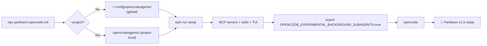
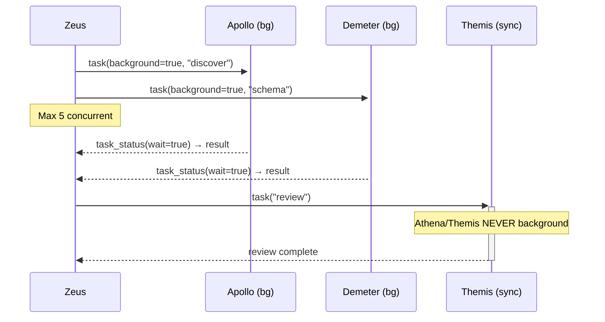

# Pantheon Installation Guide — v1.0 (OpenCode)

Pantheon v1.0 is **OpenCode-only**. It installs globally via `npx pantheon-opencode init` and works across all your projects.

## Prerequisites

- **OpenCode v1.18.4+** — [Install OpenCode](https://opencode.ai/docs/install)
- **Node.js 18+** — for `npx pantheon-opencode init`
- **Python 3.11+** — for MCP servers (optional, used by `npm run setup`)
- **Git** — for version detection in TUI sidebar

## Interactive TUI Installer

Since v1.1.1, the installer has an **interactive TUI mode** with component selection, visual feedback, and real-time progress:

```bash
# Default: interactive if terminal, headless if piped
npx pantheon-opencode init

# Force interactive mode (even in CI-like terminals)
npx pantheon-opencode init --interactive

# Force headless mode (for scripts and CI)
npx pantheon-opencode init --headless

# Skip confirmations, use defaults
npx pantheon-opencode init -y
```

The interactive mode shows:
- **Checkbox selection** — choose which components to install (agents, skills, plugins, runtime, etc.)
- **Progress spinners** — real-time feedback during installation
- **Config diff** — visual summary of what changed
- **Component descriptions** — what each component does

For non-interactive use (scripts, CI, automation), use `--headless`:

```bash
# CI pipeline — fully automated
npx pantheon-opencode init --headless --no-mcp
```

## Quick Install

```bash
# 1. Install Pantheon agents globally
npx pantheon-opencode init --headless

# 2. (Optional) Install MCP servers + skills + TUI plugin
npm run setup

# 3. Enable background subagents
# Add to ~/.zshrc or ~/.bashrc:
export OPENCODE_EXPERIMENTAL_BACKGROUND_SUBAGENTS=true

# 4. Launch OpenCode with background subagents
opencode
```

## Install Modes

| Mode | Command | Installs | Time | Dependencies |
|------|---------|----------|------|-------------|
| **Interactive** 🎯 | `npx pantheon-opencode init` (default TTY) | seletor visual de componentes | ~variavel | Node.js 18+ |
| **Minimal** 🟢 | `npx pantheon-opencode init --headless --no-mcp` | agents + commands | ~2s | None |
| **Full** 🔵 | `npx pantheon-opencode init --headless` | agents + MCPs + skills + TUI | ~60s | Python 3.11+ |
| **Runtime** 🟡 | `npm run setup` | MCP servers + venv | ~30s | Python 3.11+ |

```bash
# Minimal — just the agent rules, no Python dependencies
npx pantheon-opencode init --no-mcp

# Full setup — agents + MCP servers (memory, persistence, resources, vision)
npx pantheon-opencode init

# Add MCP servers to an existing minimal install
npm run setup
```

## Global vs Project-Local

By default, `npx pantheon-opencode init` installs agents **globally** to `~/.config/opencode/agents/`. This makes Pantheon available in all your projects.

For project-local installation (e.g., team-shared config):

```bash
npx pantheon-opencode init --project
```

This installs to `.opencode/agents/` in the current project directory.

## Background Subagents

Pantheon v1.0 supports **native OpenCode background delegation**. This allows dispatching up to 5 agents in parallel.

**Requirement:** Set the environment variable before launching OpenCode:

```bash
export OPENCODE_EXPERIMENTAL_BACKGROUND_SUBAGENTS=true
opencode
```

Or use the provided npm script:

```bash
npm run start
```

**How it works:**

```javascript
// Dispatch a background task — returns immediately
task(background=true, subagent_type="apollo", prompt="...")
// → { task_id: "ses_xxx", state: "running" }

// Collect results later
task_status(task_id="ses_xxx", wait=true)
// → { state: "completed", task_result: "..." }
```

**Which agents run in background:**

| Agent | Background? | Why |
|-------|------------|-----|
| Apollo, Hermes, Aphrodite, Demeter, Hephaestus, Prometheus | ✅ Yes | Independent, long-running work |
| Athena, Themis | ❌ No | Need full session context |
| Talos, Iris, Nyx, Mnemosyne, Gaia | ❌ No | Quick operations |

## TUI Sidebar Plugin

Pantheon includes a TUI sidebar plugin showing:

```
Pantheon v1.0.0
⎇ main
▶ Sessions (N total)
▶ Commands (5)
▶ Agents (14)
▶ Config — MCPs, Compaction
▶ Memory — Entry count
```

The plugin is installed automatically during `npm run setup`. It appears in the right sidebar of OpenCode TUI.

## Commands

Type these in the OpenCode chat:

| Command | Description |
|---------|-------------|
| `/pantheon` | Multi-perspective council synthesis via inline agents |
| `/pantheon-audit` | 3-layer code audit: heuristic scan → Themis deep review → OWASP Top 10 |
| `/pantheon-deepwork` | Heavy multi-phase task with persisted checkpoints and Themis review gates |
| `/pantheon-optimize` | Project optimization: bloat scan, deepwork archive, cache migration, token report |
| `/pantheon-consolidate` | Merge and deduplicate memory entries in the vector database |

## Verification

After installation, verify everything works:

```bash
# 1. Check agents are installed
ls ~/.config/opencode/agents/
# Should show 14 .md files

# 2. Check MCP servers
ls ~/.config/opencode/scripts/

# 3. Launch OpenCode with background subagents
export OPENCODE_EXPERIMENTAL_BACKGROUND_SUBAGENTS=true
opencode

# 4. Test background delegation
# Type: @zeus, task(background=true, subagent_type="apollo", prompt="test")

# 5. Run health check
npm run doctor
```

## Troubleshooting

### TUI runtime versus development build

The installer copies the prebuilt `plugins/pantheon-tui/dist/tui.tsx` and only
installs runtime dependencies. OpenCode loads that TSX entry directly and
transpiles it at startup, so users do not need `tsconfig.json`, `tsdown`, or
development dependencies after installation. The TUI `build` and `typecheck`
scripts are maintainer/development tasks for the repository, not post-install
health checks; their failure in `~/.config/opencode/plugins/pantheon-tui` does
not indicate a broken runtime.

| Problem | Solution |
|---------|----------|
| Agents not found | Run `npx pantheon-opencode init` again |
| MCP servers not starting | Check Python 3.11+, run `npm run setup` |
| Background delegation not available | Set `OPENCODE_EXPERIMENTAL_BACKGROUND_SUBAGENTS=true` before launching OpenCode |
| TUI sidebar not showing | Check `~/.config/opencode/tui.json` has `"plugins/pantheon-tui"` |
| Plugin not loading | Ensure `~/.config/opencode/plugins/pantheon-tui/dist/tui.tsx` exists |
| Health check fails | Run `npm run doctor` for detailed diagnostics |

## Installation Flow



## Background Delegation Flow



## TUI Sidebar Layout

```mermaid
block-beta
    columns 1
    block["Pantheon v1.0.0"]
        block("⎇ main")
        end
        block Sessions["▶ Sessions (N total)"]
        end
        block Commands["▶ Commands (5)"]
        end
        block Agents["▶ Agents (14)"]
        end
        block Config["▶ Config"]
        end
        block Memory["▶ Memory"]
        end
    end
```
