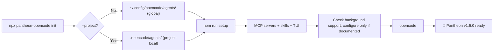

# Pantheon Installation Guide — v1.6.0 (OpenCode 2)

Pantheon v1.6.0 é **compatível com OpenCode 2**. `npx pantheon-opencode init` instala a geração selecionada. O seletor interativo V1 oferece **Inherit**, **OpenCode Go**, **OpenAI** e **Anthropic**; ele pergunta o escopo de gravação apenas para um perfil salvo e não é uma rota de modelo V2. No V2, `pantheon_model` oferece somente `status`, `show`, `set` e `reset` manuais, sem wizard de presets: o default do host fica intacto sem override explícito por agente; markers `preset` e `PANTHEON_MODEL_PRESET` são ignorados e preservados. Herança nativa para delegates: sem preset, os filhos herdam o modelo do chat pai no caminho V1. As tabelas dos presets abaixo são referência V1 legada e derivadas de `src/routing.yml` (sem hardcodar segredos: só nomes de variáveis e `baseURL`s).

## TL;DR (Quick Start)

```bash
# Instalar agentes Pantheon globalmente (a seleção de presets é V1 legacy)
npx pantheon-opencode init

# Headless (CI/scripts, usa defaults) — apply não-interativo exige --yes
npx pantheon-opencode init --headless --yes

# (Opcional) Servidores MCP + skills + plugin TUI
npm run setup

# Verificar instalação
npm run doctor
```

- Requisitos: **Node.js >=26.4.0** para a CLI/instalador/ferramentas Node do Pantheon, **Python 3.11+** (opcional, MCP servers), e um host suportado: **OpenCode 1.19.x** (contrato V1) ou **OpenCode 2.x** (contrato V2). **OpenCode 2.0.22 tem falha conhecida** — não expõe `ctx.permission.assert`. Node 22, Node 24 e Node 26.0–26.3 estão fora da faixa suportada.
- Com a configuração padrão do npm, versões incompatíveis podem gerar `EBADENGINE` como aviso durante a instalação. O postinstall do Pantheon então pula a sincronização Node/config e permite que o pacote termine de instalar; a CLI bloqueia a configuração com uma mensagem explícita antes de gravar arquivos. `engine-strict=true` pode fazer o próprio npm interromper a instalação. Para atualizar sem instalação global/system-wide, use um gerenciador de Node do usuário:

  ```bash
  nvm install 26.4.0 && nvm use 26.4.0
  # ou: fnm install 26.4.0 && fnm use 26.4.0
  # ou: volta install node@26.4.0
  ```
- Isso não pressupõe um runtime Node universal para o host OpenCode: o OpenCode 2.x oficial — um host suportado — tem um caminho de runtime Bun e um build Node separado fixado em Node 26.4.0, o que não altera o piso do pacote. Nenhum mínimo de Bun é declarado. `node:sqlite` >=22.5 é apenas um limite de capacidade do backend opcional `pantheon_cost`, não o requisito de suporte do pacote.
- No resumo de uma configuração interativa em TTY, o instalador recomenda um local persistente externo para futuros worktrees: `<project-parent>/.pantheon-worktrees/<exact-repository-directory-basename>/<task>` (por exemplo, `/home/user/.pantheon-worktrees/My Project/feature-name`). Use o nome exato do diretório do projeto, incluindo espaços; não o normalize como slug. A recomendação é apenas orientação para agentes; o Pantheon não cria worktrees Git nem diretórios automaticamente.
- A configuração interativa em TTY usa prompts Clack para selecionar componentes, escolher instalação global/projeto e confirmar a revisão antes de aplicar. Cancelar não altera a configuração. `--yes`, `--headless`, `--dry-run` e os caminhos sem TTY mantêm seus comportamentos.
- Delegação e modo background dependem das ferramentas expostas pela versão/runtime do host. Na sessão Beta 10 reportada, Zeus tinha a ferramenta `subagent`, sem `task_status`/`cancel_task` ou garantia de acompanhamento/recuperação. Verifique o schema e a documentação do runtime; não presuma que `task()` ou background estejam disponíveis. A variável experimental abaixo só se aplica a hosts/versões que a documentem.
- Passo a passo de 5 minutos: [QUICKSTART.md](QUICKSTART.md).

## Revisão, autorização e recuperação do instalador

`init --dry-run` mostra as operações de arquivos gerenciados sem aplicá-las. Para
revisar em uma execução e autorizar em outra, salve um plano versionado:

```bash
# Preview legível ou JSON (somente no stdout)
npx pantheon-opencode init --project --no-mcp --components agents --dry-run
npx pantheon-opencode init --project --no-mcp --components agents --dry-run --json

# Salvar e aplicar o plano revisado; sem --yes, uma sessão TTY pergunta
npx pantheon-opencode init --project --no-mcp --components agents --dry-run \
  --save-plan .pantheon-install-plan.json
npx pantheon-opencode init --apply-plan .pantheon-install-plan.json --yes
```

O artefato é JSON versionado, gravado atomicamente com permissões `0600`; guarda
identidades, opções, snapshots/fingerprints e operações, não o conteúdo dos
arquivos gerados. Ele fica vinculado ao caminho original do artefato, ao alvo e
à identidade do pacote. Na aplicação, o instalador recalcula o plano e compara a
origem e os destinos; se houver drift, aborta antes de escrever (código de saída
`3`). `--apply-plan` aceita somente o caminho do plano e autorização (`--yes`/
`-y` ou prompt TTY). Planos salvos com `--force`/`--clean` não são suportados.

Para manter o preview livre de efeitos colaterais no host, `--dry-run` não
executa `opencode --version`: sem um hint de versão configurado, assume V1 e
informa isso como advisory. Use `--opencode-version v1` ou
`--opencode-version v2` para selecionar a geração do preview e do plano salvo.
O plano descreve operações de
arquivos gerenciados; não representa integralmente efeitos em lote ou externos,
como criar/atualizar um ambiente Python. `postinstall`/`sync-tui` também fica
fora do fluxo de aprovação do `init` e pode atualizar artefatos TUI sem prompt.
Não trate o preview como transação nem como promessa de rollback automático.

Antes das primeiras gravações gerenciadas, `init` cria um backup exato em
`.pantheon/backups/<timestamp>/` (diretório `0700`, arquivos `0600`, retenção das
5 cópias mais recentes). Como o backup é byte a byte, pode conter credenciais já
presentes nos arquivos; não o compartilhe. Para recuperar, use
`npx pantheon-opencode restore [--project] [--yes]`. Uma falha/interrupção pode
deixar alterações parciais; a recuperação é manual pelo comando `restore`, não
um rollback automático.

### Remoção e purge

O desinstalador também pode ser revisado antes de aplicar:

```bash
npx pantheon-opencode uninstall --project --dry-run
npx pantheon-opencode uninstall --project --force
```

Sem `--force`, a aplicação pede confirmação em TTY e falha fechada em ambiente
não interativo. O desinstalador remove apenas itens identificados como do
Pantheon, preserva symlinks e cria backup dos arquivos regulares que serão
alterados/removidos; os backups não são apagados pelo uninstall. Em V2 global ele
também desfaz a negação do Context nativo em `cli.json`, removendo só a diretiva
`-opencode.sidebar.context` (e o arquivo inteiro quando foi o Pantheon que o
criou), para o bloco Context nativo voltar a aparecer. `--purge-data`
é mais restrito: só permite remover `.pantheon/install-state.json` quando for um
arquivo regular e um estado schema-v2 verificável. Não é uma limpeza geral de
`.pantheon` nem remove os backups. Primeiro revise com `--dry-run`; para aplicar
purge em modo não interativo, combine `--purge-data --force`.

### Revisar drift de arquivos instalados

Instalações novas mantêm um inventário versionado por arquivo regular gerenciado
(caminho relativo exato, componente/layout, hash e modo; nenhum conteúdo é salvo).
Use `reconcile` para identificar arquivos que saíram da fonte atual e permanecem
idênticos à última gravação do instalador:

```bash
# Preview somente leitura; selecione --global ou --target PATH quando apropriado
npx pantheon-opencode reconcile --project --dry-run
npx pantheon-opencode reconcile --project --dry-run --components agents,skills
npx pantheon-opencode reconcile --global --target /caminho/config-opencode --dry-run
npx pantheon-opencode reconcile --target /caminho/projeto --dry-run

# Plano revisável, aplicado em outra chamada com autorização explícita
npx pantheon-opencode reconcile --project --components agents --save-plan .pantheon-reconcile.json
npx pantheon-opencode reconcile --apply-plan .pantheon-reconcile.json --yes

# Alternativa: revisar e aplicar na mesma chamada
npx pantheon-opencode reconcile --project --apply --yes
```

O preview não grava nem remove arquivos. A aplicação revalida o inventário, os
hashes e o conjunto exato de operações; qualquer drift cancela antes da remoção.
Antes de apagar, cria um backup restaurável em `.pantheon/backups/`; use
`pantheon-opencode restore` para recuperar. Somente arquivos regulares e exatos
são removidos — diretórios nunca são apagados recursivamente. Componentes não
selecionados permanecem fora da reconciliação.

Estados v1/v2 e instalações anteriores ao inventário migram para uma lista vazia:
seus arquivos existentes são desconhecidos/ambíguos e nunca são inferidos como
propriedade do Pantheon nem removidos automaticamente. Arquivos alterados,
ausentes, symlinks, caminhos inválidos ou layouts incompatíveis também são
preservados. `doctor` diferencia arquivos previamente gerenciados que foram
modificados ou desapareceram; quando o payload atual não está disponível, informa
que só verificou o hash registrado. `reconcile` aceita `--project`, `--global` ou
`--target PATH`; um alvo explícito usa o layout de projeto por padrão. Combine
`--global --target PATH` para indicar que um alvo global explícito usa o layout
global plano. Essa escolha não é inferida nem reinterpretada pelo caminho. Sem
inventário legível, não há limpeza automática.

## Prerequisites

- **OpenCode 1.19.x**, or **2.x** — [Install OpenCode](https://opencode.ai/docs/). **OpenCode 2.0.22 is known broken** (no `ctx.permission.assert`).
- **Node.js >=26.4.0** — for `npx pantheon-opencode init` and Node-based Pantheon tooling (`engines.node` = `>=26.4.0`). Node 22, Node 24, and Node 26.0–26.3 are unsupported. The optional `pantheon_cost` backend separately needs `node:sqlite` (Node >=22.5); this capability threshold does not lower package support. Official OpenCode 2.x — a supported host — has a Bun runtime path and a separate Node build pinned to 26.4.0; no Bun minimum is implied.
- **Python 3.11+** — for MCP servers (optional, used by `npm run setup`)
- **Git** — for version detection in TUI sidebar

## Package and dependency contract

The TUI plugin is a **root workspace**. `package.json` declares
`"workspaces": ["src/plugins/tui"]`, and the root `package-lock.json` carries a
`link: true` entry for `node_modules/pantheon-tui` resolving to
`src/plugins/tui`. A single `npm ci --ignore-scripts` at the root installs the
root project **and** the TUI subpackage; there is no second install step, and
`npm ci --prefix src/plugins/tui` is no longer part of any workflow.

For a checkout validation:

```bash
npm ci --ignore-scripts
```

`npm ci` is the only accepted path: there is no fallback to `npm install`, and
`PANTHEON_ALLOW_NPM_INSTALL_FALLBACK` is not a supported escape hatch. The
post-install TUI sync likewise propagates a failing `npm ci`; it does not
silently repair or rewrite a lockfile.

### The nested TUI lockfile is still shipped, and still load-bearing

Two lockfiles exist and both are committed, but they now serve **different**
consumers, which is worth being explicit about:

- **root `package-lock.json`** — what the workspace install and CI use.
- **`src/plugins/tui/package-lock.json`** — a *published artifact*. It is
  copied by `scripts/sync-tui.mjs` into the user's live plugin dir, where
  `npm ci --omit=dev` runs against **it**, not the root one. A manifest/lock
  divergence there makes every end user's `npm install pantheon-opencode`
  hard-fail inside `postinstall`.

That second lock can no longer be regenerated in place: under a `workspaces`
parent, `npm install --package-lock-only` in the member directory reports "up
to date" and folds the change into the root lock instead, and neither
`--workspaces=false` nor `--ignore-workspace-root-check` changes that. Hand
applying the same version to both files is valid **only for a version change on
a dependency already present in the lock's tree**; adding or removing one
requires generating the lock in an isolated directory (no workspace parent)
and copying it back — and that regeneration re-resolves the entire transitive
tree, so its diff must be reviewed. `tests/tui-workspace-lock.test.mjs` is the
gate that catches a drift in either direction.

### Why `overrides: { "rolldown": "1.2.7" }` exists

`tsdown@0.23.0` requires `rolldown: "~1.2.7"`. The exact `1.2.7` override
satisfies that range and keeps the workspace and standalone TUI installs on
the same bundler, whose minifier output is part of the committed bundle. Pinning
tsdown alone does not pin its dependency; a direct `devDependency` would not
hold either because Node resolution can prefer a nearer nested copy. The root
and standalone TUI overrides both enforce the same version. tsdown 0.23.0's
engine range (`^22.18.0 || ^24.11.0 || >=26.0.0`) includes the project's
declared Node support floor (`>=26.4.0`).

Two consequences a maintainer must know before touching it:

- `overrides` **bypasses** range validation rather than erroring, so it can
  silently contradict a dependent's declared range. `tests/tui-workspace-lock.test.mjs`
  asserts the override against `tsdown`'s declared range and that the root lock
  resolves exactly one `rolldown`; CI additionally asserts the installed
  version is exactly `1.2.7`.
- Changing it can alter minifier output and break the `TUI dist freshness`
  gate. Update both overrides, regenerate both locks, rebuild `dist`, and
  review the generated diff together.

### TUI production security overrides

The root and standalone TUI manifests override `@babel/core` to `7.29.7`
(security floor `>=7.29.6`) and `seroval` to `1.6.8` (security floor
`>=1.6.3`). The affected packages are reachable from the shipped TUI runtime;
these pins clear the audited production advisories while upstream
`@opentui/solid@0.5.10` still pins Babel `7.28.0` and Solid `1.9.12`.

`seroval@1.6.8` is outside Solid `1.9.12`'s declared `~1.5.0` range. Keep
`solid-js` pinned to the exact `1.9.12` peer required by OpenTUI rather than
allowing a workspace copy of `1.9.15`; `tests/tui-workspace-lock.test.mjs`
checks both lock trees and exercises the Seroval serializer API used by
Solid's server renderer. Run that regression, both clean install paths, and
the production audit before changing these overrides. Remove them only when
upstream dependency ranges accept patched releases and the production audit
remains clear without them.

## Coverage reporting

`npm run coverage` runs `test:node` under Node's built-in
`--experimental-test-coverage` and prints line/branch/function coverage for the
`.mjs`/`.js` modules under `scripts/`, `src/` and `bin/`. It adds **no**
dependencies and enforces **no** threshold — the repository has no established
coverage floor, so a percentage gate would fail immediately on pre-existing
untested code and block unrelated work. The number is a baseline to improve
against, not a gate.

What it does **not** cover: `test:ts` is a hand-rolled `tsx` loop with no
`node --test` runner, so the 41 TypeScript files under `src/` and `bin/` are
entirely unmeasured by this command; `test:ci` is pytest and reports no
JavaScript coverage at all. Python coverage additionally requires
`pytest-cov`, which is not declared in any requirements file — see
`src/mcp/requirements-mcp.txt`.

## OpenCode generation and plugin contract

The installer selects exactly one plugin generation. V1 registers `src/plugin.ts`
plus `src/plugins/pantheon-hooks.ts` under the singular `plugin` key. V2
registers the `<installed>/src/plugin-v2` directory under the plural `plugins`
key.

| Selection | Key | Registration | Surface |
|---|---|---|---|
| `v1` | `plugin` | `src/plugin.ts` + `src/plugins/pantheon-hooks.ts` | Six tools, board lifecycle, V1 hooks and compaction |
| `v2` | `plugins` | `<installed>/src/plugin-v2` | Host-native tools and hooks, read-only enforcement, optional delegation matrix |

Choose explicitly when needed:

```bash
npx pantheon-opencode init --opencode-version v1
npx pantheon-opencode init --opencode-version v2
npx pantheon-opencode init --opencode-version auto
```

`auto` is the default. The resolution order and fallback behavior are documented
once in [Compatibility](COMPATIBILITY.md#how-the-generation-is-selected). The
exact tool list per generation is in
[Architecture](ARCHITECTURE.md#what-each-generation-registers); user-facing V2
behavior is in [OpenCode V2](opencode-v2.md).

The installer removes Pantheon references from both config shapes before writing
the selected one, so a host never loads both generations. Third-party entries
are retained and not converted.

### V2 config fields

The V2 installer writes native V2 fields instead of V1 shims: `providers`,
`permissions`, and MCP entries under `mcp`. The enforceable MCP rule is
`{ "action": "<server>_*", "resource": "*", "effect": "deny" }` (or the exact
tool name). `action: "mcp"` and the V1 key `permission.mcp.<server>` are not
evaluated by the host; the installer converts `allow`/`deny` and emits no rule
for `ask`, because `ask` hides the tool instead of prompting.

## Interactive model setup (V1 legacy routing)

The TTY wizard applies to the legacy V1 preset path only. V2 ignores static
presets and `PANTHEON_MODEL_PRESET`; use `pantheon_model` for explicit per-agent
overrides. In V1, **Inherit** is the default and writes no
`active-preset.json`, so delegates keep the parent chat model.

| Choice | Saved preset | Provider / model | Environment variable |
|---|---|---|---|
| Inherit | none | Current chat model | — |
| OpenCode Go | `go-hybrid` | OpenCode Go; premium routes for Zeus, Athena, Themis, Hephaestus | `PANTHEON_OPENCODE_API_KEY` |
| OpenAI | `openai` | OpenAI profile | `OPENAI_API_KEY` |
| Anthropic | `anthropic` | `anthropic/claude-sonnet-5-5` | `ANTHROPIC_API_KEY` |

The wizard reports the required variable **name only**. It does not read or
validate keys, print values, write `.env`, or contact a catalog. Legacy
`go-free`, `go-fast`, and `go-premium` presets remain for old settings and
explicit `--preset` use.

```bash
npx pantheon-opencode init                     # interactive in a TTY; plan-only without --yes
npx pantheon-opencode init --interactive       # force the wizard
npx pantheon-opencode init --preset go-hybrid  # explicit V1 preset
npx pantheon-opencode init --headless --yes    # non-interactive defaults
npx pantheon-opencode init --headless --yes --no-mcp  # no Python/MCP
```

With no preset, V1 inherits the parent chat model: `resolveActivePreset()`
returns `null`, no model is imposed on children, and `small_model` is never
used. The child model resolves as: per-agent override in
`.pantheon/active-preset.json`, then the active preset's agent model, then
native inheritance. The installer removes legacy top-level `model`/
`small_model` values from managed agents; `--model`/`--small-model` remain for
an explicit override and validate `provider/model-id`.

### Optional vision step

After the wizard, an interactive TTY session offers an optional vision step:
automatic discovery (default, writes nothing), pin a `provider/model` (merges
`visionModel` into the global `opencode-vision.json` atomically with a `.bak`),
or skip. Non-interactive flows never prompt and never write vision config.
`/pantheon-vision` shows the resolved target and origin, and its picker applies
`visionModel` with the same atomic merge. See
[MCP](MCP.md#pantheon-vision) for model precedence and the degradation chain.

## `/pantheon-model` (V1 legacy)

Both paths write overrides to `active-preset.json` and never write `.env` or
top-level `model`/`small_model`. V1 accepts `project` and (with separate
`confirm` + `authorize-global`) `global`; V2 is project-only and rejects
`scope=global` and authorization flags in the same call.

```text
/pantheon-model status
/pantheon-model set --agent hermes --model opencode-go/gpt-5.6-terra --effort medium --scope project
/pantheon-model reset --agent hermes --scope project
```

V1 also has an interactive wizard when called with no arguments. Validation
errors name the accepted agents, require `provider/model-id`, reject an unknown
model or invalid effort (a valid effort above the model ceiling is clamped with
a warning), and warn when a text-only model is requested for vision. V2 exposes
`pantheon_model` with explicit `status`, `show`, `set`, and `reset` actions and
no wizard. See [MCP Tools](mcp-tools.md#opencode-plugin-tools).

## Delegation on V2

OpenCode V2 documents `subagent` as the child-session tool. It is a host tool,
not a Pantheon-specific API; availability, schema, background support, and
completion observability depend on the active runtime. A foreground call waits
for the result; with `background: true`, where the schema supports it, the call
returns a `sessionID` and the parent is notified on completion. `task()` is
host/API terminology, not a guaranteed root tool name.

The brief, return contracts, retry rule, and the caller/target matrix are in
[Architecture](ARCHITECTURE.md#delegation-mechanics). The installer does not
register a Pantheon delegation tool.

## TUI installation

The TUI is an optional component installed by `npm run setup` or an install that
includes the `plugins` component. The installer selects the host-specific entry:
OpenCode V1 uses `tui.json`; OpenCode V2 discovers the local plugin's
`index.ts` + `tui.ts` pair. Without the `plugins` component, neither entry is
installed.

On V2 the installer also cancels the host's builtin Context block by appending
`-opencode.sidebar.context` to the global `~/.config/opencode/cli.json`
`plugins` array. The negation is global-only: a project install neither creates
nor edits `cli.json`, so the native Context block can appear duplicated.
`uninstall` removes exactly that directive (and the file when Pantheon created
it). A `cli.json` that is not valid JSON, or whose `plugins` is not an array, is
never overwritten; the install warns and continues.

The sidebar block and `/dispatch` panel are documented in
[OpenCode V2](opencode-v2.md#dispatch-sidebar-block).

### TUI dev build

```bash
npm ci --ignore-scripts --no-audit --no-fund
npm run build --prefix src/plugins/tui
```

For V1, register the repo path with
`registerPlugin('.opencode/tui.json', process.cwd() + '/src/plugins/tui')`.
For V2, install the built plugin into `.opencode/plugins/pantheon-tui` so the
directory contains the V2 `index.ts` and `tui.ts` entrypoints. TUI plugins load
at process start, so restart OpenCode after each build.

`.opencode/tui.json` is gitignored. Never add `src/plugins/tui` to
`opencode.json`; that file is packaged and merged into user configs.

## Commands

Type these in the OpenCode chat:

| Command | Description |
|---------|-------------|
| `/pantheon` | Multi-perspective council synthesis via inline agents |
| `/pantheon-audit` | 3-layer code audit: heuristic scan → Themis deep review → OWASP Top 10 |
| `/pantheon-deepwork` | Heavy multi-phase task with persisted checkpoints and Themis review gates |
| V1 `/pantheon-model` (wizard) e ações; V2 ferramenta `pantheon_model` (`status\|show\|set\|reset`) | Overrides manuais per-agent em `active-preset.json` (`overrides.agents[agent]`). V2: ações explícitas sem wizard de presets, project-only; `status` mostra overrides e warnings do projeto; `set` recebe `agent`, `model`, `effort` opcional e opcionalmente `scope: project`; `reset` recebe `agent` e opcionalmente `scope: project`. Arquivos globais não são lidos nem aplicados. Mutação global exige autorização humana explícita futura, indisponível nesta ferramenta; `scope=global` e flags de autorização são rejeitados. Escrita atômica `.bak`+lock; nunca escreve `.env` nem top-level `model`. O wizard sem argumentos é legado V1 apenas. |
| `/pantheon-optimize` | Project optimization: bloat scan, deepwork archive, cache migration, token report |
| `/pantheon-consolidate` | Merge and deduplicate memory entries through the persistence MCP server |

## Troubleshooting — Chaves e Presets

> Esta seção descreve o caminho legado V1 de instalação e presets. No OpenCode
> V2, `PANTHEON_MODEL_PRESET` e markers `preset` não ativam modelos; somente
> overrides per-agent explícitos do projeto são aplicados, arquivos globais são
> ignorados e sem override o modelo do host permanece intacto. Mutação global
> requer autorização humana explícita futura e não é suportada pela ferramenta.
> V1 continua inalterado até a decisão de compatibilidade.

**Sem segredos hardcoded — só nomes de env vars + `baseURL`s abaixo.**

### Diagnóstico rápido

```bash
# ver preset ativo (env vence arquivo)
echo $PANTHEON_MODEL_PRESET
cat .pantheon/active-preset.json 2>/dev/null || cat ~/.config/opencode/.pantheon/active-preset.json 2>/dev/null || echo "nenhum active-preset.json (herança nativa)"
cat ~/.config/opencode/opencode.json | grep -A2 '"model"' || echo "sem model top-level (esperado no fluxo 1.5.0)"

# status per-agent (sem segredos)
/pantheon-model status
# ou
/pantheon-model show

# validar preset defs
node scripts/validate-routing.mjs
# ou
node -e "import('./src/pantheon/presets.mjs').then(m=>console.log(m.validatePresetDefs(m.loadPresetDefs())))"
```

### Environment variables por preset (nomes, sem valores)

| Preset | Provider | BaseURL | Key env (nome) | Alias de compatibilidade | Quando é exigido |
|---|---|---|---|---|---|
| `go-free` (legacy) | `opencode` | `https://opencode.ai/zen/v1` | `PANTHEON_OPENCODE_API_KEY` | `OPENCODE_GO_API_KEY` | Quando esse V1 profile é aplicado |
| `go-fast` (legacy) | `opencode-go` | `https://opencode.ai/zen/go/v1` | `PANTHEON_OPENCODE_API_KEY` | `OPENCODE_GO_API_KEY` | Quando esse V1 profile é aplicado |
| `go-premium` (legacy) | `opencode-go` | `https://opencode.ai/zen/go/v1` | `PANTHEON_OPENCODE_API_KEY` | `OPENCODE_GO_API_KEY` | Quando esse V1 profile é aplicado |
| `go-hybrid` (OpenCode Go) | `opencode-go` | `https://opencode.ai/zen/go/v1` | `PANTHEON_OPENCODE_API_KEY` | `OPENCODE_GO_API_KEY` | Quando esse V1 profile é aplicado |
| `openai` | `openai` | `https://api.openai.com/v1` | `OPENAI_API_KEY` | — | Quando esse V1 profile é aplicado |
| `anthropic` | `anthropic` | `https://api.anthropic.com/v1` | `ANTHROPIC_API_KEY` | — | Quando esse V1 profile é aplicado |
| (sem preset) | — | — | — | — | Herança nativa — usa modelo do chat (`/model ...`) |

- Configure a variável adequada no ambiente antes de usar o profile. O wizard mostra apenas o nome da variável: não coleta nem valida chaves, não imprime valores secretos e não escreve `.env`.
- A configuração do provider no runtime V1 continua usando a variável apropriada quando o preset está ativo. Logs de instalação informam nomes/estado, nunca valores de chave.

### Erros comuns

| Sintoma | Causa | Solução |
|---|---|---|
| Provider sem credencial no runtime V1 | Profile Go/OpenAI/Anthropic ativo, mas a variável esperada não está disponível | Configure `PANTHEON_OPENCODE_API_KEY` (alias `OPENCODE_GO_API_KEY` para Go), `OPENAI_API_KEY` ou `ANTHROPIC_API_KEY`, conforme o profile |
| `unknown agent "foo"` em `/pantheon-model set` | agente não canônico | Use um dos 14: `zeus`, `athena`, `apollo`, `hermes`, `aphrodite`, `demeter`, `themis`, `prometheus`, `hephaestus`, `nyx`, `gaia`, `iris`, `mnemosyne`, `talos` |
| `model must use provider/model-id format` | modelo sem barra ou com espaço/`..` | Use `provider/model-id` ex.: `openai/gpt-5.6-sol`, `opencode-go/kimi-k2.7-code` (valida `MODEL_REF_PATTERN`) |
| No V1, `global set/reset requires explicit confirmation...` | `--scope global` sem confirmação | No V1, adicione `--confirm --authorize-global` (ou use `--scope project`, default seguro). Na ferramenta V2, global não é suportado. |
| `.pantheon/active-preset.json has invalid JSON` | arquivo corrompido | Apague ou corrija JSON; `readActivePresetRaw` trata como ausência + log `warn` sem segredos; `write` preserva anterior se falhar |
| `health-check: active-preset.json verification failed` | `writeActivePreset` gravou mas `preset` mismatch | Verifique permissões (`mode` default `600`, `O_NOFOLLOW`, `fsync` dir); wizard loga warning, não expõe chave |
| `[pantheon-delegate] no model resolved for agent "X" — omitting model...` | sem preset e sem override, herança nativa | Normal em default (herança nativa); para pinar, `npx pantheon-opencode set-tier <preset>` ou `/pantheon-model set --agent X ...` |
| Modelo `text-only` com `hasVision` warning | usou `big-pickle`/`kimi-k2.7-code` etc. para visão | Troque para multimodal (`mimo-v2.5*`, `gpt-5.6*`, `minimax-m3`) ou aceite limitação (`vision:false` no `CAPABILITY_TABLE`) |
| `Presets defined: 6` falha em `validate-routing.mjs` | `routing.yml` corrompido | `node --check src/pantheon/presets.mjs` + `yamllint src/routing.yml` |

### Headless / CI (sem TTY)

> **Apply não-interativo exige `--yes`.** Sem TTY, `init` imprime o plano e
> **não altera nada** sem `--yes` (alias `-y`). Exit codes: `0` ok/plan-only
> (nada aplicado) · `2` apply pedido sem autorização · `3` drift (um alvo
> planejado mudou entre o plano e o apply) · `130` cancelado · `1` falha.

#### Backup, restore e fluxo de aprovação

- **Preview**: `init --dry-run` imprime o plano e **não grava no alvo**. Para
  revisão entre execuções, use `--save-plan <arquivo>`; para aplicar o artefato
  revisado, use `--apply-plan <arquivo> --yes` (ou confirme no TTY). O plano
  versionado é gravado com modo `0600`, inclui metadados/fingerprints e não
  inclui conteúdo gerado. Está vinculado ao caminho original, alvo e pacote; o
  apply recalcula operações e snapshots e aborta com código `3` se houver drift.
  Planos salvos com `--force`/`--clean` não são aceitos.
- **Geração OpenCode no preview**: para evitar efeitos colaterais, o dry-run não
  executa `opencode --version`; sem um hint de versão configurado, assume V1 e
  emite um aviso advisory. Passe `--opencode-version v1` ou `v2` para fixar a
  geração.
- **Limites do preview**: o plano representa operações de arquivos gerenciados,
  não todos os efeitos em lote ou externos, como setup do ambiente Python.
  `postinstall`/`sync-tui` fica fora do fluxo de aprovação. Não é uma transação
  nem garante rollback automático.
- **Backup exato**: antes da primeira escrita, `init` salva um conjunto exato em
  `.pantheon/backups/<timestamp>/` (diretório `0700`, arquivos e manifest `0600`;
  mantém os **5** mais recentes). É uma cópia byte-a-byte e, portanto, **também
  contém quaisquer API keys/tokens já presentes nos seus arquivos** — por isso
  nunca é impresso (nem seus hashes).
- **Restore**: `pantheon-opencode restore [--project] [--from <dir>] [--dry-run] [--yes]`.
  Verifica a integridade do manifest e se recusa a restaurar um conjunto
  adulterado; faz um backup do estado atual antes de reverter. Em execução não
  interativa, exige `--yes`; num TTY pergunta (default **não**).
- **Falha no meio do apply**: aborta as escritas restantes, limpa arquivos
  temporários (`<arquivo>.tmp-<pid>`), lista os caminhos já aplicados (sem
  conteúdo) e imprime a instrução de recuperação. **Não há rollback automático** —
  o backup exato + `restore` é o caminho de recuperação (um apply interrompido é
  recuperável do mesmo modo).
- **Fora do fluxo de aprovação**: `postinstall`/`sync-tui` apenas ressincroniza
  artefatos da TUI; não faz prompt nem passa pelo gate de `--yes`.

```bash
# Preset explícito pula o seletor interativo
PANTHEON_OPENCODE_API_KEY=... npx pantheon-opencode init --headless --yes --preset go-fast
OPENAI_API_KEY=... npx pantheon-opencode init --headless --yes --preset openai --project

# Env override (vence arquivo) — útil em CI
PANTHEON_MODEL_PRESET=go-premium opencode run "hello"

# Nenhum preset (herança nativa) em CI
PANTHEON_MODEL_PRESET=none opencode run "hello"
# ou simplesmente não definir preset e não gravar active-preset.json

# Per-agent override headless (via Node, sem TUI)
node -e "
import('./src/pantheon/model-command.ts').then(m=>console.log('import ok'))
"
# ou no chat OpenCode (determinístico, backup .bak):
# /pantheon-model set --agent hermes --model opencode-go/gpt-5.6-terra --effort medium --scope project
```

## Verification

After installation, verify everything works:

```bash
# 1. Check agents are installed
ls ~/.config/opencode/agents/
# Should show 14 .md files

# 2. Check MCP servers
ls ~/.config/opencode/scripts/

# 3. Launch normally; use the conditional setting below only when supported.
opencode

# 4. Test delegation with the actual tool schema shown to Zeus
# In the reported Beta 10 runtime, dispatch through `subagent`; request
# background only if the active schema offers it.

# 5. Run health check
npm run doctor
```

If (and only if) the active host version/runtime documents and requires the
experimental background setting, export
`OPENCODE_EXPERIMENTAL_BACKGROUND_SUBAGENTS=true` before launching OpenCode.
Verify delegation against the tools actually exposed to Zeus; do not infer
completion tracking or recovery from a successful dispatch.

**Instalação global isolada:** para testar o pacote instalado em um sandbox
isolado (sem contaminar o ambiente de dev, que mistura várias instalações), use
`~/pantheon-sandbox/` — rode `bash ~/pantheon-sandbox/run-test.sh` (mcp list 5/5
+ doctor + TUI isolado). Esse gate cobre o sandbox preparado; não é uma alegação
de suporte para todo host real. O runner instala o CLI estável atual de
`@opencode/cli` por padrão; `OPENCODE_V2_SPEC` permite selecionar outro build.
Descarte com `rm -rf ~/pantheon-sandbox`; detalhes
em `~/pantheon-sandbox/README.md`.

## Troubleshooting

### TUI runtime versus development build

The installer treats `src/plugins/tui` as the single source of truth and always
copies it into the target config as `plugins/pantheon-tui` (the bundled `dist/`
+ `package.json`). OpenCode's TUI loader reads the copied `package.json` `exports`
map (`./tui` → `dist/tui.js`, `./server` → `dist/server.js`), so users do not
need `tsconfig.json`, `tsdown`, or development dependencies after installation.
The TUI `build` and `typecheck` scripts are maintainer/development tasks for the
repository, not post-install health checks; their failure in
`~/.config/opencode/plugins/pantheon-tui` does not indicate a broken runtime.

Every install (global or project) registers exactly ONE Pantheon TUI reference
system-wide — the copied `plugins/pantheon-tui` directory in the installed
config. Stale references from older installs (dist file paths, in-package
`src/plugins/tui` dirs, bare `plugins/pantheon-tui` copies, npx paths) are
removed from all `tui.json` locations OpenCode reads: `~/.opencode/tui.json`,
`~/.config/opencode/tui.json` and `<project>/.opencode/tui.json`.

> **Windows/WSL:** each environment (Windows native vs. WSL/Linux) uses its own
> OpenCode binary, config directory, and Node/npx install. Run the installer
> separately inside each environment — never share a config dir or copy
> `tui.json` references between them, since paths are environment-specific.

| Problem | Solution |
|---------|----------|
| Agents not found | Run `npx pantheon-opencode init` again |
| MCP servers not starting | Check Python 3.11+, run `npm run setup` |
| Background delegation not available | Check the active host version/runtime's tool schema and documentation. Set `OPENCODE_EXPERIMENTAL_BACKGROUND_SUBAGENTS=true` only if that version documents support and requires it; the setting does not guarantee status, completion tracking, or recovery tools. |
| TUI sidebar not showing | Check the installed config's `tui.json` has exactly one `plugins/pantheon-tui` entry (absolute path) |
| Plugin not loading | Ensure `<config>/plugins/pantheon-tui/dist/tui.js` exists (copied at install time) |
| Health check fails | Run `npm run doctor` for detailed diagnostics |

### Memory MCP packaging

`src/mcp/memory_mcp.py` is the canonical Memory MCP server. The source-tree
`scripts/memory_mcp.py` entrypoint delegates to it, and the runtime installer
copies the canonical source into the installed scripts directory.
`install-mcp.mjs` first resolves that installed copy and falls back to the
source-tree entrypoint when running from a checkout. The script-sync test checks
that both entrypoints expose the same tool list.

### MCP servers e falha de spawn (ENOENT)

Pantheon's MCP servers (resources, code-mode, memory, persistence, vision) are
spawned by OpenCode as local child processes. Two facts shape how spawn
failures behave:

1. **OpenCode 1.18 does not retry a failed local MCP server.** If the spawn
   fails at startup, the server stays in `failed` state for the whole TUI
   process. There is no reconnect hook; the only recovery is restarting the
   TUI. Session data and persistence are safe — they live in the SQLite
   database, not in the MCP process.
2. **`posix_spawn ENOENT` means the command path does not exist.** The most
   common cause is a stale hardcoded path (e.g. a config that still points at
   `/home/admin/.config/opencode/...` after the home directory was migrated)
   or a path relative to an ambiguous root. OpenCode spawns the command
   verbatim — a missing interpreter or script fails with ENOENT before any
   Python code runs.

**Diagnosis**

```bash
# Verify the interpreter and script exist for each configured server
ls /home/ils15/.config/opencode/.venv/bin/python3
ls /home/ils15/.config/opencode/scripts/mcp_resources.py
# etc. — compare against the paths in ~/.config/opencode/opencode.json

# Static check — `npm run doctor` (or `pantheon-opencode doctor`) validates
# that every local MCP command's executable and absolute script args exist
npm run doctor -- --target /home/ils15/.config/opencode
```

If the doctor reports `MCP "..." executable does not exist`, fix the path in
`~/.config/opencode/opencode.json` (or re-run the installer, which resolves
hermetic absolute paths — see below) and **restart the OpenCode TUI**.

**Recovery**

```bash
# Close the TUI (Ctrl+C / exit) and relaunch. Sessions and data persist.
opencode
# Verify MCP servers are back:
opencode mcp list
```

**Hermetic path policy (P2, 2026-08-05)**

- `scripts/install-mcp.mjs` generates commands with **absolute** interpreter
  and script paths, resolved in this order: canonical user install
  (`~/.config/opencode/.venv/bin/python3` + `~/.config/opencode/scripts/*.py`),
  then the local checkout (`<ROOT>/.venv` + `<ROOT>/scripts|src/mcp`), with a
  warning fallback to PATH `python3`.
- `scripts/doctor.mjs` now includes a **hermetic spawn check**: every local MCP
  entry is verified for an existing executable and existing absolute script
  args, so the ENOENT class is caught statically before OpenCode tries to
  spawn.
- Avoid editing MCP commands to relative paths or paths under another user's
  home — they reproduce this failure class.

## Installation Flow


```mermaid
flowchart LR
    A["npx pantheon-opencode init"] --> B{"--project?"}
    B -->|No| C["~/.config/opencode/agents/ (global)"]
    B -->|Yes| D[".opencode/agents/ (project-local)"]
    C --> E["npm run setup"]
    D --> E
    E --> F["MCP servers + skills + TUI"]
    F --> G["Check background support; configure only if documented"]
    G --> H["opencode"]
    H --> I["🚀 Pantheon v1.5.0 ready"]
```

## Host/API `task()` Delegation Concept

This is an API-level illustration for hosts that expose the documented native
`task()` shape and completion semantics. It is not a guarantee that Zeus has a
root `task()` tool, that this signature is available, or that dispatch returns
a trackable result. In the reported Beta 10 Zeus-root runtime, dispatch was via
`subagent`; `task_status` and `cancel_task` were not exposed, and no status,
completion-tracking, or recovery guarantee follows from this diagram. Check the
active runtime's tool schema and documentation. Background support, the
experimental environment variable, and completion notifications are
version/runtime-dependent.

```mermaid
sequenceDiagram
    participant Z as Zeus
    participant A as Apollo (child)
    participant H as OpenCode host

    Z->>H: host API dispatch (e.g. task(), if exposed)
    H-->>A: child session starts (host-dependent)
    A-->>H: child completion (if emitted by host)
    opt Host exposes a result or completion notification
        H-->>Z: host-defined result/notification
    end

    Note over Z,H: Illustrative host API only; no Pantheon-specific delegate API
```

## TUI Sidebar Layout

```mermaid
block-beta
    columns 1
    block["Pantheon v1.5.0"]
        block("⎇ main")
        end
        block Sessions["▶ Sessions (N total)"]
        end
        block Commands["▶ Commands (5)"]
        end
        block Agents["▶ Agents (14)"]
        end
        block Config["▶ Config"]
        end
        block Memory["▶ Memory"]
        end
    end
```
