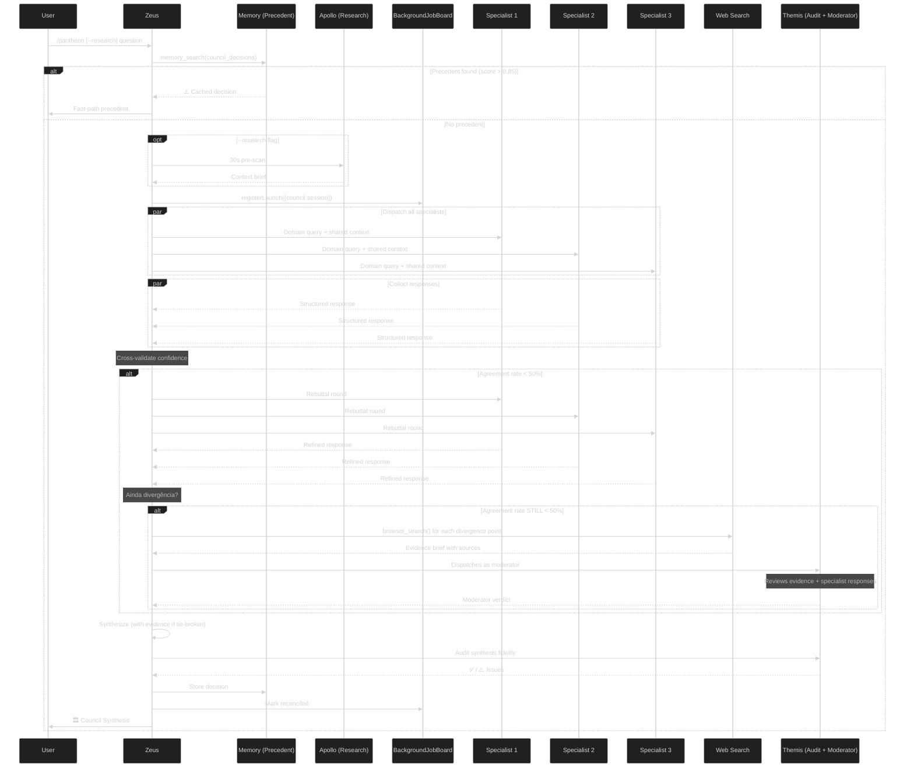

# 🏛️ INLINE COUNCIL SYNTHESIS — /pantheon

When a question requires multiple expert perspectives on a trade-off or architecture decision, **dispatch specialists inline** (visible to user) instead of delegating to a hidden subagent.

## Trigger Patterns (detect ANY)
- Trade-off questions: "which is better?", "should we use X or Y?", "compare A and B"
- Architecture decisions with long-term impact
- Security/compliance choices
- Technology selection (databases, frameworks, providers, libraries)
- "Is this safe?", "trade-offs of...", "what are the risks?"
- Cost vs quality decisions
- Multi-stakeholder concerns (frontend + backend + infra)



## Dispatch Sequence (9-Step Protocol)

### Step 0 — Precedent Fast-Path (Fase 1)
Before any dispatch: `memory_search(query, top_k=2, namespace="council_decisions")`
- Score > 0.85 AND age < 30 days → return precedent verbatim with note "⚠️ Decisão de [data] — reavaliar se contexto mudou". SKIP entire dispatch.
- Score > 0.85 AND age > 30 days → return precedent with ⚠️ "Reavaliar se contexto mudou — decisão tem mais de 30 dias"
- Else → proceed to Step 0b

### Step 0b — Apollo Pre-Scan (Fase 2, --research flag)
If `/pantheon --research <question>`: dispatch @apollo with 30s timeout. Inject findings as `shared_context` into ALL specialist prompts. Skip if flag absent.

### Step 1 — Register on BackgroundJobBoard (Fase 1)
Before dispatching specialists:
```
board.registerLaunch({
  taskID: "council:<uuid>",
  parentSessionID: "<session-id>",
  agent: "zeus",
  description: "Council: <question>",
  objective: "Synthesize specialist recommendations"
})
```
Enables crash recovery — if context is lost mid-synthesis, the board preserves session state.

### Step 2 — Select Specialists
Use domain-to-specialist mapping table (below). Max 3 specialists.

### Step 3 — Dispatch ALL task() calls in ONE message
Each specialist prompt MUST include:
- Structured output template (see Specialist Output Format below)
- `shared_context` if Apollo pre-scan was done
- Timeout per role: 120s for reviewers, 60s for explorers/implementers

### Step 4 — Collect Responses
Wait for all responses. Note TIMEOUT agents. Partial results OK only for read-only specialists (@apollo, @gaia).

### Step 5 — Confidence Cross-Validation (Fase 2)
For each specialist response, validate confidence claims:

| Reported | Minimum Required | Action |
|----------|-----------------|--------|
| High | ≥ 3 specific claims | If fewer → downgrade to Medium, annotate "(auto-downgraded from High: only N specific claims)" |
| Medium | ≥ 1 specific claim | Pass |
| Low | Any response | Pass |

"Specific claim" = statement with evidence, data point, or verifiable fact (not opinion).

### Step 6 — Divergence-Gated Rebuttal Round (Fase 2, conditional)
Calculate agreement rate = `min(agreements, divergences) / total_points` from structured `agreement_signals`. If < 50% agreement:
- Dispatch ONE rebuttal round: specialists see ALL other responses and refine their own
- Updated responses treated as final
- Hard cap: MAX 3 total rounds (initial + 2 rebuttals)
- Skip if any TIMEOUT occurred (can't rebuttal without all voices)

### Step 6b — Modo Desempate com Evidência (Fase 2, conditional)

If after Step 6 the agreement rate is STILL < 50% (rebuttal did not resolve divergence):

1. **Identify divergence points** — Parse all specialist responses (initial + rebuttal) and extract specific issues where positions differ
2. **Web research** — For EACH divergence point, Zeus calls `browser_search()` or `webfetch()` to find factual evidence:
   - Benchmarks, documentation, GitHub issues, official sources
   - At least 2 independent sources per point when possible
   - Focus on factual data, not opinion
3. **Compile Evidence Brief** — Structure findings as:
   ```
   ## evidence_brief
   **divergence_point_1:** <description>
   **evidence_found:** <facts from web, max 3 sentences>
   **sources:** [URL1, URL2]

   **divergence_point_2:** ...
   ```
4. **Dispatch @themis as moderator** — Send ONE task with:
   - All specialist responses (initial + rebuttal)
   - The evidence brief
   - Prompt: "Act as impartial moderator. These specialists disagree on [points]. Here is web evidence on each point. Issue a final verdict for each divergence point, citing specific evidence. Return structured verdict."
5. **Themis returns moderator verdict** in this format:
   ```
   ## moderator_verdict
   **divergence_points_analyzed:** <count>
   **verdicts:**
     - <point 1>: <decision> — evidence: <citation>
     - <point 2>: <decision> — evidence: <citation>
   **overall_direction:** <which approach is better supported by evidence>
   **confidence:** High | Medium | Low
   **unresolved:** <any points still unclear despite evidence>
   ```
6. **Zeus incorporates verdict** into synthesis (Step 7), showing which evidence supported which conclusion

**Rules:**
- Only triggers when agreement rate < 50% AFTER rebuttal round
- Skip if NO divergence points are web-researchable (purely subjective/opinion-based disagreements)
- Max 3 web searches per council (prevents runaway)
- If Themis confidence is Low or points remain unresolved, note this explicitly in synthesis
- Themis moderator role is SEPARATE from the Themis Audit Gate (Step 8) — they serve different functions

### Step 7 — Zeus Synthesize
Use structured `agreement_signals` to auto-detect agreements/divergences. Output synthesis template (see below).

### Step 8 — Themis Audit Gate (Fase 1)
Post-synthesis, dispatch @themis:
```
task(subagent_type: "themis", prompt: "Audit this council synthesis for fidelity. Compare raw specialist responses against the synthesized output. Check: (1) Any specialist misrepresented? (2) Divergences hidden or softened? (3) Confidence claims match response specificity? Return ✅ or list specific issues.")
```
- If ✅ → proceed
- If issues → fix each issue before delivering to user

### Step 9 — Persist & Reconcile (Fase 1)
```
memory_store({
  namespace: "council_decisions",
  key: "council:<yyyy-mm-dd>:<slug>",
  value: JSON.stringify({
    question, specialists, recommendation, confidence,
    agreements, divergences, precedent_used, timestamp
  }),
  metadata: {type: "council_decision", specialist_count: N}
})
board.markReconciled("<task-id>")
```

## Specialist Output Format (Fase 1 — machine-parseable structured fields)

Specialists MUST return these structured fields in their response:

```
## specialist_response
**position:** <clear one-sentence position>
**reasoning:** <2-4 sentences>
**trade_offs:** <what's gained vs lost>
**risks:** <what could go wrong>
**confidence:** High | Medium | Low
**agreement_signals:** agree: @agent1, @agent2 on [issue] | disagree: @agent3 on [issue]
**specific_claims:** <count of specific factual claims in response>
```

## Domain-to-Specialist Mapping

| Domain | Specialists |
|--------|-------------|
| Architecture | hermes, demeter, themis, athena |
| Security | themis, hermes, prometheus, nyx |
| Database | demeter, hermes, prometheus |
| AI/RAG | hephaestus, nyx |
| Infrastructure | prometheus, hermes, themis |
| Frontend/UX | aphrodite, themis, hermes |
| Observability | nyx, hermes |
| General | athena, themis, hermes |

## Synthesis Output Template (enhanced)

```
## 🏛️ Council Synthesis

**Question:** <original question>
**Date:** <date>
**Response rate:** X of Y specialists responded
**Timed out:** @agent1, @agent2 (if any)
**Precedent used:** yes/no (which one, date)
**Research context:** <shared_context summary> (if --research)

### Specialist Perspectives
| Agent | Position | Trade-offs | Confidence |
|-------|----------|------------|------------|
| @agent1 | ... | ... | High/Med/Low |

### Agreements
- <what 2+ specialists agree on>

### Divergences
| Issue | Side A | Side B | Resolution |
|-------|--------|--------|------------|

### Evidence & Moderation (if tie-break activated)
**Divergence points researched:** <list>
**Evidence summary:** <key findings from web>
**Moderator verdict:** <Themis final determination>
**Sources:** <citations>

### Recommendation
<decisive conclusion>

### Audit Gate
**Status:** ✅ Themis approved | ⚠️ Issues corrected

### Decision Gate
**Confidence:** High/Medium/Low (adjusted for response rate)
```

## Themis Audit Gate Rules (Fase 1)

1. Every specialist mentioned in synthesis? → ✅
2. Divergences from raw responses preserved (not softened/hidden)? → ✅
3. No specialist attributed a position they didn't state? → ✅
4. Confidence claims match response specificity? → ✅
5. If any ❌, list specific issues for Zeus to fix before delivery

## Rebuttal Round Rules (Fase 2)

1. Only triggers when agreement rate < 50%
2. MAX 3 rounds total (including initial dispatch)
3. Skip if any TIMEOUT (can't rebuttal without all voices)
4. Each rebuttal round: specialist sees ALL other responses + current synthesis draft
5. Refined responses replace originals for the final synthesis
6. If agreement rate STILL < 50% after rebuttal → Step 6b (Modo Desempate com Evidência)

## Crash Recovery via BackgroundJobBoard (Fase 1)

If Zeus context crashes mid-council:
1. On restart, `board.recoverRunningJobs()` marks running jobs as error
2. Check `board.formatForPrompt()` for unreconciled terminal jobs
3. Re-dispatch council with same question, noting: "⚠️ Retry — previous council session crashed. Using same question."

## Performance Budget

| Step | Latency | Phase |
|------|---------|-------|
| Precedent fast-path | < 500ms | Fase 1 |
| Apollo pre-scan | +30s (optional, --research) | Fase 2 |
| Specialist dispatch | bounded by slowest (60-120s) | — |
| Rebuttal round | +60s (conditional, < 50% agreement) | Fase 2 |
| Web search (tie-break) | +15s (conditional, < 50% after rebuttal) | Fase 2 |
| Themis moderator | +15s (conditional, tie-break activated) | Fase 2 |
| Themis audit | +15s | Fase 1 |
| **Total worst case** (research + rebuttal + tie-break) | ~255s | — |
| **Total typical** (no research, no rebuttal, no tie-break) | ~45-90s | — |

> **Note**: The user can explicitly invoke this via `/pantheon <question>`. The `--research` flag adds Apollo pre-scan. All decisions are stored in `council_decisions` memory namespace for fast-path retrieval on future councils.

## Modo Desempate Rules (Fase 2)

1. Only triggers when agreement rate < 50% AFTER rebuttal round
2. If no divergence points are web-researchable (pure opinion disagreement), skip — Zeus synthesizes with lower confidence
3. Max 3 web searches per council invocation
4. Themis moderator role is DISTINCT from Themis audit gate:
   - Moderator: resolves substantive disagreement between specialists (reads evidence, gives verdict)
   - Audit gate: checks synthesis fidelity against raw responses (quality assurance)
   Both run in the same council invocation, at different steps
5. If Themis moderator confidence is Low, mark as "unresolved tie" in the synthesis output
6. Evidence from web search must be cited with source URL or document reference — no anonymous claims
